# Zookeeper 如何实现分布式锁
## 什么是临时顺序节点？
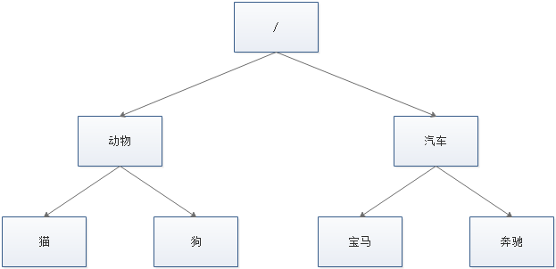

Zookeeper 的数据存储结构就像一棵树，这棵树由节点组成，这种节点叫做 Znode。

Znode 分为四种类型：

## 持久节点（PERSISTENT）
默认的节点类型。创建节点的客户端与 Zookeeper 断开连接后，该节点依旧存在。

## 持久节点顺序节点（PERSISTENT_SEQUENTIAL）
所谓顺序节点，就是在创建节点时，Zookeeper 根据创建的时间顺序给该节点名称进行编号：
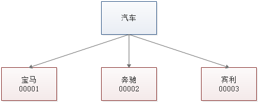

## 临时节点（EPHEMERAL）
和持久节点相反，当创建节点的客户端与 Zookeeper 断开连接后，临时节点会被删除：
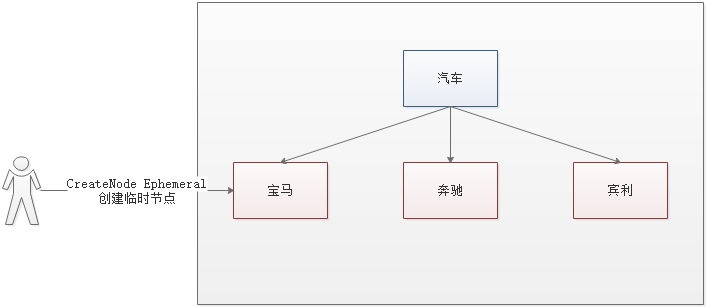
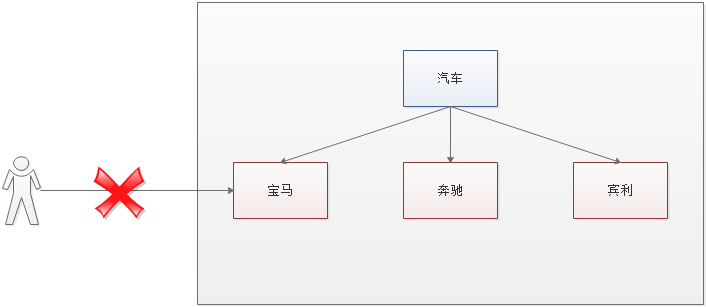
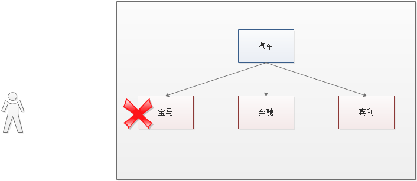

## 临时顺序节点（EPHEMERAL_SEQUENTIAL）
顾名思义，临时顺序节点结合和临时节点和顺序节点的特点：在创建节点时，Zookeeper 根据创建的时间顺序给该节点名称进行编号；当创建节点的客户端与 Zookeeper 断开连接后，临时节点会被删除。

## Zookeeper 分布式锁的原理
Zookeeper 分布式锁恰恰应用了临时顺序节点。具体如何实现呢？让我们来看一看详细步骤：

## 获取锁
首先，在 Zookeeper 当中创建一个持久节点 ParentLock。当第一个客户端想要获得锁时，需要在 ParentLock 这个节点下面创建一个临时顺序节点 Lock1。
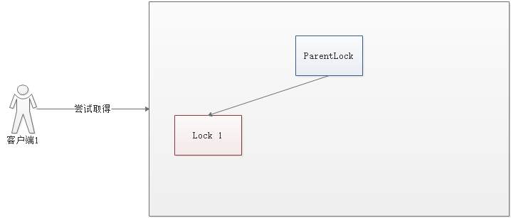

之后，Client1 查找 ParentLock 下面所有的临时顺序节点并排序，判断自己所创建的节点 Lock1 是不是顺序最靠前的一个。如果是第一个节点，则成功获得锁。

这时候，如果再有一个客户端 Client2 前来获取锁，则在 ParentLock 下载再创建一个临时顺序节点 Lock2。
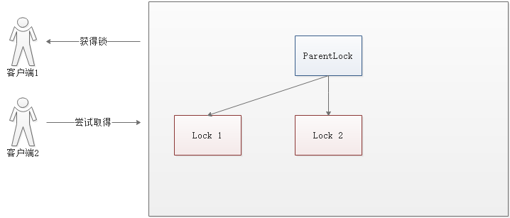

Client2 查找 ParentLock 下面所有的临时顺序节点并排序，判断自己所创建的节点 Lock2 是不是顺序最靠前的一个，结果发现节点 Lock2 并不是最小的。

于是，Client2 向排序仅比它靠前的节点 Lock1 注册 Watcher，用于监听 Lock1 节点是否存在。这意味着 Client2 抢锁失败，进入了等待状态。
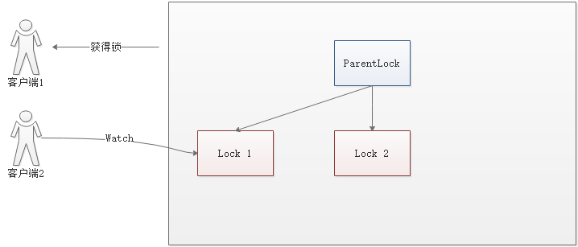

这时候，如果又有一个客户端 Client3 前来获取锁，则在 ParentLock 下载再创建一个临时顺序节点 Lock3。
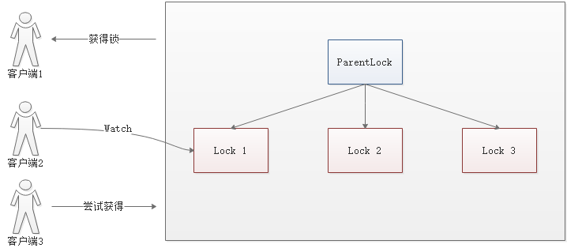

Client3 查找 ParentLock 下面所有的临时顺序节点并排序，判断自己所创建的节点 Lock3 是不是顺序最靠前的一个，结果同样发现节点 Lock3 并不是最小的。

于是，Client3 向排序仅比它靠前的节点 Lock2 注册 Watcher，用于监听 Lock2 节点是否存在。这意味着 Client3 同样抢锁失败，进入了等待状态。
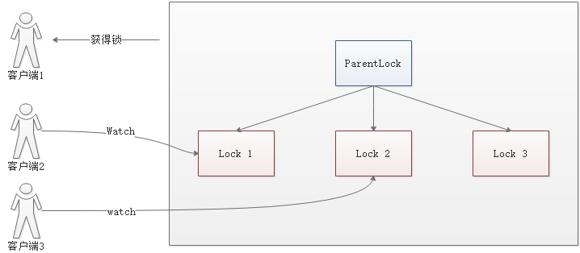

这样一来，Client1 得到了锁，Client2 监听了 Lock1，Client3 监听了 Lock2。这恰恰形成了一个等待队列，

## 释放锁
释放锁分为两种情况：

## 任务完成，客户端显示释放
当任务完成时，Client1 会显示调用删除节点 Lock1 的指令。
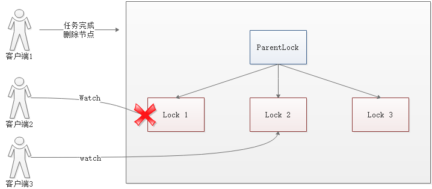

## 任务执行过程中，客户端崩溃
获得锁的 Client1 在任务执行过程中，如果崩溃，则会断开与 Zookeeper 服务端的链接。根据临时节点的特性，相关联的节点 Lock1 会随之自动删除。
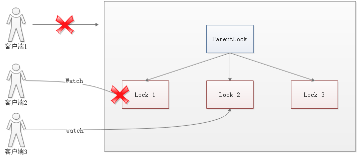

由于 Client2 一直监听着 Lock1 的存在状态，当 Lock1 节点被删除，Client2 会立刻收到通知。这时候 Client2 会再次查询 ParentLock 下面的所有节点，确认自己创建的节点 Lock2 是不是目前最小的节点。如果是最小，则 Client2 顺理成章获得了锁。
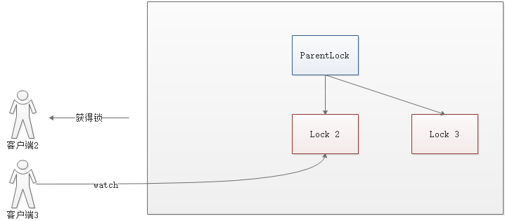

同理，如果 Client2 也因为任务完成或者节点崩溃而删除了节点 Lock2，那么 Client3 就会接到通知。
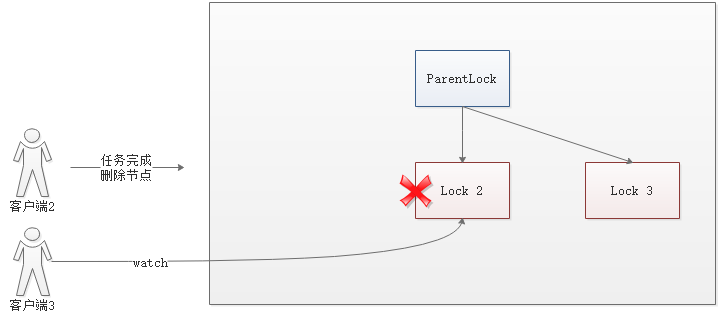

最终，Client3 成功得到了锁。
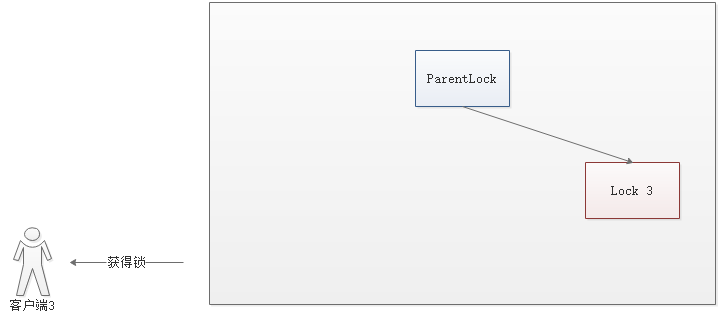

## Zookeeper 和 Redis 分布式锁的比较
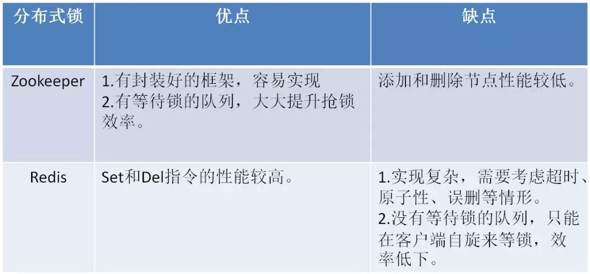