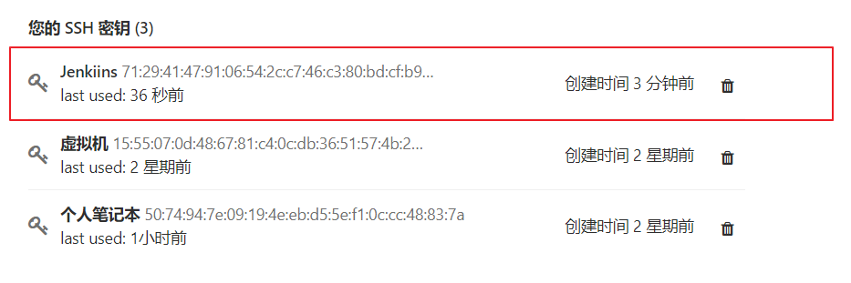
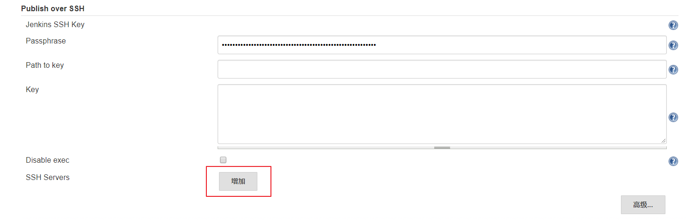
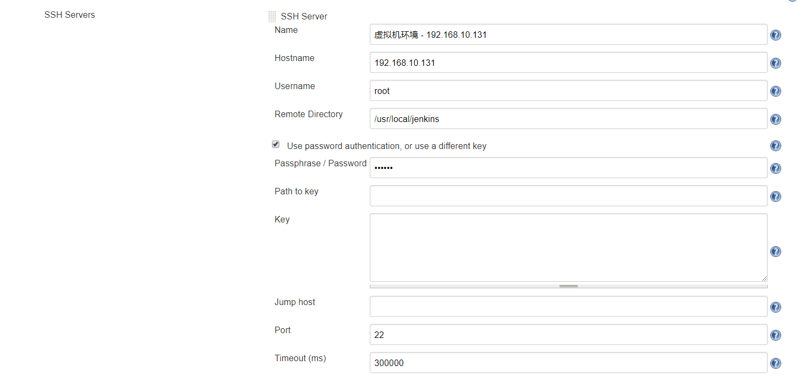
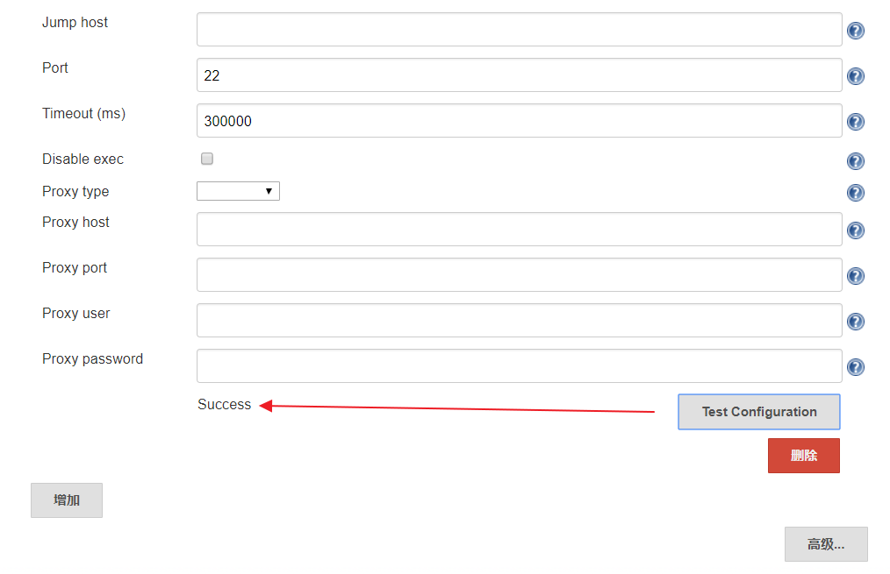
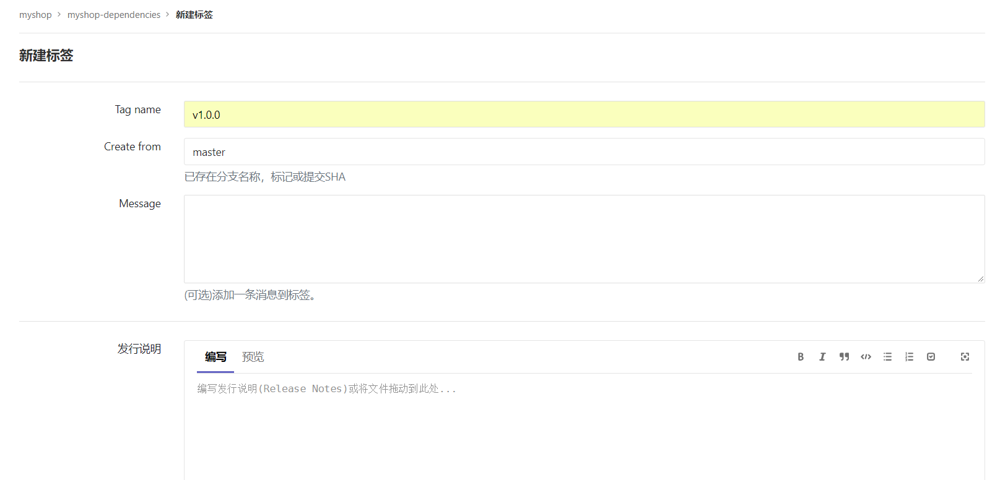
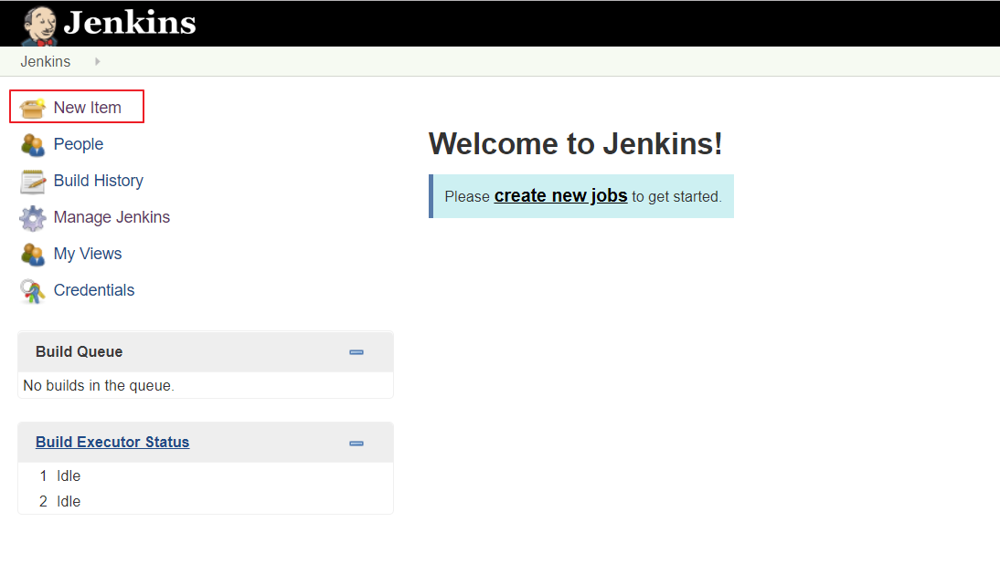
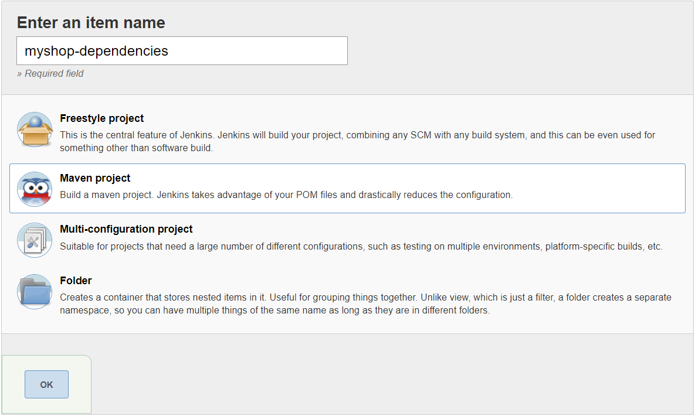
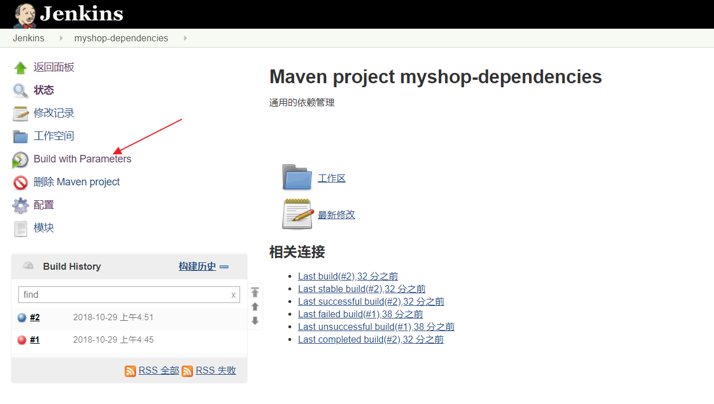
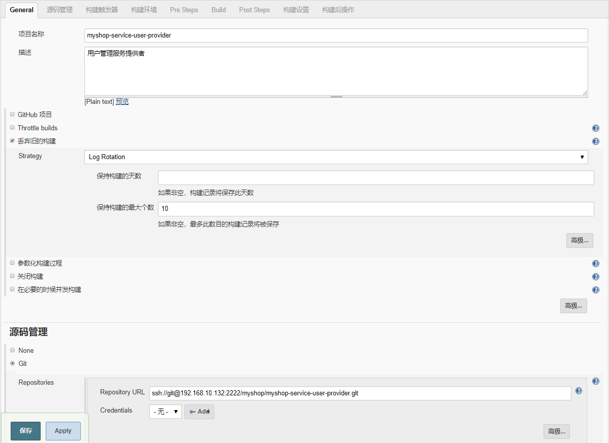

# 持续交付实战用户管理服务
## 写在前面
Jenkins 的持续交付流程与 GitLab Runner 的持续集成差不多，但 GitLab Runner 已经默认是配置好了 Git，所以 Jenkins 需要额外配置多一个 GitLab 的 SSH 登录。按照之前 GitLab Runner 的持续集成流程，Jenkins 的持续交付流程大致如下（其实原理还是挺简单的，但对于刚刚接触 Jenkins 同学理解起来可能还是有一点难度的，最好看下本节视频加深理解）：

- 拉取代码
- 打包构建
- 上传镜像
- 运行容器
- 维护清理

## 配置 Jenkins 的 GitLab SSH 免密登录
步骤同 使用 SSH 的方式拉取和推送项目

- 交互式进入 Jenkins 容器
```
docker exec -it jenkins /bin/bash
```
- 生成 SSH KEY
```
ssh-keygen -t rsa -C "your_email@example.com"
```
- 查看公钥
```
cat /var/jenkins_home/.ssh/id_rsa.pub
```
- 复制公钥到 GitLab


- 手动克隆一次项目，该步骤的主要作用是为了生成和服务器的验证信息


- 查看刚才生成的文件


## 配置 Publish over SSH
- `系统管理` -> `系统设置` -> `Publish over SSH`




 其中 Remote Directory 是指 Jenkins 可以在目标服务器操作的目录

- 测试是否能够正常通信


- 别忘记保存

## 持续交付依赖管理项目
由于我们所有项目的父工程都是依赖于 myshop-dependencies，所以我们的第一步是实现该项目的持续交付

## 为项目创建标签
在 GitLab 中为项目创建标签




## 创建 Maven Project
在 Jenkins 中创建一个基于 Maven 的任务




## 配置 Maven Project
### 配置第一次构建


- 构建项目


- 查看构建日志


### 配置正式构建
- 增加参数化构建过程


这里使用了 Groovy 脚本来查询最近的 tags 版本，代码如下：
```
def ver_keys = [ 'bash', '-c', 'cd /var/jenkins_home/workspace/myshop-dependencies;git pull>/dev/null; git remote prune origin >/dev/null; git tag -l|sort -r |head -10 ' ]
ver_keys.execute().text.tokenize('\n')
```
- 关闭源码管理


- 增加构建步骤

```
echo $RELEASE_VERSION
cd /var/jenkins_home/workspace/myshop-dependencies
git checkout $RELEASE_VERSION
git pull origin $RELEASE_VERSION
mvn clean package
```
- 使用参数化构建项目



- 查看构建日志


## 持续交付用户服务提供者
在 Jenkins 中创建一个基于 Maven 的任务


## 配置 Maven Project
### 配置第一次构建


- 构建项目


- 查看构建日志


### 配置正式构建
- 增加参数化构建过程


这里使用了 Groovy 脚本来查询最近的 tags 版本，代码如下：
```
def ver_keys = [ 'bash', '-c', 'cd /var/jenkins_home/workspace/myshop-service-user-provider;git pull>/dev/null; git remote prune origin >/dev/null; git tag -l|sort -r |head -10 ' ]
ver_keys.execute().text.tokenize('\n')
```
- 关闭源码管理


- 增加构建步骤


- Execute Shell（本地执行 Shell 脚本）
```
echo $RELEASE_VERSION
cd /var/jenkins_home/workspace/myshop-service-user-provider
git checkout $RELEASE_VERSION
git pull origin $RELEASE_VERSION
mvn clean package
```
- Send files or execute commands over SSH（发送文件或执行远程命令）

-- Source files：需要传输到远程目标服务器的文件
```
`**/*.jar,docker/**`
```
- Remove prefix：删除前缀。比如传输 `**/*.jar`，我们打包的 .jar 文件是在 target 目录下的，传输时会一并创建 target 目录，如果不希望创建 target 目录，则可以使用该参数屏蔽掉这些前缀文件夹。
- Remote directory：在远程目标服务器创建操作目录
```
myshop-service-user-provider
```
- Exec command：在远程目标服务器执行控制台命令
```
cd /usr/local/jenkins/myshop-service-user-provider
cp target/myshop-service-user-provider-1.0.0-SNAPSHOT.jar docker
cd docker
docker build -t 192.168.10.133:5000/myshop-service-user-provider:v1.0.0 .
docker push 192.168.10.133:5000/myshop-service-user-provider:v1.0.0
docker-compose down
docker-compose up -d
docker image prune -f
```
- 使用参数化构建项目


- 查看构建日志


## 持续交付用户服务消费者
操作步骤同上