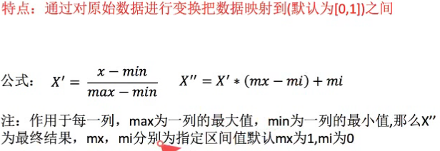
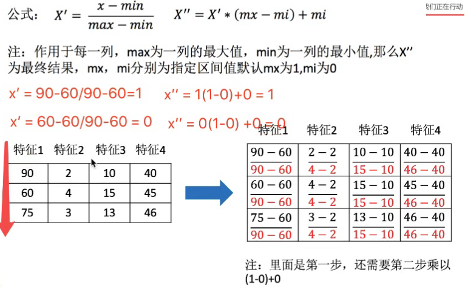
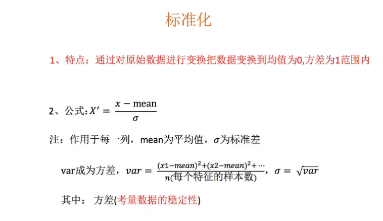
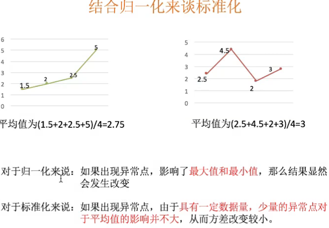
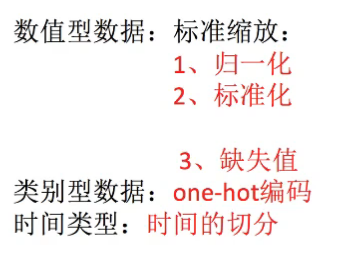

# python scikit-learn

> scikit-learn 是基于 Python 语言的机器学习工具
>
> - 简单高效的数据挖掘和数据分析工具
> - 可供大家在各种环境中重复使用
> - 建立在 NumPy ，SciPy 和 matplotlib 上
> - 开源，可商业使用 - BSD许可证

#### User installation

已有 numpy 和 scipy 的用户安装 scikit-learn 最简单的方法是使用 pip ：

```
pip install -U scikit-learn
```

或 `conda`:

```
conda install scikit-learn
```


## TF-IDF

> TF-IDF（term frequency–inverse document frequency）是一种用于信息检索与数据挖掘的常用加权技术。TF是词频(Term Frequency)，IDF是逆文本频率指数(Inverse Document Frequency)。

### 归一化

> 归一化是一种简化计算的方式，即将有量纲的表达式，经过变换，化为无量纲的表达式，成为标量。 在多种计算中都经常用到这种方法。
>
> １）把数据变成(０，１)或者（1,1）之间的小数。主要是为了数据处理方便提出来的，把数据映射到0～1范围之内处理，更加便捷快速。２）把有量纲表达式变成无量纲表达式，便于不同单位或量级的指标能够进行比较和加权。归一化是一种简化计算的方式，即将有量纲的表达式，经过变换，化为无量纲的表达式，成为纯量

```
# 公式
```






### 标准化

> 在机器学习中，我们可能要处理不同种类的资料，例如，音讯和图片上的像素值，这些资料可能是高维度的，资料标准化后会使每个特征中的数值平均变为0(将每个特征的值都减掉原始资料中该特征的平均)、标准差变为1，这个方法被广泛的使用在许多机器学习算法中(例如：支持向量机、逻辑回归和类神经网络)。










## 数据降维

> 特征的数量减少

### 特征选择

原因：数据冗余，噪声：部分特征对结果有影响

方位：0-1

### 主成本分析（PCV）

PCV:特征达到上百的时候，考虑数据的简化，损失少量数据 （90-95% 最好）


## 数据类型

- 离散型数据 ：特定范围内的汽车数量、人口数量、班级数
- 连续性数据：变量可以在某个范围取任一数

> 离散数据是区间内不可分，连续性数据是区间内可分
>
> 数据不同 应用算法不同


## 机器算法分类

- 监督学习：有特征值+目标值
  - 分类(离散)：K-近邻算法、贝叶斯分类、决策树和随机森林、逻辑回归和神经网络
  - 回归(连续)：线性回归和岭回归
  - 标注：隐马尔科夫模型
- 非监督学习：只有特征值
  - 聚类：k-means


## 步骤


建立模型：根据数据类型划分应用种类  模型=算法+数据

- 1 原始数据明确问题做什么
- 2 数据基本处理：pd处理数据（缺失值、表合并。。。）
- 3 特征数据（特征进行处理）（重要）
- 4 找到合适的算法去进行预测
- 5 模型的评估，判断效果 如果没有合格 需要换散发
- 6 上线使用，以API形式提供

