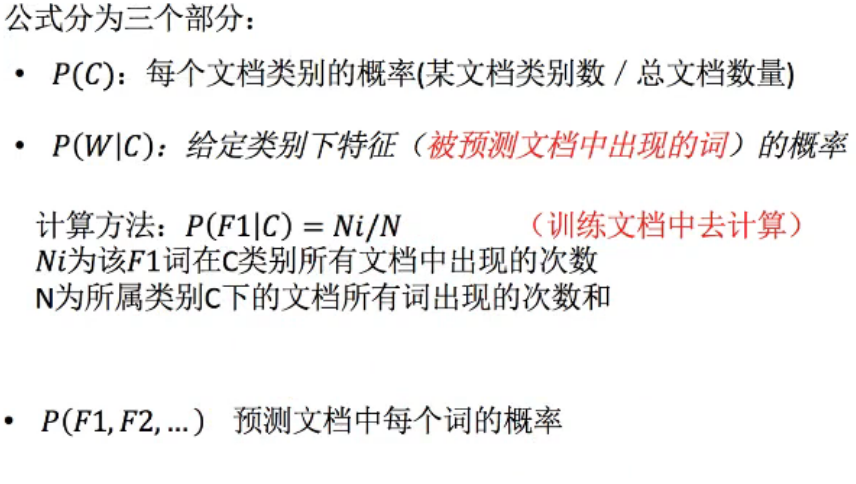

# 机器学习-sklearn-knn-朴素贝叶斯-决策树

## 1 skearn数据集与估计器

- 数据集划分  :一般 （70% 30%）  （ 80% 20%）  （ 75% 25 %）
  - 训练集
  - 测试机
- sklearn数据集接口介绍  sklearn.datasets
- sklearn分类数据集  sklearn.datasets fetch_20newsgroups
- sklearn回归数据集 sklearn.datasets load_boston

## 2 分类算法-k近邻算法

- 转换器 fit_transform(输入数据直接转换) =fit(输入，但不做事情)+transform(转换数据)
- 评估器(estimator)    sklearn 的api 难点 算法参数
  - 分类的评估器
    - sklearn.neighbors   k-近邻算法
    - sklearn.naive_bayes  贝叶斯
    - sklearn.linear_model.LogisticRegression 逻辑回归
    - sklearn.tree 决策树和随机森林
  - 回归的评估器
    - sklearn.linear_model.LinearRegression 线性回归
    - sklearn.linear_model.Ridge 岭回归

## 3 k-近邻算法实例

 k-值很小：容易受异常点影响

 k-值很大：容易受K值数据（类别）波动

性能问题：

样本越大，性能越差

**算法优点：**

　　　　（1）简单，易于理解，易于实现，无需估计参数。无需训练

　　　　（2）训练时间为零。它没有显示的训练，不像其它有监督的算法会用训练集train一个模型（也就是拟合一个函数），然后验证集或测试集用该模型分类。KNN只是把样本保存起来，收到测试数据时再处理，所以KNN训练时间为零。

　　　　（3）KNN可以处理分类问题，同时天然可以处理多分类问题，适合对稀有事件进行分类。

　　　　（4）特别适合于多分类问题(multi-modal,对象具有多个类别标签)， KNN比SVM的表现要好。

　　　　（5）KNN还可以处理回归问题，也就是预测。

　　　　（6）和朴素贝叶斯之类的算法比，对数据没有假设，准确度高，对异常点不敏感。

**算法缺点：**

　　　　（1）计算量太大，尤其是特征数非常多的时候。每一个待分类文本都要计算它到全体已知样本的距离，才能得到它的第K个最近邻点。

　　　　（2）可理解性差，无法给出像决策树那样的规则。

　　　　（3）是慵懒散学习方法，基本上不学习，导致预测时速度比起逻辑回归之类的算法慢。

　　　　（4）样本不平衡的时候，对稀有类别的预测准确率低。当样本不平衡时，如一个类的样本容量很大，而其他类样本容量很小时，有可能导致当输入一个新样本时，该样本的K个邻居中大容量类的样本占多数。 

　　　　（5）对训练数据依赖度特别大，对训练数据的容错性太差。如果训练数据集中，有一两个数据是错误的，刚刚好又在需要分类的数值的旁边，这样就会直接导致预测的数据的不准确。

#### 数据处理

- 1 缩小数据集范围 `DataFrame.query()`

- 2 处理日期数据 `pd.to_datetime()` `pd.DatetimeIndex`

- 3 分割日期数据

- 4 删除没有用的数据 `DataFrame.drop()`

- 5 将组内数据少于n个的数据删除

  ```
  # 组内数据少于N个的数据删除
      teamcount = data.groupby('TeamId').count()
      print(teamcount)
      tf = teamcount[teamcount.Id > 2].reset_index()
      data = data[data['TeamId'].isin(tf.TeamId)]
  
  ```

  

## 4 分类模型的评估 

#### 混淆矩阵

*在机器学习领域，混淆矩阵（**confusion matrix**），又称为可能性表格或是错误矩阵。它是一种特定的矩阵用来呈现算法性能的可视化效果，通常是监督学习（非监督学习，通常用匹配矩阵：**matching matrix**）。其每一列代表预测值，每一行代表的是实际的类别。这个名字来源于它可以非常容易的表明多个类别是否有混淆（也就是一个**class**被预测成另一个**class**）*

**Table of confusion**

*在预测分析中，混淆表格（有时候也称为混淆矩阵），是由**false positives**，**falsenegatives**，**true positives**和**true negatives**组成的两行两列的表格。它允许我们做出更多的分析，而不仅仅是局限在正确率。准确率对于分类器的性能分析来说，并不是一个很好地衡量指标，因为如果数据集不平衡（每一类的数据样本数量相差太大），很可能会出现误导性的结果。例如，如果在一个数据集中有**95**只猫，但是只有**5**条狗，那么某些分类器很可能偏向于将所有的样本预测成猫。整体准确率为**95%**，但是实际上该分类器对猫的识别率是**100%**，而对狗的识别率是**0%**。*

*对于上面的混淆矩阵，其对应的对**猫这个类别**的混淆表格如下：*

 

*假定一个实验有* *P**个**positive**实例，在某些条件下有* *N* *个**negative**实例。那么上面这四个输出可以用下面的偶然性表格（或混淆矩阵）来表示：*

 

 

公式陈列、定义如下：

| True positive(**TP**)  | eqv. with hit                       |
| ---------------------- | ----------------------------------- |
| True negative(**TN**)  | eqv. with correct rejection         |
| False positive(**FP**) | eqv. with false alarm, Type I error |
| False negative(**FN**) | eqv. with miss, Type II error       |

 

| Sensitivity ortrue positive rate(**TPR**)eqv. with hit rate, recall | *TPR = TP/P = TP/(TP + FN)*    |
| ------------------------------------------------------------ | ------------------------------ |
| Specificity(**SPC**)ortrue negative rate(**TNR**)            | *SPC = TN/N = TN/(FP + TN)*    |
| Precision orpositive prediction value(**PPV**)               | *PPV = TP/(TP + FP)*           |
| Negative predictive value(**NPV**)                           | *NPV = TN/(TN + FN)*           |
| Fall-out orfalse positive rate(**FPR**)                      | *FPR = FP/N = FP/(FP + TN)*    |
| False discovery rate(**FDR**)                                | *FDR = FP/(FP + TP) = 1 - PPV* |
| Miss Rate orFalse Negative Rate(**FNR**)                     | *FNR = FN/P = FN/(FN + TP)*    |
|                                                              |                                |
| Accuracy(**ACC**)                                            | *ACC = (TP + TN)/(P + N)*      |

**评估标注**

- 准确率

- 精确率

- 召回率

  

  

**分类模型评估API**

- sklearn.metrics.classification_report


## 5 分类算法-朴素贝叶斯算法





#### 拉普拉斯平滑


#### sklearn

```
sklearn.naive_bayes.MultinomialNB
# alpha  拉普拉斯平滑参数
mlt=MultinomialNB(alpha=1.0)
```

特点：

 优点：

- 朴素贝叶斯模型发源于古典数学理论，有稳定的分类效率。

- 对小规模的数据表现很好，能个处理多分类任务，适合增量式训练，尤其是数据量超出内存时，我们可以一批批的去增量训练。

- 对缺失数据不太敏感，算法也比较简单，常用于文本分类。

  

缺点：

- 由于使用了样本属性独立性的假设，所以如果样本属性有关联时效果不好

## 6 朴素贝叶斯算法实例

## 7 模型的选择与调优

### 交叉验证

> 所有数据分成N等分 其中一份为验证集，然后经过N次（组）测试，每次更换不同的验证集。即得到N组模型的结果，取平均值作为最终结果。一般N为5份

### 网格搜索-超参数搜索

> 通常情况下，有很多参数是需要手工指定的（如k-近邻算法中的k值），这种参数叫做超参数，但是手工过程繁杂，所以需要对模型预设集中超参数。每组超参数都进行交叉验证来进行评估。最后选出最优参数组合建立模型


## 8 决策树与随机森林

### 决策树

决策树分类依据：信息增益

基尼系数：划分更加仔细

泰坦尼克号生存数据：`http://biostat.mc.vanderbilt.edu/wiki/pub/Main/DataSets/titanic.txt`

导出决策树查看 软件安装

```
brew install graphviz
dot -Tpng tree.dot -o tree.png
```

优点：

- 简单的理解和解释，数目可视化
- 需要很少的数据准备，其他数据通常需要数据归一化

缺点：

- 决策树的学习者可以创建不能很好的推广数据的过于复杂的树，这个称为过拟合

改进：

- 减枝cart算法(决策树API当中已经实现，随机森林参数调优有关介绍)

  ```
  min_samples_split=2,
  min_samples_leaf=1, 
  ```

  

- 随机森林

  - 在当前所有算法中，具有很好的准确性
  - 能够有效的运行在大数据集上
  - 能够处理具有高维特征的输入样本，而且不需要降维
  - 能够评估各个特征在分类问题上的重要性

> 注意：企业重要决策，由于决策树很好的分析能力，在决策过程中应用较多


### 信息论

- 信息熵

  

  

  

  

  

  

- 

### 随机森林

