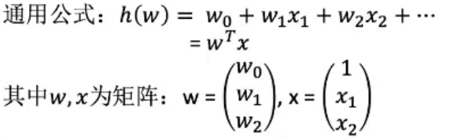
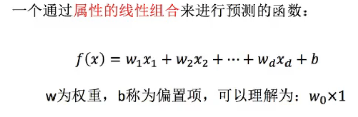
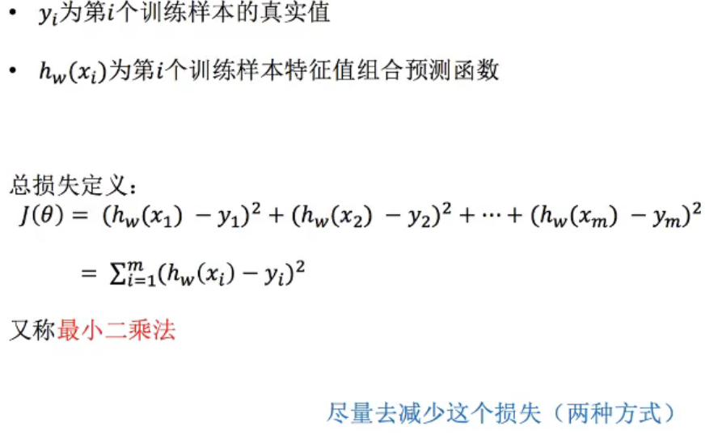
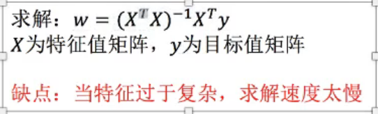
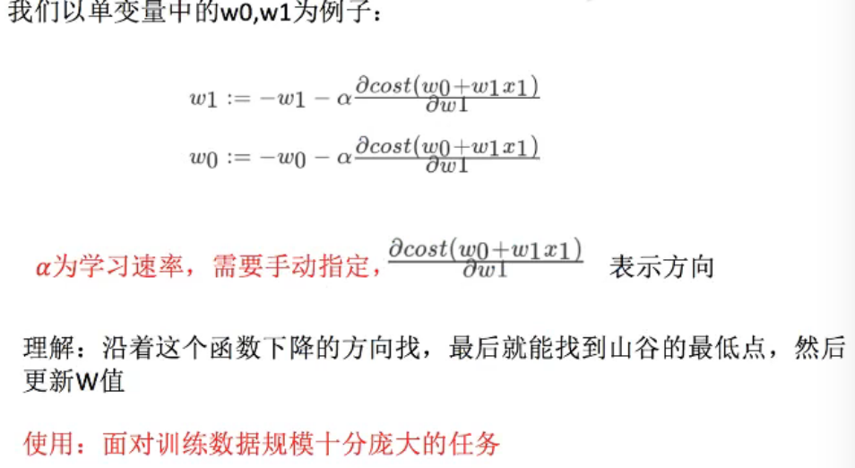
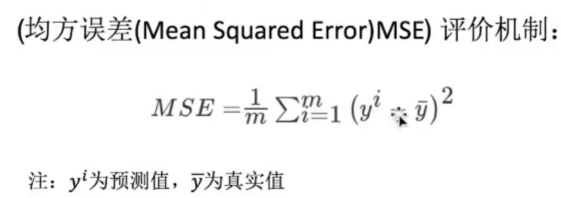
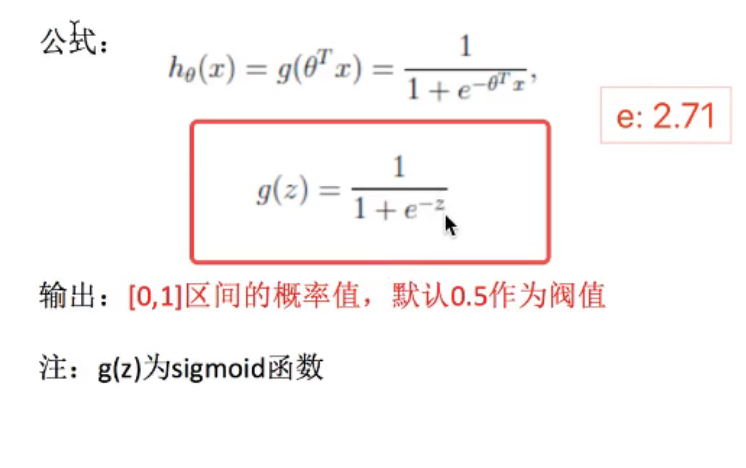

#  python-机器学习-线性回归-岭回归-聚类


## 1 回归算法-线性回归分析

> 回归：目标值是连续的  房价预测，股票预测，销售额预测
>
> 分类：离散型
>
> 定义：线性回归通过1个或者多个自变量与因变量之间之间进行建模的回归分析。其中可以为一个或者多个自变量之间的线性组合（线性回归的一种）
>
> 一元线性回归：涉及到的变量只有一个
>
> 多元线性回归：涉及到的变量2个或者2个以上
>
> **算法**: 线性回归
>
> **策略（损失函数）**：误差平方和，最小二乘值
>
> **优化**：正规方程，梯度下降学习率
>
> 




线性关系定义：y=kx+b   b:偏值

```
import numpy as np
a=[[1,2,3,4],[4,3,2,6],[6,4,8,2]]
b=[2,2,2,2]
#np计算 -数组相乘
np.multiply(a,b)
#np 计算 -矩阵计算
c=[[2],[2],[2],[2]]
np.dot(a,c)
```


### 线性关系模型



### 损失函数（误差平方和，最小二乘法） 

> 寻找最优化W值



**最小二乘法之正规方程**




> X Y 代表什么

**最小二乘法值梯度下降**



>linearRegression、SGDRegressor 
>
>sklearn.linear_modle.LinearRegression() 普通最小二乘线性回归
>
>coef_:回归系数
>
>
>
>sklearn.linear_model.SGDRegressor()
>
>通过使用SGD最小化线性模型
>
>coef_:回归系数


## 2 线性回归实例

> 波士顿房价预测

## 3 回归性能评估

> 回归性能评估：均方误差




#### 过拟合与欠拟合

> 过拟合：一个假设在训练数据上能获得比其他假设更好的拟合，但是在训练意外的数据集上却不能很好的拟合数据，此时认为这个假设出现了过拟合的现象。（模型过于复杂）
>
> 欠拟合：一个假设在训练数据上不能获得更好的拟合，但是在训练数据外的数据集上也不能很好地拟合数据，此时认为这个假设出现了欠拟合现象。（模型国语简单）

##### 解决方案

过拟合：原因：原始特征过多，窜在一些嘈杂特征，模型过于复杂是因为模型尝试去兼顾各个测试数据点

解决方法：

- 进行特征选择，消除关联性大的特征（很难做）
- 交叉验证（让所有数据都有过训练）
- L2正则化:Ridge:岭回归 带有正则化的线性回归 解决过拟合

```
sklearn.linear_model.Ridge(alpha=1.0)
 alpha 0~1 1~10
```


### 岭回归

> 回归得到的回归系数更符合实际，更可靠。另外，能让古迹参数的波动范围变小，边的更稳定。在存在病态数据表多的研究中有较大的实际价值。


### 模型的保存于加载

 ```
import joblib
# 保存训练好的模型
joblib.dump(lr,"./tmp/test.pkl")

# 下载本地模型
model1 = joblib.load("./tmp/test.pkl")
 ```


## 4 分类算法-逻辑回归

> 解决二分类问题算法：
>
> **损失函数**：局方误差（不存在多个局部最低点）只有一个最小值
>
> 对数似然损失函数：多个局部最小值  
>
> 全局最低点：目前解决不了的问题
>
> 1多次随机初始化，多次比较最小值结果
>
> 2求解过程中，调整学习率
>
> 尽量改善 
>
> **策略（损失函数）**：对数似然损失函数
>
> **优化**： 


sigmod 函数 ：能把输入的值转换成0~1之间的一个数值



## 5 逻辑回归实例

> 肿瘤数据 
>
> `http://archive.ics.uci.edu/ml/machine-learning-databases/`
>
> `http://archive.ics.uci.edu/ml/machine-learning-databases/breast-cancer-wisconsin/`
>
> 

总结：

- 应用：广告点击率预测，是否患病，金融诈骗，是否为虚拟账号
- 优点：适合需要得到一个分类概率场景，简单，速度快
- 缺点：不好处理多分类问题

判别模型：逻辑回归、k-近邻、决策树、随机森林、神经网络

生成模型：先验概率  朴素贝叶斯 隐马可夫模型

练习：广告点击预测

地址

```
https://www.kaggle.com/c/avito-context-ad-clicks/data
```

京东信贷预测：

```
https://tianle.me/2017/12/12/jd/
```


## 6 聚类算法-kmeans

kmeans性能评估指标（外部距离最大化，内部距离最小化）

轮廓系数

特点分析：

采用迭代式算法，直观易懂并非常实用

缺点：容易收敛到局部最优解（多次聚类）

> 聚类一般在分类之前

## 7 k-means实例

