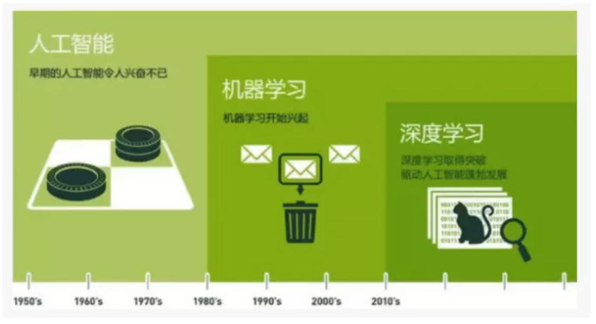
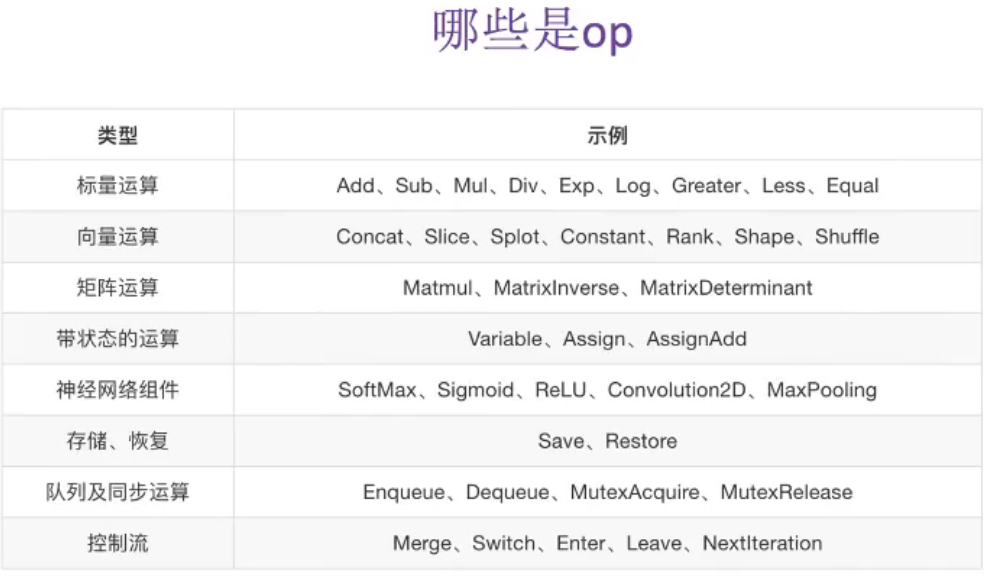
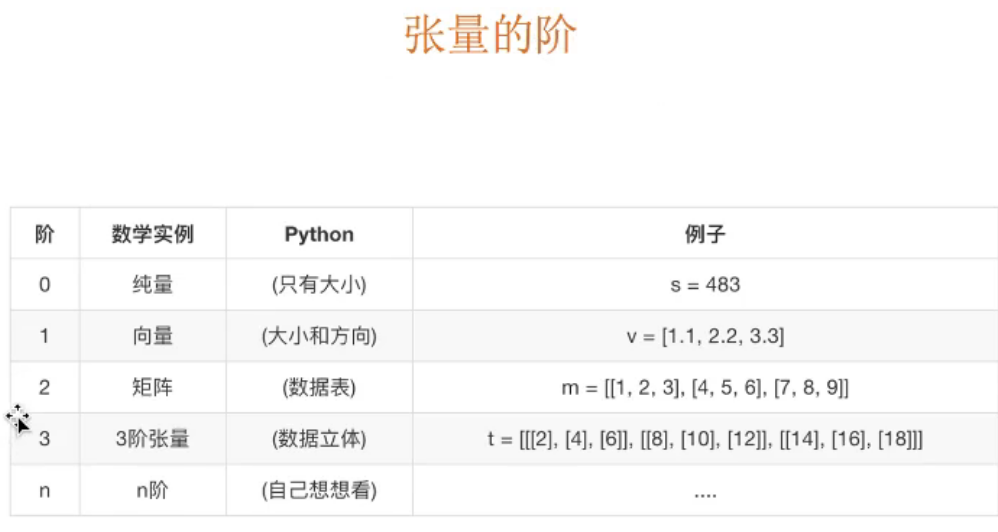
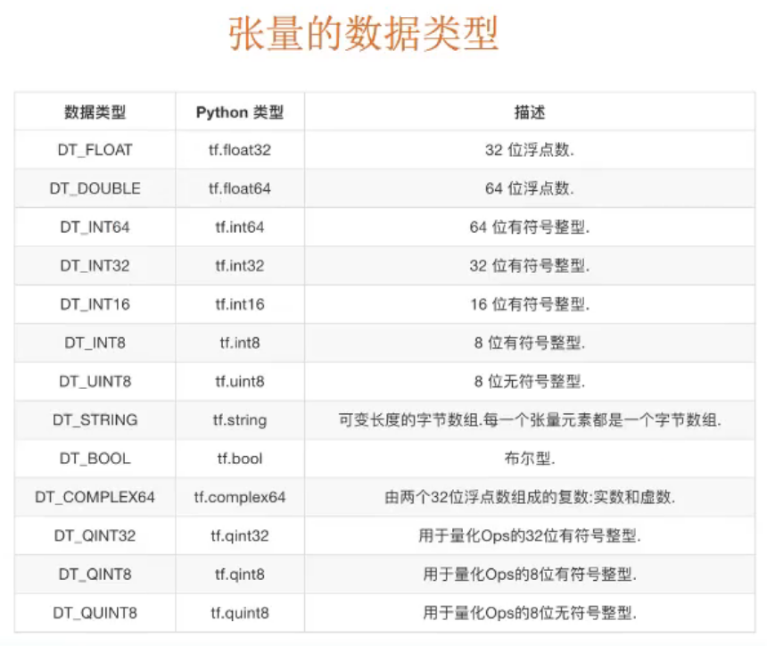
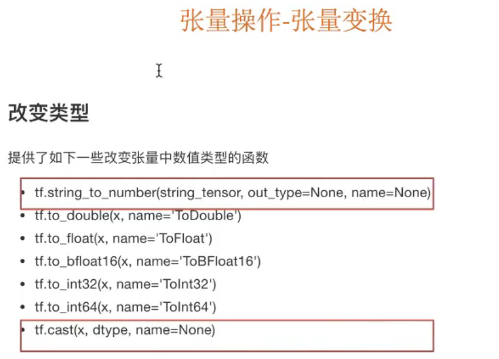

# python -深度学习-tensorflow

## 1 深度学习介绍




- 机器学习： 算法  分类：神经网络（简单）回归
- 深度学习：神经网络（深度），图像-卷积神经网络，自然语言处理-循环神经网络

#### op 和tensor 

 

回话（session）

- 1 运行图的结构
- 2 分配资源计算
- 3 掌握资源（变量的资源，队列，线程）

张量：



张量的数据类型



张量类型转换




## 2 认识tensorflow

## 3 tensorflow安装

安装

```
# python 3.6.12
pip install --upgrade pip
# mac 安装tensorflow 2.3  cpu 版本
pip install https://storage.googleapis.com/tensorflow/mac/cpu/tensorflow-2.3.0-cp36-cp36m-macosx_10_9_x86_64.whl

```


## 4 tensorflow 基础

#### 正太分布（高斯分布）

方差比较大  数据越离散

平均值，标准差

## 5 tensorflow 进阶

## 6 案例：实现线性回归

