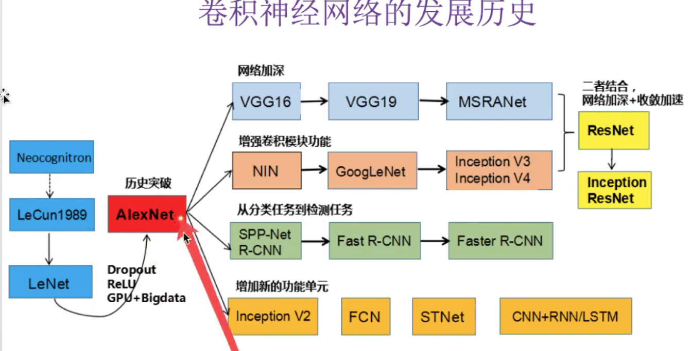

# TensorFlow 神经网络

## 1 神经网络基础

> 神经网络 解释性，分类过程无法解释  幸顿
>
> 感知机---->神经元---->多个----->神经网络     
>
> 不同的结构解决不同的问题
>
> softmax 有多少类别 输出多少类别
>
> 正向传播：输出经过一层一层的计算得出输出
>
> 反向传播：从损失计算开始，梯度下降更新权重

算法   					策略   					优化

线性回归			均方误差					梯度下降

逻辑回归			对数似然损失			梯度下降     二分类

神经网络			交叉熵损失				反向传播算法（梯度下降）

### 分类

- 基础神经网络：单层感知机，线性神经网络，BP神经网络，Hopfield神经网络等

- 进阶神经网络：玻尔兹曼机，受限玻尔兹曼机，递归神经网络等

- 深度神经网络：深度置信网络，卷积神经网络，循环神经网络，LSTM网络等

### 交叉熵损失

## 2 人工神经网络（ANN）

## 3 mnist数据集浅层神经网络分析

> 手写数字：`http://yann.lecun.com/exdb/mnist/`


input_data_py

```
# Copyright 2015 Google Inc. All Rights Reserved.
#
# Licensed under the Apache License, Version 2.0 (the "License");
# you may not use this file except in compliance with the License.
# You may obtain a copy of the License at
#
#     http://www.apache.org/licenses/LICENSE-2.0
#
# Unless required by applicable law or agreed to in writing, software
# distributed under the License is distributed on an "AS IS" BASIS,
# WITHOUT WARRANTIES OR CONDITIONS OF ANY KIND, either express or implied.
# See the License for the specific language governing permissions and
# limitations under the License.
# ==============================================================================
"""Functions for downloading and reading MNIST data."""
from __future__ import absolute_import
from __future__ import division
from __future__ import print_function
import gzip
import os
import tensorflow.python.platform
import numpy
from six.moves import urllib
from six.moves import xrange  # pylint: disable=redefined-builtin
import tensorflow as tf
SOURCE_URL = 'http://yann.lecun.com/exdb/mnist/'
def maybe_download(filename, work_directory):
    """Download the data from Yann's website, unless it's already here."""
    if not os.path.exists(work_directory):
        os.mkdir(work_directory)
    filepath = os.path.join(work_directory, filename)
    if not os.path.exists(filepath):
        filepath, _ = urllib.request.urlretrieve(SOURCE_URL + filename, filepath)
        statinfo = os.stat(filepath)
        print('Successfully downloaded', filename, statinfo.st_size, 'bytes.')
    return filepath
def _read32(bytestream):
    dt = numpy.dtype(numpy.uint32).newbyteorder('>')
    return numpy.frombuffer(bytestream.read(4), dtype=dt)[0]
def extract_images(filename):
    """Extract the images into a 4D uint8 numpy array [index, y, x, depth]."""
    print('Extracting', filename)
    with gzip.open(filename) as bytestream:
        magic = _read32(bytestream)
        if magic != 2051:
            raise ValueError(
                'Invalid magic number %d in MNIST image file: %s' %
                (magic, filename))
        num_images = _read32(bytestream)
        rows = _read32(bytestream)
        cols = _read32(bytestream)
        buf = bytestream.read(rows * cols * num_images)
        data = numpy.frombuffer(buf, dtype=numpy.uint8)
        data = data.reshape(num_images, rows, cols, 1)
        return data
def dense_to_one_hot(labels_dense, num_classes=10):
    """Convert class labels from scalars to one-hot vectors."""
    num_labels = labels_dense.shape[0]
    index_offset = numpy.arange(num_labels) * num_classes
    labels_one_hot = numpy.zeros((num_labels, num_classes))
    labels_one_hot.flat[index_offset + labels_dense.ravel()] = 1
    return labels_one_hot
def extract_labels(filename, one_hot=False):
    """Extract the labels into a 1D uint8 numpy array [index]."""
    print('Extracting', filename)
    with gzip.open(filename) as bytestream:
        magic = _read32(bytestream)
        if magic != 2049:
            raise ValueError(
                'Invalid magic number %d in MNIST label file: %s' %
                (magic, filename))
        num_items = _read32(bytestream)
        buf = bytestream.read(num_items)
        labels = numpy.frombuffer(buf, dtype=numpy.uint8)
        if one_hot:
            return dense_to_one_hot(labels)
        return labels
class DataSet(object):
    def __init__(self, images, labels, fake_data=False, one_hot=False,
                 dtype=tf.float32):
        """Construct a DataSet.
        one_hot arg is used only if fake_data is true.  `dtype` can be either
        `uint8` to leave the input as `[0, 255]`, or `float32` to rescale into
        `[0, 1]`.
        """
        dtype = tf.as_dtype(dtype).base_dtype
        if dtype not in (tf.uint8, tf.float32):
            raise TypeError('Invalid image dtype %r, expected uint8 or float32' %
                            dtype)
        if fake_data:
            self._num_examples = 10000
            self.one_hot = one_hot
        else:
            assert images.shape[0] == labels.shape[0], (
                    'images.shape: %s labels.shape: %s' % (images.shape,
                                                           labels.shape))
            self._num_examples = images.shape[0]
            # Convert shape from [num examples, rows, columns, depth]
            # to [num examples, rows*columns] (assuming depth == 1)
            assert images.shape[3] == 1
            images = images.reshape(images.shape[0],
                                    images.shape[1] * images.shape[2])
            if dtype == tf.float32:
                # Convert from [0, 255] -> [0.0, 1.0].
                images = images.astype(numpy.float32)
                images = numpy.multiply(images, 1.0 / 255.0)
        self._images = images
        self._labels = labels
        self._epochs_completed = 0
        self._index_in_epoch = 0
    @property
    def images(self):
        return self._images
    @property
    def labels(self):
        return self._labels
    @property
    def num_examples(self):
        return self._num_examples
    @property
    def epochs_completed(self):
        return self._epochs_completed
    def next_batch(self, batch_size, fake_data=False):
        """Return the next `batch_size` examples from this data set."""
        if fake_data:
            fake_image = [1] * 784
            if self.one_hot:
                fake_label = [1] + [0] * 9
            else:
                fake_label = 0
            return [fake_image for _ in xrange(batch_size)], [
                fake_label for _ in xrange(batch_size)]
        start = self._index_in_epoch
        self._index_in_epoch += batch_size
        if self._index_in_epoch > self._num_examples:
            # Finished epoch
            self._epochs_completed += 1
            # Shuffle the data
            perm = numpy.arange(self._num_examples)
            numpy.random.shuffle(perm)
            self._images = self._images[perm]
            self._labels = self._labels[perm]
            # Start next epoch
            start = 0
            self._index_in_epoch = batch_size
            assert batch_size <= self._num_examples
        end = self._index_in_epoch
        return self._images[start:end], self._labels[start:end]
def read_data_sets(train_dir, fake_data=False, one_hot=False, dtype=tf.float32):
    class DataSets(object):
        pass
    data_sets = DataSets()
    if fake_data:
        def fake():
            return DataSet([], [], fake_data=True, one_hot=one_hot, dtype=dtype)
        data_sets.train = fake()
        data_sets.validation = fake()
        data_sets.test = fake()
        return data_sets
    TRAIN_IMAGES = 'train-images-idx3-ubyte.gz'
    TRAIN_LABELS = 'train-labels-idx1-ubyte.gz'
    TEST_IMAGES = 't10k-images-idx3-ubyte.gz'
    TEST_LABELS = 't10k-labels-idx1-ubyte.gz'
    VALIDATION_SIZE = 5000
    local_file = maybe_download(TRAIN_IMAGES, train_dir)
    train_images = extract_images(local_file)
    local_file = maybe_download(TRAIN_LABELS, train_dir)
    train_labels = extract_labels(local_file, one_hot=one_hot)
    local_file = maybe_download(TEST_IMAGES, train_dir)
    test_images = extract_images(local_file)
    local_file = maybe_download(TEST_LABELS, train_dir)
    test_labels = extract_labels(local_file, one_hot=one_hot)
    validation_images = train_images[:VALIDATION_SIZE]
    validation_labels = train_labels[:VALIDATION_SIZE]
    train_images = train_images[VALIDATION_SIZE:]
    train_labels = train_labels[VALIDATION_SIZE:]
    data_sets.train = DataSet(train_images, train_labels, dtype=dtype)
    data_sets.validation = DataSet(validation_images, validation_labels,
                                   dtype=dtype)
    data_sets.test = DataSet(test_images, test_labels, dtype=dtype)
    return data_sets

```


## 4 卷积神经网络（CNN）

> 简而言之，[卷积神经网络（Convolutional Neural Networks）](https://en.wikipedia.org/wiki/Convolutional_neural_network)是一种深度学习模型或类似于人工神经网络的多层感知器，常用来分析视觉图像。**卷积神经网络的创始人是着名的计算机科学家Yann LeCun**，目前在**Facebook工作**，他是第一个通过卷积神经网络在[MNIST数据集](http://yann.lecun.com/exdb/mnist/)上解决手写数字问题的人
>
> 增加激活函数：增加网络的非线性分割能力
>
> 

### 发展历史



### 计算步长

> 问题 图像大小 [28,28,1]  卷积层：100个filter ,filter大小5*5,步长1，padding=1

```
H2 = (28-5+2*1)/1 + 1 = 26
W2 = (28-5+2*1)/1 + 1 = 26
D2 = 100

```


- 输入体积`H1*W1*D1`
- 四个超参数

  - filter数量K

  - filter大小F

  - 步长S

  - 零填充大小P
- 输入体积大小`H2*W2*D2`
  - H2 = (H1-F+2P)/S +1
  - W2 = (W1-F+2P)/S +1
  - D2 = K


## 5 卷积网络mnist数字图片识别

### 卷积神经网络：

- 一卷积层: 卷积：32个filter,5*5,strides1,padding="SAME"  		bais =32

  - 输入：[None,28,28,1] 	输出：[None,28,28,32]

  - 激活：[None,28,28,32]

  - 池化：2*2，strides2,padding="SAME"  

    [None,28,28,32]---------->[None,14,14,32]

- 二卷积层: 卷积：64个filter,5*5,strides1,padding="SAME"         bais =64

  - 输入：[None,14,14,32] 	输出：[None,14,14,64]

  - 激活：[None,14,14,64]

  - 池化：2*2，strides2,padding="SAME"  

    [None,14,14,64]---------->[None,7,7,64]

- 全连接层FC:     bais =10

  - `[None,7*7*64]			[7*7*64,10]				[None,10]`

  - ```
    [None,7,7,64]-------->[None,7*7*64]*[7*7*64,10]+[10]=[None,10]
    ```

