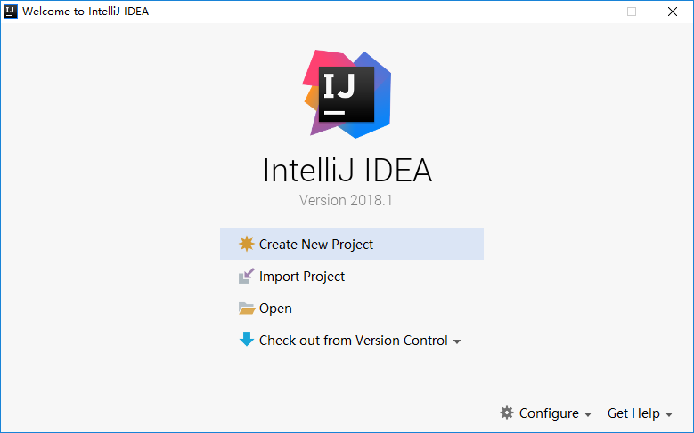

# maven 使用说明
## 概述
Maven 是一个项目管理和综合工具。Maven 提供了开发人员构建一个完整的生命周期框架。开发团队可以自动完成项目的基础工具建设，Maven 使用标准的目录结构和默认构建生命周期。

在多个开发团队环境时，Maven 可以设置按标准在非常短的时间里完成配置工作。由于大部分项目的设置都很简单，并且可重复使用，Maven 让开发人员的工作更轻松，同时创建报表，检查，构建和测试自动化设置。

Maven 提供了开发人员的方式来管理：

- Builds
- Documentation
- Reporting
- Dependencies
- SCMs
- Releases
- Distribution
- mailing list
概括地说，Maven 简化和标准化项目建设过程。处理编译，分配，文档，团队协作和其他任务的无缝连接。 Maven 增加可重用性并负责建立相关的任务。

## Maven 安装配置
### 概述
想要安装 Apache Maven 在 Windows 系统上, 需要下载 Maven 的 zip 文件，并将其解压到你想安装的目录，并配置 Windows 环境变量。

> 注意：请尽量使用 JDK 1.8 及以上版本

### JDK 和 JAVA_HOME
确保已安装 `JDK`，并设置 `JAVA_HOME` 环境变量到 `Windows` 环境变量。

### 下载 Apache Maven
下载地址：http://maven.apache.org/download.cgi

下载 Maven 的 zip 文件，例如： apache-maven-3.5.2-bin.zip，将它解压到你要安装 Maven 的文件夹。假设你解压缩到文件夹 – D:\apache-maven-3.5.2

### 添加 MAVEN_HOME
添加 MAVEN_HOME 环境变量到 Windows 环境变量，并将其指向你的 Maven 文件夹。

### 添加到环境变量 - PATH
### 验证
使用命令：mvn -version

输出：
```
C:\Users\Lusifer>mvn -version
Apache Maven 3.5.2 (138edd61fd100ec658bfa2d307c43b76940a5d7d; 2017-10-18T15:58:13+08:00)
Maven home: D:\apache-maven-3.5.2\bin\..
Java version: 1.8.0_152, vendor: Oracle Corporation
Java home: C:\Program Files\Java\jdk1.8.0_152\jre
Default locale: zh_CN, platform encoding: GBK
OS name: "windows 10", version: "10.0", arch: "amd64", family: "windows"
```
## Maven 本地仓库
### 概述
Maven 的本地资源库是用来存储所有项目的依赖关系(插件 Jar 和其他文件，这些文件被 Maven 下载)到本地文件夹。很简单，当你建立一个 Maven 项目，所有相关文件将被存储在你的 Maven 本地仓库。

默认情况下，Maven 的本地资源库默认为 `.m2` 目录文件夹：
- Unix/Mac OS X：`~/.m2`
- Windows：`C:\Documents and Settings\{your-username}\.m2`

通常情况下，可改变默认的 `.m2` 目录下的默认本地存储库文件夹到其他更有意义的名称，例如， `maven-repo` 找到 `{M2_HOME}\conf\setting.xml`, 更新 `localRepository` 到其它名称。

执行之后，新的 Maven 本地存储库现在改为 D:/apache-maven-3.5.2/repo