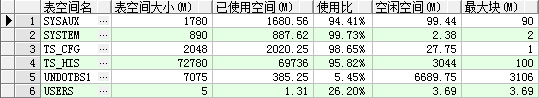
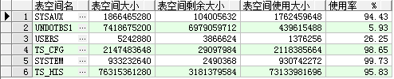
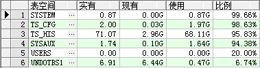

# Oracle 表空间查看

## 1、查看表空间的名称及大小
```
SELECT t.tablespace_name, round(SUM(bytes / (1024 * 1024)), 0) ts_size
FROM dba_tablespaces t, dba_data_files d
WHERE t.tablespace_name = d.tablespace_name
GROUP BY t.tablespace_name;
```


## 2、查看表空间物理文件的名称及大小
```
SELECT tablespace_name,
file_id,
file_name,
round(bytes / (1024 * 1024), 0) total_space
FROM dba_data_files
ORDER BY tablespace_name;
```


## 3、查看回滚段名称及大小

```
SELECT segment_name,
tablespace_name,
r.status,
(initial_extent / 1024) initialextent,
(next_extent / 1024) nextextent,
max_extents,
v.curext curextent
FROM dba_rollback_segs r, v$rollstat v
WHERE r.segment_id = v.usn(+)
ORDER BY segment_name;
```

## 4、查看控制文件
```
SELECT NAME FROM v$controlfile;
```


## 5、查看日志文件
```
SELECT MEMBER FROM v$logfile;
```


## 6、查看表空间的使用情况

```
SELECT SUM(bytes) / (1024 * 1024) AS free_space, tablespace_name
FROM dba_free_space
GROUP BY tablespace_name;
SELECT a.tablespace_name,
a.bytes total,
b.bytes used,
c.bytes free,
(b.bytes * 100) / a.bytes "% USED ",
(c.bytes * 100) / a.bytes "% FREE "
FROM sys.sm$ts_avail a, sys.sm$ts_used b, sys.sm$ts_free c
WHERE a.tablespace_name = b.tablespace_name
AND a.tablespace_name = c.tablespace_name;
```


## 7、查看数据库库对象

```
SELECT owner, object_type, status, COUNT(*) count#
FROM all_objects
GROUP BY owner, object_type, status;
```


## 8、查看数据库的版本　

```
SELECT version
FROM product_component_version
WHERE substr(product, 1, 6) = 'Oracle';
```


## 9、查看数据库的创建日期和归档方式

```
SELECT created, log_mode, log_mode FROM v$database;

--1G=1024MB
--1M=1024KB
--1K=1024Bytes
--1M=11048576Bytes
--1G=1024*11048576Bytes=11313741824Bytes
SELECT a.tablespace_name "表空间名",
total "表空间大小",
free "表空间剩余大小",
(total - free) "表空间使用大小",
total / (1024 * 1024 * 1024) "表空间大小(G)",
free / (1024 * 1024 * 1024) "表空间剩余大小(G)",
(total - free) / (1024 * 1024 * 1024) "表空间使用大小(G)",
round((total - free) / total, 4) * 100 "使用率 %"
FROM (SELECT tablespace_name, SUM(bytes) free
FROM dba_free_space
GROUP BY tablespace_name) a,
(SELECT tablespace_name, SUM(bytes) total
FROM dba_data_files
GROUP BY tablespace_name) b
WHERE a.tablespace_name = b.tablespace_name 
```


### 参考1


```
--查询表空间使用情况
SELECT Upper(F.TABLESPACE_NAME)         "表空间名",
       D.TOT_GROOTTE_MB                 "表空间大小(M)",
       D.TOT_GROOTTE_MB - F.TOTAL_BYTES "已使用空间(M)",
       To_char(Round(( D.TOT_GROOTTE_MB - F.TOTAL_BYTES ) / D.TOT_GROOTTE_MB * 100, 2), '990.99')
       || '%'                           "使用比",
       F.TOTAL_BYTES                    "空闲空间(M)",
       F.MAX_BYTES                      "最大块(M)"
FROM   (SELECT TABLESPACE_NAME,
               Round(Sum(BYTES) / ( 1024 * 1024 ), 2) TOTAL_BYTES,
               Round(Max(BYTES) / ( 1024 * 1024 ), 2) MAX_BYTES
        FROM   SYS.DBA_FREE_SPACE
        GROUP  BY TABLESPACE_NAME) F,
       (SELECT DD.TABLESPACE_NAME,
               Round(Sum(DD.BYTES) / ( 1024 * 1024 ), 2) TOT_GROOTTE_MB
        FROM   SYS.DBA_DATA_FILES DD
        GROUP  BY DD.TABLESPACE_NAME) D
WHERE  D.TABLESPACE_NAME = F.TABLESPACE_NAME
ORDER  BY 1

--查询表空间的free space
select tablespace_name, count(*) AS extends,round(sum(bytes) / 1024 / 1024, 2) AS MB,sum(blocks) AS blocks from dba_free_space group BY tablespace_name;

--查询表空间的总容量
select tablespace_name, sum(bytes) / 1024 / 1024 as MB from dba_data_files group by tablespace_name;
--查询表空间使用率
SELECT total.tablespace_name,
       Round(total.MB, 2)           AS Total_MB,
       Round(total.MB - free.MB, 2) AS Used_MB,
       Round(( 1 - free.MB / total.MB ) * 100, 2)
       || '%'                       AS Used_Pct
FROM   (SELECT tablespace_name,
               Sum(bytes) / 1024 / 1024 AS MB
        FROM   dba_free_space
        GROUP  BY tablespace_name) free,
       (SELECT tablespace_name,
               Sum(bytes) / 1024 / 1024 AS MB
        FROM   dba_data_files
        GROUP  BY tablespace_name) total
WHERE  free.tablespace_name = total.tablespace_name;
```


上述语句查询结果如下图所示：



 

### 参考2：


```
SELECT a.tablespace_name                        "表空间名",
       total                                    "表空间大小",
       free                                     "表空间剩余大小",
       ( total - free )                         "表空间使用大小",
       Round(( total - free ) / total, 4) * 100 "使用率   %"
FROM   (SELECT tablespace_name,
               Sum(bytes) free
        FROM   DBA_FREE_SPACE
        GROUP  BY tablespace_name) a,
       (SELECT tablespace_name,
               Sum(bytes) total
        FROM   DBA_DATA_FILES
        GROUP  BY tablespace_name) b
WHERE  a.tablespace_name = b.tablespace_name
```


查询结果



 

### 参考3


```
SELECT TABLESPACE_NAME "表空间",
       To_char(Round(BYTES / 1024, 2), '99990.00')
       || ''           "实有",
       To_char(Round(FREE / 1024, 2), '99990.00')
       || 'G'          "现有",
       To_char(Round(( BYTES - FREE ) / 1024, 2), '99990.00')
       || 'G'          "使用",
       To_char(Round(10000 * USED / BYTES) / 100, '99990.00')
       || '%'          "比例"
FROM   (SELECT A.TABLESPACE_NAME                             TABLESPACE_NAME,
               Floor(A.BYTES / ( 1024 * 1024 ))              BYTES,
               Floor(B.FREE / ( 1024 * 1024 ))               FREE,
               Floor(( A.BYTES - B.FREE ) / ( 1024 * 1024 )) USED
        FROM   (SELECT TABLESPACE_NAME TABLESPACE_NAME,
                       Sum(BYTES)      BYTES
                FROM   DBA_DATA_FILES
                GROUP  BY TABLESPACE_NAME) A,
               (SELECT TABLESPACE_NAME TABLESPACE_NAME,
                       Sum(BYTES)      FREE
                FROM   DBA_FREE_SPACE
                GROUP  BY TABLESPACE_NAME) B
        WHERE  A.TABLESPACE_NAME = B.TABLESPACE_NAME)
--WHERE TABLESPACE_NAME LIKE 'CDR%' --这一句用于指定表空间名称
ORDER  BY Floor(10000 * USED / BYTES) DESC;
```


查询结果



 

 


```
select tablespace_name,
       max_gb,
       used_gb,
       round(100 * used_gb / max_gb) pct_used
  from (select a.tablespace_name tablespace_name,
               round((a.bytes_alloc - nvl(b.bytes_free, 0)) / power(2, 30),
                     2) used_gb,
               round(a.maxbytes / power(2, 30), 2) max_gb
          from (select f.tablespace_name,
                       sum(f.bytes) bytes_alloc,
                       sum(decode(f.autoextensible,
                                  'YES',
                                  f.maxbytes,
                                  'NO',
                                  f.bytes)) maxbytes
                  from dba_data_files f
                 group by tablespace_name) a,
               (select f.tablespace_name, sum(f.bytes) bytes_free
                  from dba_free_space f
                 group by tablespace_name) b
         where a.tablespace_name = b.tablespace_name(+)
        union all
        select h.tablespace_name tablespace_name,
               round(sum(nvl(p.bytes_used, 0)) / power(2, 30), 2) used_gb,
               round(sum(decode(f.autoextensible,
                                'YES',
                                f.maxbytes,
                                'NO',
                                f.bytes)) / power(2, 30),
                     2) max_gb
          from v$temp_space_header h, v$temp_extent_pool p, dba_temp_files f
         where p.file_id(+) = h.file_id
           and p.tablespace_name(+) = h.tablespace_name
           and f.file_id = h.file_id
           and f.tablespace_name = h.tablespace_name
         group by h.tablespace_name)
order by 4;
```

