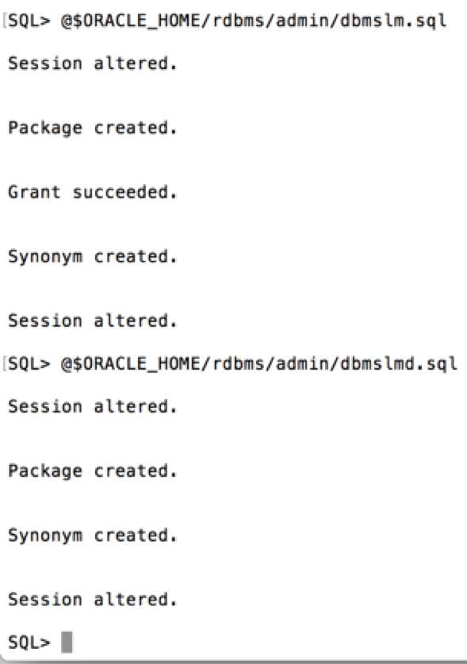
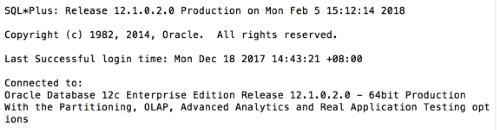
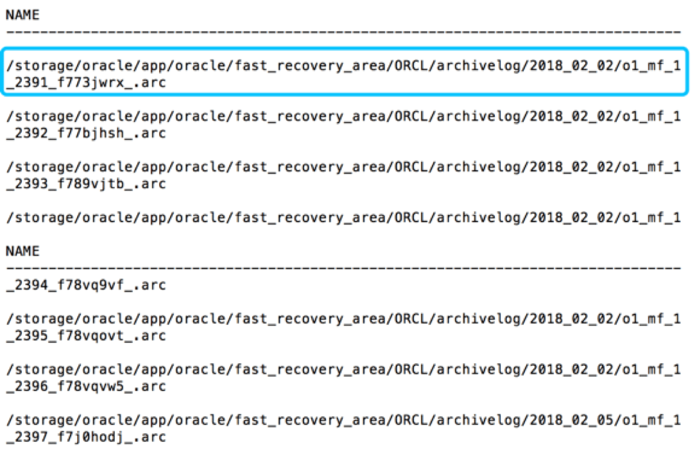
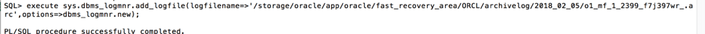
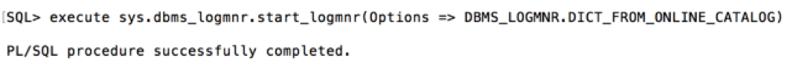
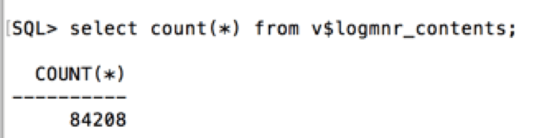

# **Oracle 配置 LOGMINER**

## 一、通过logminer我们可以实现：

1、确定数据的逻辑损坏的时间；

2、跟踪用户执行的事务变化操作；

3、跟踪表的DML操作；

## 二、 Logminer 安装步骤：

**最好由DBA\**\**工程师操作：**

> 命令行登录  
>
> sqlplus 
>
> sys as sysdba
>
> oracle

#### **1.开启归档日志，以下操作风险较大，请联系\**\*\*DBA\*\**\*工程师依次操作下列语句，开启数据库归档。**

a. shutdown immediate;

b. startup mount;

c. alter database archivelog;

d. alter database open;

#### **2**.**依次执行以下脚本**：（**最好由\**\*\*DBA\*\**\*操作，需要权限**）

a. 输入 @$ORACLE_HOME/rdbms/admin/dbmslm.sql

b. 输入 @$ORACLE_HOME/rdbms/admin/dbmslmd.sql

c. 输入 @$ORACLE_HOME/rdbms/admin/dbmslms.sql

（注意：Oracle12c经典安装中只有前两个，但并不影响使用）

#### **3. 打开终端，连接服务器后输入「 su - oracle」切换至Oracle用户**

#### **4.输入 「sqlplus dp_test/oracle」 使用dp_test用户进入数据库（使用LOGMNR推荐使用sys用户[如需使用其他用户需要dba权限]）**

a. 当看到「Conneted to: Oracle Database...」时即表示已经登陆成功，此时终端开头会变为「SQL

b. 若使用sys以外的用户，进行后续操作前请联系DBA工程师赋予「grant EXECUTE_CATALOG_ROLE,DBA to user;」权限

#### **5.Logminer需要开启全字段日志补全功能（suppplemental logging，\**表级\****/***\*列级\**），能够补全数据库日志信息，保证传递信息的全面性。（此操作会增加Oracle数据库的日志量）**

a.输入「**ALTER DATABASE ADD SUPPLEMENTAL LOG DATA;**」

b.输入「**ALTER DATABASE ADD SUPPLEMENTAL LOG DATA(ALL,PRIMARY KEY,UNIQUE) COLUMNS;**」

c.输入「SELECT supplemental_log_data_min min, supplemental_log_data_pk pk, supplemental_log_data_ui ui, supplemental_log_data_fk fk, supplemental_log_data_all allc FROM v$database;」

SQL> SELECT supplemental_log_data_min min, supplemental_log_data_pk pk, supplemental_log_data_ui ui, supplemental_log_data_fk fk, supplemental_log_data_all allc FROM v$database;

MIN PK  UI  FK  ALL

-------- --- --- --- ---

YES YES YES NO  YES

d.当看到如上图所示内容时，表示已经成功。

## 三. 存在的影响：

1、对Oracle执行用户的权限依赖较高，官方推荐使用sys用户；

2、较为依赖归档日志，启用归档日志和加强日志类型后，Oracle会产生大于非归档模式下数倍的日志量，对存储空间的使用较多。但如果不使用归档日志则只能使用联机日志文件，当联机日志文件轮询较快时容易发生数据覆盖，导致数据丢失，另外过于频繁的联机日志文件的轮询会产生Oracle数据库log file sync事件，从而影响数据库服务器的IO，当应用调用Logmnr工具使用联机日志文件时还易引发服务器网络性能下降；

3、较为依赖固定的数据字典信息，使用Logmnr适用于数据字典变化较少的情形下，当Oracle数据字典发生改变则需要重新执行Logmnr配置流程。

## 四、测试logmnr

1. 在登陆用户条件下输入「select name from V$ARCHIVED_LOG;」
   a. 
   
   b. 找到archive log file
   c. 上图中蓝框内容archive log file
2. 任意一个archive log file作为logmnr测试分析使用
   a. 复制archive log file路径
   b. 输入 「execute sys.dbms_logmnr.add_logfile(logfilename=>'此处输入路径',options=>dbms_logmnr.new);」
   
   c. 输入「execute sys.dbms_logmnr.start_logmnr(Options => DBMS_LOGMNR.DICT_FROM_ONLINE_CATALOG)」
   
   d. 输入「select count(*) from v$logmnr_contents;」解析日志记录条数
   
   e. 当看到数字时，即表示logmnr已经成功部署并且可以正常使用

## 五. 赋权语句

grant select any transaction to dp_test;

grant execute on dbms_logmnr_d to dp_test;

grant execute on dbms_logmnr to dp_test;

grant execute on dbms_flashback to dp_test;

grant create session to dp_test;

grant resource to dp_test;

grant select any dictionary to dp_test;

grant flashback any table to dp_test;

grant execute_catalog_role to dp_test;

grant select any table to dp_test;

grant LOGMINING to dp_test;（12g 下执行）

## 六. 强制切换归档日志命令

alter system switch logfile;

## 七.（不用修改以下设置）

**设置\**\*\*LogMiner\*\**\*日志切换时间，默认\**\**0s**
**alter system set archive_lag_target = 60 scope=spfile;****重启生效**!
**alter system set archive_lag_target = 60 scope=both;****临时生效**