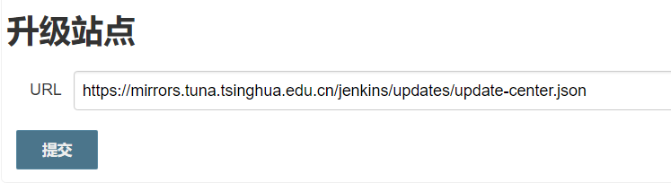

# 实战Jenkins

```
version: '3.7'
services:
  webjenkins:
    container_name: webjenkins
    image: 'jenkins/jenkins:lts'
    restart: always
    environment:
      - TZ=Asia/Shanghai
    ports:
      - '3083:8080'
      - '50001:50000'
    volumes:
      - ./jenkins-data:/var/jenkins_home:z
      - ./jenkins-data/docker.sock:/var/run/docker.sock
    network_mode: "bridge"
```


oracle 账号

```
qqkinger@163.com/32#@EWdscx

```

### 修改Jenkins插件为国内源

首页 --> configure --> Manage Jenkins --> Advanced --> Update Site（页面最下方‘升级站点’）

替换URL为 清华大学仓库地址：

```
https://updates.jenkins.io/update-center.json
改为
https://mirror.tuna.tsinghua.edu.cn/jenkins/updates/update-center.json
```

### 1、告诉jenkins 我哪些插件需要更新

jenkins插件清华大学镜像地址
https://mirrors.tuna.tsinghua.edu.cn/jenkins/updates/update-center.json

1.进入jenkins系统管理
2.进入插件管理（Manage Plugins）——高级——升级站点



### 2、欺骗jenkins 我要去清华真实下载插件

绑定 mirrors.jenkins-ci.org host 到本机

$ grep jenkins /etc/hosts
\### jenkins ###
127.0.0.1 mirrors.jenkins-ci.org

nginx反向代理到清华

\# root @ web-devops-01 in /usr/local/nginx/conf/vhost [23:32:55]
$ cat mirrors.jenkins-ci.org.conf
server
  {
    listen 80;
    server_name mirrors.jenkins-ci.org;

​    location / {
​      proxy_redirect off;
​      proxy_pass https://mirrors.tuna.tsinghua.edu.cn/jenkins/;
​      proxy_set_header X-Real-IP $remote_addr;
​      proxy_set_header X-Forwarded-For $proxy_add_x_forwarded_for;
​      proxy_set_header Accept-Encoding "";
​      \#proxy_set_header User-Agent "Mozilla/5.0 (Windows NT 6.1; WOW64) AppleWebKit/537.36 (KHTML, like Gecko) Chrome/36.0.1985.49 Safari/537.36";
​      proxy_set_header Accept-Language "zh-CN";
​    }
​    index index.html index.htm index.php;

​    \#error_page  404  /404.html;

​    location ~ /\.
​    {
​      deny all;
​    }

​    access_log  /data/weblog/xx.access.log;
​    error_log  /data/weblog/xx.error.log;
  }

## 其他做法

不推荐，维护困难。

直接把步骤1的地址下载下来放到本地，修改里面的地址，然后本地启动个服务跑起来，在升级站点写成自己网站的json文件。 打开 https://mirrors.tuna.tsinghua.edu.cn/jenkins/updates/update-center.json 发现插件的地址都是外国，只要把外国的地址成功清华对应的地址即可，批量修改。

## 原理

https://mirrors.tuna.tsinghua.edu.cn/jenkins/updates/update-center.json 这个文件里面 包含了所有插件的更新地址 清华把这个文件镜像过来了 ，但是没有把里面的插件升级地址改成清华。 这样只会获取更新信息快，实际下载不快。

```
curl -vvvv  http://updates.jenkins-ci.org/download/plugins/ApicaLoadtest/1.10/ApicaLoadtest.hpi
302到
http://mirrors.jenkins-ci.org/plugins/ApicaLoadtest/1.10/ApicaLoadtest.hpi
又重定向到一个ftp地址分流。

清华的地址是：
https://mirrors.tuna.tsinghua.edu.cn/jenkins/plugins/ApicaLoadtest/1.10/ApicaLoadtest.hpi
只要把mirrors.jenkins-ci.org 代理到 mirrors.tuna.tsinghua.edu.cn/jenkins 即可。
```

按照推荐做法，发现速度太快了，基本上秒下。 网上的大部分教程只做到第一步，设置完了，有时候能加速，有时候不能，这才是真正的最终解决方案。