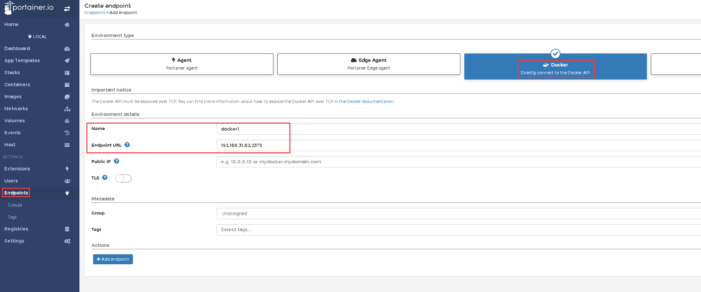

# Portainer docker-编排工具

```
version: '3'
services:
  portainer:
    restart: always
    image: portainer/portainer
    ports:
      - "21999:9000"
    command: "-H unix:///var/run/docker.sock"
    volumes:
      - "/var/run/docker.sock:/var/run/docker.sock"
      - "./data:/data"
    deploy:
      replicas: 1
      restart_policy:
        condition: on-failure
      placement:
        constraints:
          - node.hostname==ods_env00


version: '3'
services:
  portainer:
    restart: always
    image:  portainer/portainer:1.24.1
    ports:
      - "9000:9000"
    command: -H unix:///var/run/docker.sock
    volumes:
      - /var/run/docker.sock:/var/run/docker.sock
      - ./data:/data
      - ./public:/public
```

可以下载[汉化包](https://pan.baidu.com/s/1BLXMSmJFcgESeNMhQL26Mg&shfl=sharepset)（提取码：6vjr）

之后解压，并将解压后的public文件夹

### 多台机器

```
3台机器上都修改 /usr/lib/systemd/system/docker.service
ExecStart= xxxx -H tcp://0.0.0.0:2375 -H unix:///var/run/docker.sock
xxx是代表原有的参数，追加 -H tcp://0.0.0.0:2375 -H unix:///var/run/docker.sock 内容
保存启动文件后重启服务
systemctl daemon-reload
systemctl restart docker
ss -unlpt | grep 2375 检查看是否生效
```

# portainer管理多台docker主机

### 1. portainer管理多台docker主机



### 2. 管理其他docker主机，需要开启docker api

```shell
# vi /usr/lib/systemd/system/docker.service
ExecStart=/usr/bin/dockerd -H tcp://0.0.0.0:2375 -H unix:///var/run/docker.sock
# systemctl restart docker
```