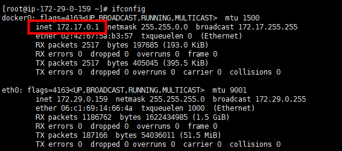
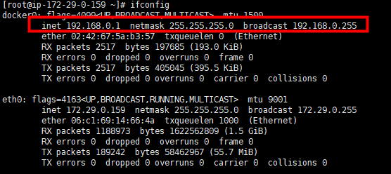

# 修改默认网络段

# **排查心里路程**

1、部署秘密武器之前，可以内外网；部署后，只能外网，看这么个症状就是网络防火墙问题，于是乎~~~

   1）iptables -F

   2）setenforce 0

   3）在AWS上把此服务器的安全组入站0.0.0.0（这纯粹是为了测试，正式环境千万别~~~）

 

2、这ssh不通难道是ssh的配置文件修改了，因为改了端口，难道ssh的配置文件里有控制内外网是否可以登录的配置？于是乎~~~

   vim /etc/ssh/sshd_config  一顿瞎改（这里就体现了对ssh的认识不足，对配置文件不熟悉，得学习）

 

3、这什么玩意儿，网络是可以的，安全组没问题，不知为什么脑袋里面想到了路由，route -n 先看看，哇~~噢，这么多条路由，看到这些路由的时候，其中有一条172.29.0.0（我们跳板机的网段跟这个很像），就隐隐约约觉得这里有问题（女人的直觉不只在判断男朋友是否在外面有狗，还爱不爱上；在这里直觉也还是挺准，哈哈）；于是乎~~~

   route -n

   route del -net 172.22.32.0 netmask 255.255.255.0

   route del -net 172.23.32.0 netmask 255.255.255.0

   ......

   只要是与容器有关的路由全部干掉，然后再从跳板机去内网ssh登录，哇~~~哇~~~可以了耶，好激动好激动噢~~~~

 

4、确定了，就是那一条路由的问题，这个容器分配的网段与跳板机的网段冲突了，于是乎~~~~

   route add -net 172.22.32.0 netmask 255.255.255.0

   ......

   把刚刚删了的路由除了那一条冲突的，又傻不拉几的加上，接下来就是解决这个问题的时候了

 

 

# **当时的解决办法**

想了想，既然冲突了，那我肯定就是把这个容器的网段给改了，怎么改呢，用了一个及其愚蠢的办法，我把这个容器停掉删除，重新用docker-compose重启启动了一个，就重新分配了一个新的网段，就不冲突了。

 

# **根本解决办法**

在启动容器之前就把整个docker的网络改为与我们自己的网段不冲突的，这样docker永远只分配我们给他设置的

 

操作步骤：修改docker.json，使得整个docker的网络网段都改掉，原来是172网段，现在我要改为192



 

1）vim /etc/docker/daemon.json（这里没有这个文件的话，自行创建）

```
{
    "bip":"192.168.0.1/24"
}
```

 

2）重启docker 

```
systemctl restart docker
```

 

 

3）在重新看网段 



 

**注：**在使用docker容器最初规划的时候就要想到这一点，要规划好使用什么样的网段；上面的这种办法得重启docker，重启容器的；

 

# **疑问**

还没有其他更好的办法呢，在不停止容器不删除容器的前提下，修改网段？（待我研究好了，再来补充）

 

# **总结**

1：对ssh的配置文件不熟悉（这个得找个时间系统的过一遍）

2：对网络这块熟悉，尤其是路由这些，说实在的，到现在还是说不出路由的具体作用，只可意会的那种，只知道没他不行（等这段时间把PMP考完了，开始看思科那几本书，不说考证，先把那几本书好好看看，加强网络）

3：对Docker网络模式不熟悉（接下来这段时间好好看Dokcer网络部分的官方文档）

 

下次再见~~~

 