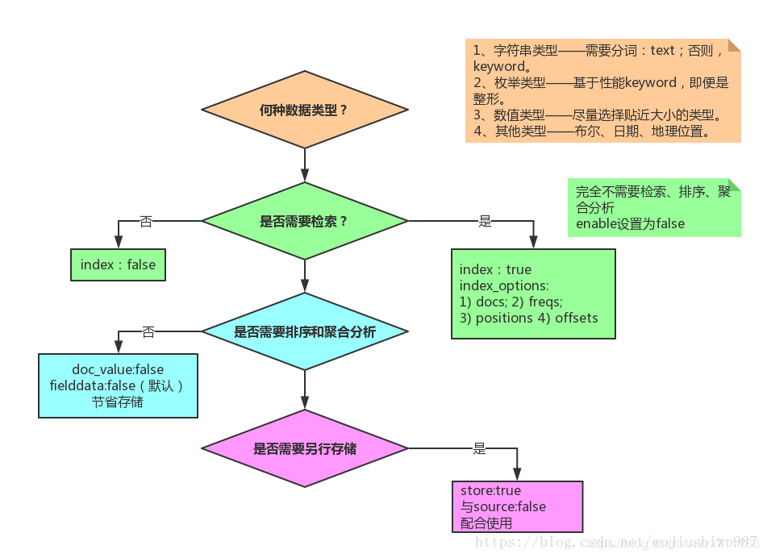

# Elasticsearch数据类型及其属性

#### Elasticsearch数据类型及其属性

**一、数据类型**

##### 字段类型概述

| 一级分类 | 二级分类     | 具体类型                             |
| -------- | :----------- | :----------------------------------- |
| 核心类型 | 字符串类型   | string,text,keyword                  |
| h        | 整数类型     | integer,long,short,byte              |
| h        | 浮点类型     | double,float,half_float,scaled_float |
| h        | 逻辑类型     | boolean                              |
| h        | 日期类型     | date                                 |
| h        | 范围类型     | range                                |
| h        | 二进制类型   | binary                               |
| 复合类型 | 数组类型     | array                                |
| f        | 对象类型     | object                               |
| f        | 嵌套类型     | nested                               |
| 地理类型 | 地理坐标类型 | geo_point                            |
| d        | 地理地图     | geo_shape                            |
| 特殊类型 | IP类型       | ip                                   |
| t        | 范围类型     | completion                           |
| t        | 令牌计数类型 | token_count                          |
| t        | 附件类型     | attachment                           |
| t        | 抽取类型     | percolator                           |

##### 核心类型

- **1、字符串类型**
   　string类型: 在ElasticSearch 旧版本中使用较多，从ElasticSearch 5.x开始不再支持string，由text和keyword类型替代。
   　text 类型：当一个字段是要被全文搜索的，比如Email内容、产品描述，应该使用text类型。设置text类型以后，字段内容会被分析，在生成倒排索引以前，字符串会被分析器分成一个一个词项。text类型的字段不用于排序，很少用于聚合。
   　keyword
   keyword类型适用于索引结构化的字段，比如email地址、主机名、状态码和标签。如果字段需要进行过滤(比如查找已发布博客中status属性为published的文章)、排序、聚合。keyword类型的字段只能通过精确值搜索到。

- **2、整数类型**

  | 类型    |   取值范围   |
  | ------- | :----------: |
  | byte    |   -128~127   |
  | short   | -32768~32767 |
  | integer |  -231~231-1  |
  | short   |  -263~263-1  |

  在满足需求的情况下，尽可能选择范围小的数据类型。比如，某个字段的取值最大值不会超过100，那么选择byte类型即可。迄今为止吉尼斯记录的人类的年龄的最大值为134岁，对于年龄字段，short足矣。字段的长度越短，索引和搜索的效率越高。

- **3、浮点类型**

  | 类型         |          取值范围          |
  | ------------ | :------------------------: |
  | doule        | 64位双精度IEEE 754浮点类型 |
  | float        | 32位单精度IEEE 754浮点类型 |
  | half_float   | 16位半精度IEEE 754浮点类型 |
  | scaled_float |     缩放类型的的浮点数     |

  对于float、half_float和scaled_float,-0.0和+0.0是不同的值，使用term查询查找-0.0不会匹配+0.0，同样range查询中上边界是-0.0不会匹配+0.0，下边界是+0.0不会匹配-0.0。

  其中scaled_float，比如价格只需要精确到分，price为57.34的字段缩放因子为100，存起来就是5734
   优先考虑使用带缩放因子的scaled_float浮点类型。

- **4、date类型**
   日期类型表示格式可以是以下几种：
   （1）日期格式的字符串，比如 “2018-01-13” 或 “2018-01-13 12:10:30”
   （2）long类型的毫秒数( milliseconds-since-the-epoch，epoch就是指UNIX诞生的UTC时间1970年1月1日0时0分0秒)
   （3）integer的秒数(seconds-since-the-epoch)

- 5、boolean类型　true和false

- **6、 binary类型**
   　进制字段是指用base64来表示索引中存储的二进制数据，可用来存储二进制形式的数据，例如图像。默认情况下，该类型的字段只存储不索引。二进制类型只支持index_name属性。

- **7、array类型**
   （1）字符数组: [ “one”, “two” ]
   （2）整数数组: productid:[ 1, 2 ]
   （3）对象（文档）数组: “user”:[ { “name”: “Mary”, “age”: 12 }, { “name”: “John”, “age”: 10 }]，
   注意：lasticSearch不支持元素为多个数据类型：[ 10, “some string” ]

- **8、 object类型**
   JSON对象，文档会包含嵌套的对象

- **9、ip类型**
   p类型的字段用于存储IPv4或者IPv6的地址

#### 二、Mapping 支持属性

- 1、enabled：仅存储、不做搜索和聚合分析

  

  ```bash
    "enabled":true （缺省）| false
  ```

- 2、index：是否构建倒排索引（即是否分词，设置false，字段将不会被索引）

  

  ```bash
        "index": true（缺省）| false
  ```

- 3、index_option：存储倒排索引的哪些信息

  

  ```bash
    4个可选参数：
        docs：索引文档号
        freqs：文档号+词频
        positions：文档号+词频+位置，通常用来距离查询
        offsets：文档号+词频+位置+偏移量，通常被使用在高亮字段
    分词字段默认是positions，其他默认时docs
    
    "index_options": "docs"
  ```

- 4、norms：是否归一化相关参数、如果字段仅用于过滤和聚合分析、可关闭
   分词字段默认配置，不分词字段：默认{“enable”: false}，存储长度因子和索引时boost，建议对需要参加评分字段使用，会额外增加内存消耗

  

  ```bash
    "norms": {"enable": true, "loading": "lazy"}
  ```

- 5、doc_value：是否开启doc_value，用户聚合和排序分析
   对not_analyzed字段，默认都是开启，分词字段不能使用，对排序和聚合能提升较大性能，节约内存

  

  ```bash
    "doc_value": true（缺省）| false
  ```

- 6、fielddata：是否为text类型启动fielddata，实现排序和聚合分析
   针对分词字段，参与排序或聚合时能提高性能，不分词字段统一建议使用doc_value

  

  ```bash
    "fielddata": {"format": "disabled"}
  ```

- 7、store：是否单独设置此字段的是否存储而从_source字段中分离，只能搜索，不能获取值

  

  ```bash
    "store": false（默认）| true
  ```

- 8、coerce：是否开启自动数据类型转换功能，比如：字符串转数字，浮点转整型

  

  ```bash
    "coerce: true（缺省）| false"
  ```

- 9、multifields：灵活使用多字段解决多样的业务需求

- 11、dynamic：控制mapping的自动更新

  

  ```ruby
    "dynamic": true（缺省）| false | strict
  ```

1

- 12、data_detection：是否自动识别日期类型

  

  ```bash
    "data_detection"：true（缺省）| false
  ```

[dynamic和data_detection的详解：Elasticsearch dynamic mapping（动态映射） 策略](https://blog.csdn.net/zx711166/article/details/82427837/).

- 13、analyzer：指定分词器，默认分词器为standard analyzer

  

  ```bash
    "analyzer": "ik"
  ```

- 14、boost：字段级别的分数加权，默认值是1.0

  

  ```bash
    "boost": 1.23
  ```

- 15、fields：可以对一个字段提供多种索引模式，同一个字段的值，一个分词，一个不分词

  

  ```bash
    "fields": {"raw": {"type": "string", "index": "not_analyzed"}}
  ```

- 16、ignore_above：超过100个字符的文本，将会被忽略，不被索引

  

  ```bash
    "ignore_above": 100
  ```

- 17、include_in_all：设置是否此字段包含在_all字段中，默认时true，除非index设置成no

  

  ```bash
    "include_in_all": true
  ```

- 18、null_value：设置一些缺失字段的初始化，只有string可以使用，分词字段的null值也会被分词

  

  ```bash
    "null_value": "NULL"
  ```

- 19、position_increament_gap：影响距离查询或近似查询，可以设置在多值字段的数据上或分词字段上，查询时可以指定slop间隔，默认值时100

  

  ```bash
    "position_increament_gap": 0
  ```

- 20、search_analyzer：设置搜索时的分词器，默认跟analyzer是一致的，比如index时用standard+ngram，搜索时用standard用来完成自动提示功能

  

  ```bash
    "search_analyzer": "ik"
  ```

- 21、similarity：默认时TF/IDF算法，指定一个字段评分策略，仅仅对字符串型和分词类型有效

  

  ```bash
    "similarity": "BM25"
  ```

- 22、trem_vector：默认不存储向量信息，支持参数yes（term存储），with_positions（term+位置），with_offsets（term+偏移量），with_positions_offsets（term+位置+偏移量）对快速高亮fast vector highlighter能提升性能，但开启又会加大索引体积，不适合大数据量用

  

  ```bash
    "trem_vector": "no"
  ```

#### 三、Mapping 字段设置流程



