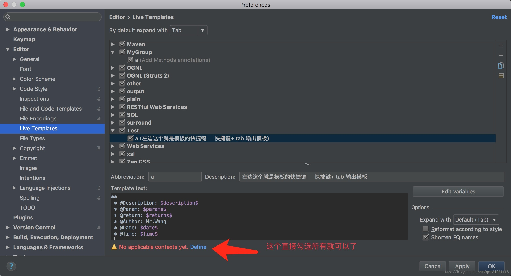

# idea 注释模板
## 生成类注释
### 打开Preferences
`Editor` -> `File and Code Templates` ->` Files` -> `Class`


效果图


```
/**
  *@description ${description}
  *@author lamb
  *@date ${DATE} ${TIME}
  *@version V1.0
  *@see ${PACKAGE_NAME}
  **/
```


网上很多都是在Includes的File Header里面添加，在这里面添加还需要自己去移动下鼠标，然后再去操作键盘，再去写description，，直接在创建类的时候就添加好description不更快吗？

在此添加的话你每次创建类的时候会弹两次框，第二次是让你输入description的内容了，so, 这就是最优的方法
同理，也可以在这儿为你的Interface，Enum添加上注释
————————————————

1. **在此添加的话你每次创建类的时候会弹两次框，第二次是让你输入description的内容了**，so, 这就是最优的方法
2. 同理，也可以在这儿为你的Interface，Enum添加上注释

打开Idea，依次选择 `File`--> `Settings` --> `live templates`


点击最右侧的『+』号按钮，添加一个模板组 `Template group`，这里组名我们填写myGroup，这样就完成了一个模板组的创建，接下来我们将在这个模板组下创建类注释及方法注释模板 `live template`


## 配置类注释模板
选中模板组myGroup，在最右侧单击『+』号按钮，添加 `Live Template`，输入模板基础信息（模板名称填写ccmt，模板介绍填写类注释模板），填写完成后单击第二张图片箭头指向处设置要针对的语言（这里我们只选择了Java和JavaScript）


在如下方框内输入模板内容：
```
/**
 * @Description:    
 * @Author:         leizhenjie
 * @CreateDate:     $DATE$ $TIME$
 * @UpdateUser:     leizhenjie
 * @UpdateDate:     $DATE$ $TIME$
 * @UpdateRemark:   
 * @Version:        1.0
 */
```
$\color{red}{注意：可以根据需要设置更多变量，在接下来的步骤中给设置的变量配置相应的取值函数}$

单击 `Edit Variables` 编辑变量，分别给上面的两个变量Date、Time设置取值函数date(),time(),methodParameters(),methodReturnType()，设置完成后单击 `OK` 保存。



### 打开Java文件，在Java类上面输入ccmt后按下回车键即可快速添加类注释模板


## 添加方法注释模板
参照 `配置类注释模板` ,添加方法注释模板，模板名称为mcmt，模板内容为:

```
/**
 * 
 * @author      leizhenjie
 $param$
 * @return      $return$
 * @exception   $exception$
 * @date        $date$ $time$
 */
```


点击上图的 `Edit Variables` 编辑变量，其中

param中填写Groovy脚本：
```
groovyScript("if(\"${_1}\".length() == 2) {return '';} else {def result=''; def params=\"${_1}\".replaceAll('[\\\\[|\\\\]|\\\\s]', '').split(',').toList();for(i = 0; i < params.size(); i++) {if(i<(params.size()-1)){result+=' * @param ' + params[i] + ' : ' + '\\n'}else{result+=' * @param ' + params[i] + ' : '}}; return result;}", methodParameters());
```
其他变量则从下拉框中直接选择下图对应的即可。


完成上面的模板配置后，在如下方法上面输入mcmt，然后按下Tab键或回车键就可以看到生成的方法注释喽！


