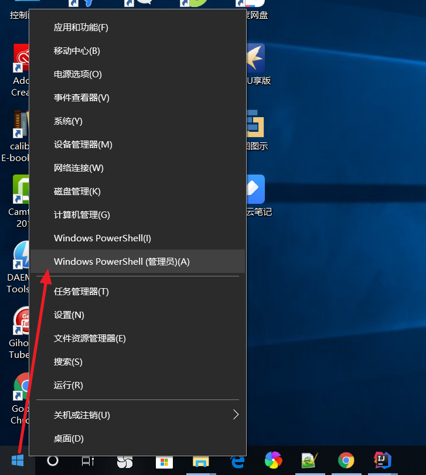
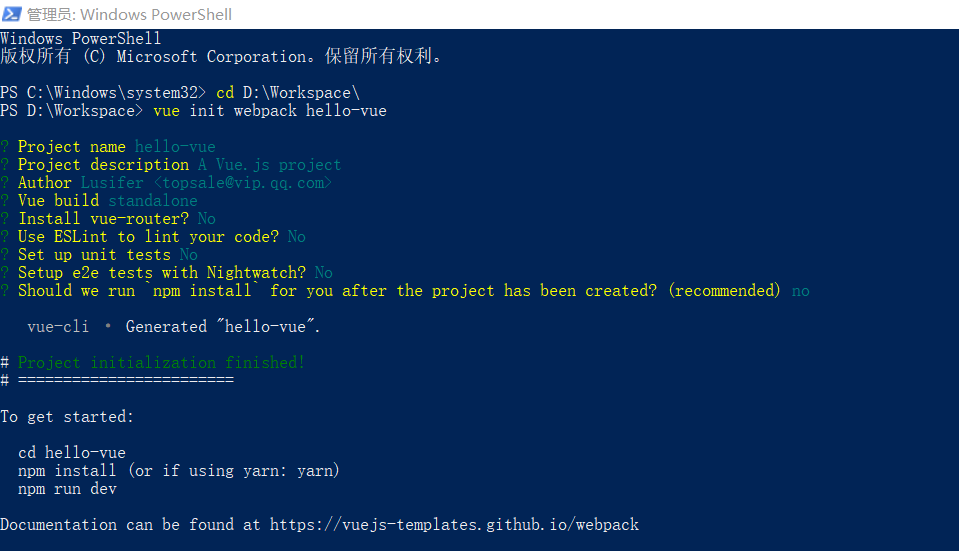

# 第一个 Vue 工程项目

## 概述

从本章节开始，我们采用实战教学模式并结合 [**ElementUI**](http://element-cn.eleme.io/#/zh-CN) 组件库，将所需知识点应用到实际中，以最快速度带领大家掌握 Vue 的使用

## 创建工程

> 使用 NPM 安装相关组件依赖时可能会遇到权限问题，此时使用 PowerShell 管理员模式运行即可；开始菜单 -> 鼠标右击 -> Windows PowerShell (管理员)



创建一个名为 `hello-vue` 的工程

```bash
# 使用 webpack 打包工具初始化一个名为 hello-vue 的工程
vue init webpack hello-vue
```




## 安装依赖

我们需要安装 `vue-router`、`element-ui`、`sass-loader` 和 `node-sass` 四个插件

```bash
# 进入工程目录
cd hello-vue
# 安装 vue-router
npm install vue-router --save-dev
# 安装 element-ui
npm i element-ui -S
# 安装 SASS 加载器
npm install sass-loader node-sass --save-dev
```


```bash
# 安装依赖
npm install
```


## 启动工程

```bash
npm run dev
```


## 运行效果

在浏览器打开  你会看到如下效果


## 附：NPM 相关命令说明

- `npm install moduleName`：安装模块到项目目录下
- `npm install -g moduleName`：-g 的意思是将模块安装到全局，具体安装到磁盘哪个位置，要看 npm config prefix 的位置
- `npm install -save moduleName`：--save 的意思是将模块安装到项目目录下，并在 package 文件的 dependencies 节点写入依赖，`-S` 为该命令的缩写
- `npm install -save-dev moduleName`：--save-dev 的意思是将模块安装到项目目录下，并在 package 文件的 devDependencies 节点写入依赖，`-D` 为该命令的缩写