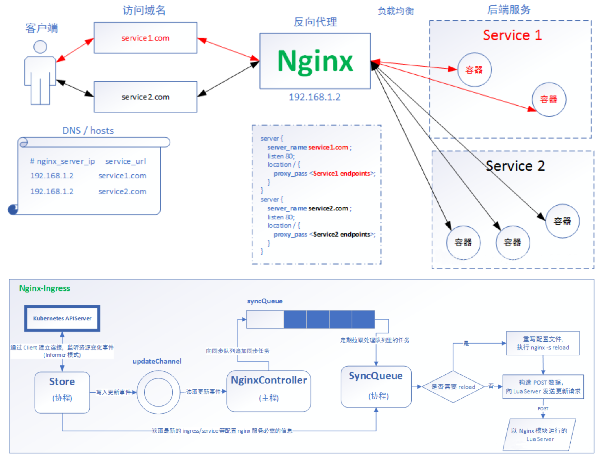

# ingress 操作实例

### 资料信息

Ingress-Nginx github 地址:https://github.com/kubernetes/ingress-nginx

Ingress-Nginx 官方网站:https://kubernetes.github.io/ingress-nginx/



### 安装ingress

```
kubectl apply -f https://raw.githubusercontent.com/kubernetes/ingress-nginx/controller-0.25.0/deploy/static/provider/cloud/deploy.yaml
## 翻墙下载
docker  pull quay.io/kubernetes-ingress-controller/nginx-ingress-controller:0.32.0
docker save -o ingress.contr.tar quay.io/kubernetes-ingress-controller/nginx-ingress-controller:0.32.0
docker load -i ingress.contr.tar
scp ingress.contr.tar root@k8s-node01:/root/
scp ingress.contr.tar root@k8s-node02:/root/


kubectl apply -f deploy.yaml

kubectl get pod -n ingress-nginx


kubectl apply -f https://raw.githubusercontent.com/kubernetes/ingress-nginx/controller-0.32.0/deploy/static/provider/baremetal/deploy.yaml

```


### 部署 Ingress-Nginx

```
kubectl  apply -f mandatory.yaml
kubectl  apply -f service-nodeport.yaml
```

### Ingress HTTP 代理访问

#### deployment、Service、Ingress Yaml 文件

```
apiVersion: extensions/v1beta1
kind: Deployment
metadata:
  name: nginx-dm
spec:
  replicas: 2
  template:
    metadata:
      labels:
        name: nginx
    spec:
      containers:
        - name: nginx
          image: wangyanglinux/myapp:v1
          imagePullPolicy: IfNotPresent
          ports:
            - containerPort: 80
---
apiVersion: v1
kind: Service
metadata:
  name: nginx-svc
spec:
  ports:
    - port: 80
      targetPort: 80
      protocol: TCP
  selector:
    name: nginx
---
apiVersion: extensions/v1beta1
kind: Ingress
metadata:
  name: nginx-test
spec:
  rules:
    - host: www1.a.com
      http: 
        paths:
        - path: /
          backend:
            serviceName: nginx-svc
            servicePort: 80
```

```
kubectl get pod -o wide
kubectl get pod -n ingress-nginx
kubectl exec ingress-nginx-controller-5575c6cd9d-8lc8m -n ingress-nginx -it -- /bin/bash


```


### Ingress HTTPS 代理访问

#### 创建证书，以及 cert 存储方式

```
openssl req -x509 -sha256 -nodes -days 365 -newkey rsa:2048 -keyout tls.key -out tls.crt -subj "/CN=nginxsvc/O=nginxsvc"
kubectl create secret tls tls-secret --key tls.key --cert tls.crt
```

#### deployment、Service、Ingress Yaml 文件

```
apiVersion: extensions/v1beta1
kind: Ingress
metadata:
  name: https
spec:
  tls:
    - hosts:
      - www3.a.com
      secretName: tls-secret
  rules:
    - host: www3.a.com
      http:
        paths:
        - path: /
          backend:
            serviceName: svc3
            servicePort: 80
```

```
kubectl get pod -o wide
kubectl get pod -n ingress-nginx
kubectl exec ingress-nginx-controller-5575c6cd9d-8lc8m -n ingress-nginx -it -- /bin/bash

```


### Nginx 进行 BasicAuth

```
yum -y install httpd
htpasswd -c auth foo
kubectl create secret generic basic-auth --from-file=auth

```

```
apiVersion: extensions/v1beta1
kind: Ingress
metadata:
  name: ingress-with-auth
  annotations:
    nginx.ingress.kubernetes.io/auth-type: basic
    nginx.ingress.kubernetes.io/auth-secret: basic-auth
    nginx.ingress.kubernetes.io/auth-realm: 'Authentication Required - foo'
spec: 
  rules:
  - host: www4.a.com
    http:
      paths:
      - path: /
        backend:
          serviceName: svc1
          servicePort: 80
```

### Nginx 进行重写

|名称|描述|值|
| :-------: | :--------: | ---- |
|nginx.ingress.kubernetes.io/rewrite- target|必须重定向流量的目标URI| 串|
|nginx.ingress.kubernetes.io/ssl- redirect| 指示位置部分是否仅可访问SSL(当Ingress包含证书时 默认为True) | 布 尔 |
| nginx.ingress.kubernetes.io/force- ssl-redirect |即使Ingress未启用TLS，也强制重定向到HTTPS | 布 尔 |
|nginx.ingress.kubernetes.io/app- root| 定义Controller必须重定向的应用程序根，如果它在'/'上 下文中  | 串|
|nginx.ingress.kubernetes.io/use- regex|指示Ingress上定义的路径是否使用正则表达式| 布 尔 |

```
apiVersion: extensions/v1beta1
kind: Ingress
metadata:
  name: nginx-test
  annotations:
    nginx.ingress.kubernetes.io/rewrite-target: https://www3.a.com:30317/
spec:
  rules:
  - host: re.a.com
    http: 
      paths:
      - path: /
        backend:
          serviceName: svc1
          servicePort: 80
```

