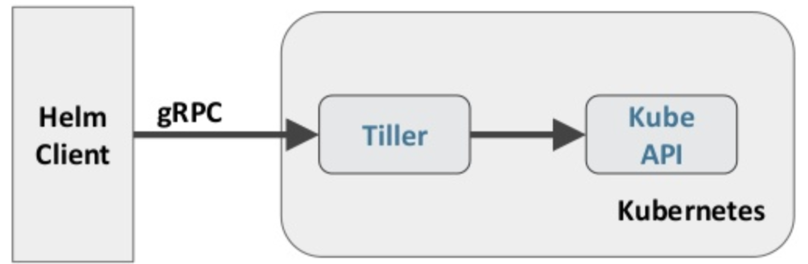

# helm 安装

https://github.com/helm/helm/blob/master/docs/charts.md

## 什么是 Helm

在没使用 helm 之前，向 kubernetes 部署应用，我们要依次部署 deployment、svc 等，步骤较繁琐。况且随 着很多项目微服务化，复杂的应用在容器中部署以及管理显得较为复杂，helm 通过打包的方式，支持发布的版本 管理和控制，很大程度上简化了 Kubernetes 应用的部署和管理

Helm 本质就是让 K8s 的应用管理(Deployment,Service 等 ) 可配置，能动态生成。通过动态生成 K8s 资源清 单文件(deployment.yaml，service.yaml)。然后调用 Kubectl 自动执行 K8s 资源部署

Helm 是官方提供的类似于 YUM 的包管理器，是部署环境的流程封装。Helm 有两个重要的概念:chart 和 release

- chart 是创建一个应用的信息集合，包括各种 Kubernetes 对象的配置模板、参数定义、依赖关系、文档说 明等。chart 是应用部署的自包含逻辑单元。可以将 chart 想象成 apt、yum 中的软件安装包
- release 是 chart 的运行实例，代表了一个正在运行的应用。当 chart 被安装到 Kubernetes 集群，就生成 一个 release。chart 能够多次安装到同一个集群，每次安装都是一个 release

Helm 包含两个组件:Helm 客户端和 Tiller 服务器，如下图所示



Helm 客户端负责 chart 和 release 的创建和管理以及和 Tiller 的交互。Tiller 服务器运行在 Kubernetes 集群 中，它会处理 Helm 客户端的请求，与 Kubernetes API Server 交互

## Helm 部署

越来越多的公司和团队开始使用 Helm 这个 Kubernetes 的包管理器，我们也将使用 Helm 安装 Kubernetes 的常用组件。 Helm 由客户端命 helm 令行工具和服务端 tiller 组成，Helm 的安装十分简单。下载 helm 命令行工具到master 节点 node1 的 /usr/local/bin 下，这里下载的 2.13. 1版本：

```
ntpdate ntp1.aliyun.com
wget https://storage.googleapis.com/kubernetes-helm/helm-v2.13.1-linux-amd64.tar.gz
tar -zxvf helm-v2.13.1-linux-amd64.tar.gz
cd linux-amd64/
cp helm /usr/local/bin/
chmod a+x /usr/local/bin/helm
```

为了安装服务端 tiller，还需要在这台机器上配置好 kubectl 工具和 kubeconfig 文件，确保 kubectl 工具可以 在这台机器上访问 apiserver 且正常使用。 这里的 node1 节点以及配置好了 kubectl

因为 Kubernetes APIServer 开启了 RBAC 访问控制，所以需要创建 tiller 使用的 service account: tiller 并分 配合适的角色给它。 详细内容可以查看helm文档中的 Role-based Access Control。 这里简单起见直接分配 cluster- admin 这个集群内置的 ClusterRole 给它。创建 rbac-config.yaml 文件:

```
apiVersion: v1
kind: ServiceAccount
metadata:
name: tiller
  namespace: kube-system
---
apiVersion: rbac.authorization.k8s.io/v1beta1
kind: ClusterRoleBinding
metadata:
  name: tiller
roleRef:
  apiGroup: rbac.authorization.k8s.io
  kind: ClusterRole
  name: cluster-admin
subjects:
  - kind: ServiceAccount
    name: tiller
    namespace: kube-system
```

```
kubectl create -f rbac-config.yaml


docker pull gcr.io/kubernetes-helm/tiller:v2.13.1
docker save -o tiller.tar.gz gcr.io/kubernetes-helm/tiller:v2.13.1
```

```
helm init --service-account tiller --skip-refresh
```

### tiller 默认被部署在 k8s 集群中的 kube-system 这个 namespace 下


```
kubectl get pod -n kube-system -l app=helm
NAME                            READY   STATUS    RESTARTS   AGE
tiller-deploy-c4fd4cd68-dwkhv   1/1     Running   0          83s
```


```
helm version
Client: &version.Version{SemVer:"v2.13.1", GitCommit:"618447cbf203d147601b4b9bd7f8c37a5d39fbb4",
GitTreeState:"clean"}
Server: &version.Version{SemVer:"v2.13.1", GitCommit:"618447cbf203d147601b4b9bd7f8c37a5d39fbb4",
GitTreeState:"clean"}
```

### Helm 自定义模板

```
# 创建文件夹
$ mkdir ./hello-world 
$ cd ./hello-world
```


``` 
# 创建自描述文件 Chart.yaml , 这个文件必须有 name 和 version 定义 

$ cat <<'EOF' > ./Chart.yaml
name: hello-world
version: 1.0.0
EOF
```

```
# 创建模板文件， 用于生成 Kubernetes 资源清单(manifests) 
$ mkdir ./templates
$ cat <<'EOF' > ./templates/deployment.yaml
apiVersion: extensions/v1beta1
kind: Deployment
metadata:
  name: hello-world
spec:
  replicas: 1
  template:
    metadata:
      labels:
        app: hello-world
    spec:
      containers:
        - name: hello-world
          image: wangyanglinux/myapp:v1
          ports:
            - containerPort: 80
              protocol: TCP
EOF
$ cat <<'EOF' > ./templates/service.yaml
apiVersion: v1
kind: Service
metadata:
  name: hello-world
spec:
  type: NodePort
  ports:
  - port: 80
    targetPort: 80
    protocol: TCP
  selector:
    app: hello-world
EOF
  
```

```
 # 使用命令 helm install RELATIVE_PATH_TO_CHART 创建一次Release 
 helm install .
 helm --help
 helm list
 helm upgrade veering-whale .
 helm history veering-whale
 kubectl get pod
 helm status veering-whale
 
```

```
# 列出已经部署的 Release
$ helm ls
# 查询一个特定的 Release 的状态
$ helm status RELEASE_NAME
# 移除所有与这个 Release 相关的 Kubernetes 资源
$ helm delete cautious-shrimp
# helm rollback RELEASE_NAME REVISION_NUMBER
$ helm rollback cautious-shrimp 1
# 使用 helm delete --purge RELEASE_NAME 移除所有与指定 Release 相关的 Kubernetes 资源和所有这个 Release 的记录
$ helm delete --purge cautious-shrimp
$ helm ls --deleted
```

```
# 配置体现在配置文件 values.yaml 
$ cat <<'EOF' > ./values.yaml
image:
  repository: gcr.io/google-samples/node-hello
  tag: '1.0'
EOF

# 这个文件中定义的值，在模板文件中可以通过 .VAlues对象访问到 
$ cat <<'EOF' > ./templates/deployment.yaml
apiVersion: extensions/v1beta1
kind: Deployment
metadata:
  name: hello-world
spec:
  replicas: 1
  template:
    metadata:
      labels:
        app: hello-world
    spec:
      containers:
        - name: hello-world
          image: {{ .Values.image.repository }}:{{ .Values.image.tag }}
          ports:
            - containerPort: 8080
              protocol: TCP
 EOF

```

```
# 在 values.yaml 中的值可以被部署 release 时用到的参数 --values YAML_FILE_PATH 或 --set key1=value1, key2=value2 覆盖掉
$ helm install --set image.tag='latest' .
# 升级版本
helm upgrade veering-whale --set image.tag='v3'

helm upgrade -f values.yaml test .
  
```

```
helm upgrade --set image.tag='v3' .
helm upgrade --set image.tag='v1' .
helm upgrade veering-whale --set image.tag='v3' .
helm upgrade veering-whale --set image.tag='v1' .
helm delete veering-whale
helm ls --deleted
helm rollback veering-whale 5
helm status veering-whale
helm delete --purge veering-whale
helm ls --deleted
helm list --deleted
helm install --dry-run .

```


### Debug

```
# 使用模板动态生成K8s资源清单，非常需要能提前预览生成的结果。
# 使用--dry-run --debug 选项来打印出生成的清单文件内容，而不执行部署 

helm install . --dry-run --debug --set image.tag=latest

helm install --dry-run .

```

### 使用Helm部署 dashboard

**kubernetes-dashboard.yaml:**

```
image:
  repository: k8s.gcr.io/kubernetes-dashboard-amd64
  tag: v1.10.1
ingress:
  enabled: true
  hosts:
    - k8s.frognew.com
  annotations:
    nginx.ingress.kubernetes.io/ssl-redirect: "true"
    nginx.ingress.kubernetes.io/backend-protocol: "HTTPS"
  tls:
    - secretName: frognew-com-tls-secret
      hosts:
      - k8s.frognew.com
rbac:
  clusterAdminRole: true
```

```
## 添加国内仓库
helm repo add stable https://kubernetes.oss-cn-hangzhou.aliyuncs.com/charts
helm repo update
helm fetch stable/kubernetes-dashboard
tar zxvf kubernetes-dashboard-0.6.0.tg
cd kubernetes-dashboard
vim kubernetes-dashboard.yaml
docker pull k8s.gcr.io/kubernetes-dashboard-amd64:v1.10.1
docker save -o kubernetes-dashboard.tar.gz k8s.gcr.io/kubernetes-dashboard-amd64:v1.10.1

docker load -i kubernetes-dashboard.tar.gz

helm install . -n kubernetes-dashboard --namespace kube-system -f kubernetes-dashboard.yaml
kubectl get pod -n kube-system


helm install stable/kubernetes-dashboard \
-n kubernetes-dashboard \
--namespace kube-system  \
-f kubernetes-dashboard.yaml
```

```
kubectl get svc -n kube-system
kubectl edit svc kubernetes-dashboard -n kube-system 
## 修改 ClusterIP 为 NodePort

## 查找 kubernetes-dashboard-token
kubectl -n kube-system get secret | grep kubernetes-dashboard-token

## 查看 登录令牌
kubectl describe secret kubernetes-dashboard-token-lsv8j -n kube-system

eyJhbGciOiJSUzI1NiIsImtpZCI6IiJ9.eyJpc3MiOiJrdWJlcm5ldGVzL3NlcnZpY2VhY2NvdW50Iiwia3ViZXJuZXRlcy5pby9zZXJ2aWNlYWNjb3VudC9uYW1lc3BhY2UiOiJrdWJlLXN5c3RlbSIsImt1YmVybmV0ZXMuaW8vc2VydmljZWFjY291bnQvc2VjcmV0Lm5hbWUiOiJrdWJlcm5ldGVzLWRhc2hib2FyZC10b2tlbi1sc3Y4aiIsImt1YmVybmV0ZXMuaW8vc2VydmljZWFjY291bnQvc2VydmljZS1hY2NvdW50Lm5hbWUiOiJrdWJlcm5ldGVzLWRhc2hib2FyZCIsImt1YmVybmV0ZXMuaW8vc2VydmljZWFjY291bnQvc2VydmljZS1hY2NvdW50LnVpZCI6IjE5N2M3ZjgxLTlkMWYtNGVmZi04NDFkLWJjZGJjMTY1NjgxZiIsInN1YiI6InN5c3RlbTpzZXJ2aWNlYWNjb3VudDprdWJlLXN5c3RlbTprdWJlcm5ldGVzLWRhc2hib2FyZCJ9.Mjt_SNznn4r95cqdg55vS8jd45r8ioKE3jAx4MZCTwLLIrBBQ0e9VsGitrDQcmYrabfQmY9uAhtlxLYw4RJZNSCrVZhtIsPrHYB31NCcKL1SUfDS2-1J-i2Nr1dFozCx9iNoGycpG_JBC9rPDZ1jkcxPBQMu2B9bOp2ZvaCCwArU6eCqPeA4EE5ioE9CMih9zWnVeVS6fC1SYOTai8vmTQCq_Qt8wkgO0skLtk_R11oqkZe1SapIrGPs3zrKsNtZoD9_a8jPv8ZNA9rBJk0Z9rFMkQy_1J5TYA8TPuBPBRkYZ-jf7JyH_Oax1_VLM4ZzKiZVKyCxHYhWexFFuz4fOQ

```

### 使用Helm部署metrics-server

从 Heapster 的 github <https://github.com/kubernetes/heapster >中可以看到已经，heapster 已经DEPRECATED。这里是heapster的deprecation timeline。可以看出 heapster 从 Kubernetes 1.12 开始将从 Kubernetes 各种安装脚本中移除。Kubernetes 推荐使用metrics-server。我们这里也使用helm来部署metrics-server。

**metrics-server.yam**

```
args:
- --logtostderr
- --kubelet-insecure-tls
- --kubelet-preferred-address-types=InternalIP
```

```
helm install stable/metrics-server \
-n metrics-server \
--namespace kube-system \
-f metrics-server.yaml
```

**使用下面的命令可以获取到关于集群节点基本的指标信息:**

```
kubectl top node
NAME    CPU(cores)   CPU%   MEMORY(bytes)   MEMORY%
node1   650m         32%    1276Mi          73%
node2   73m          3%     527Mi           30%
```

```
 kubectl top pod --all-namespaces
 
```

