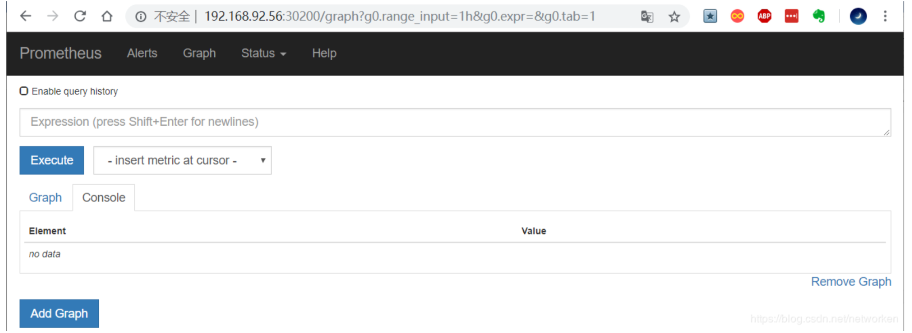
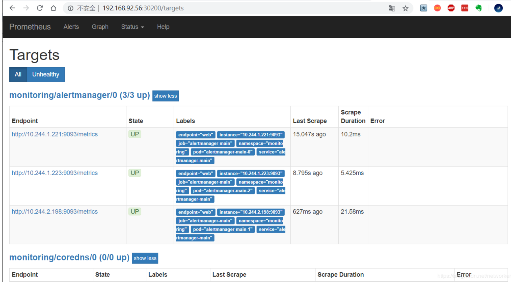
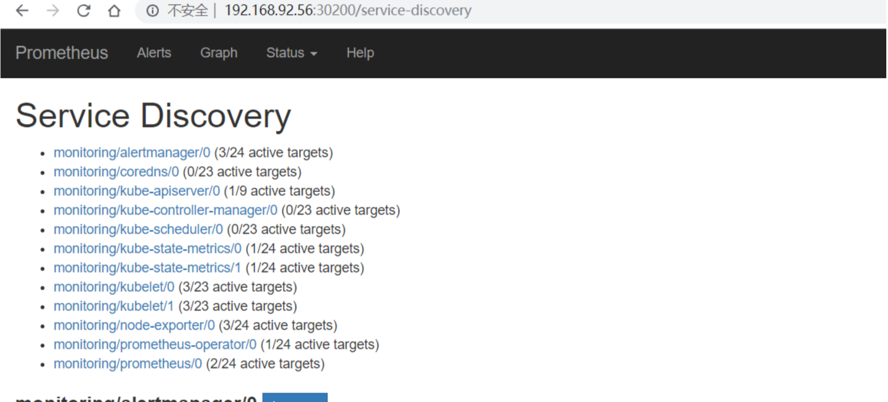
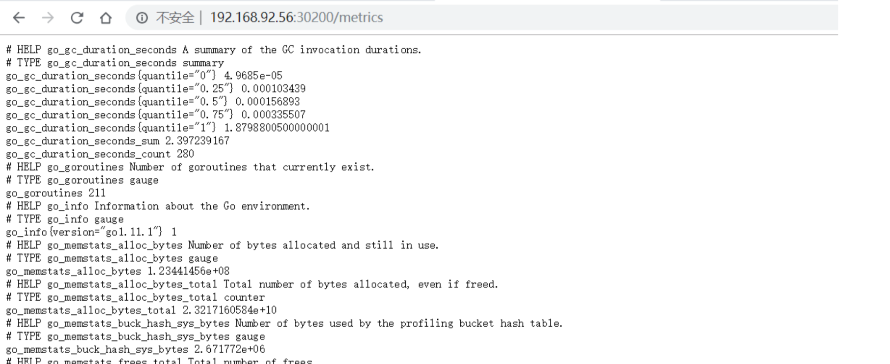
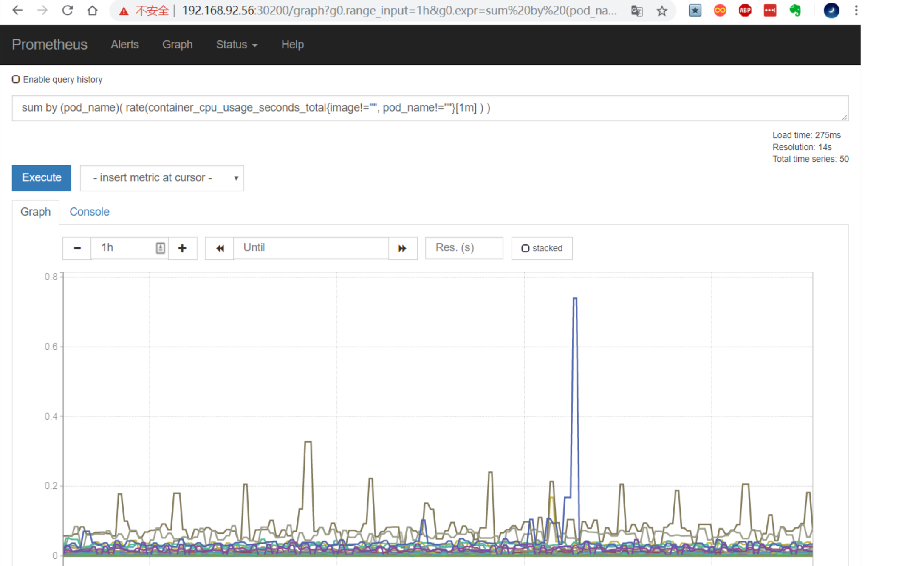
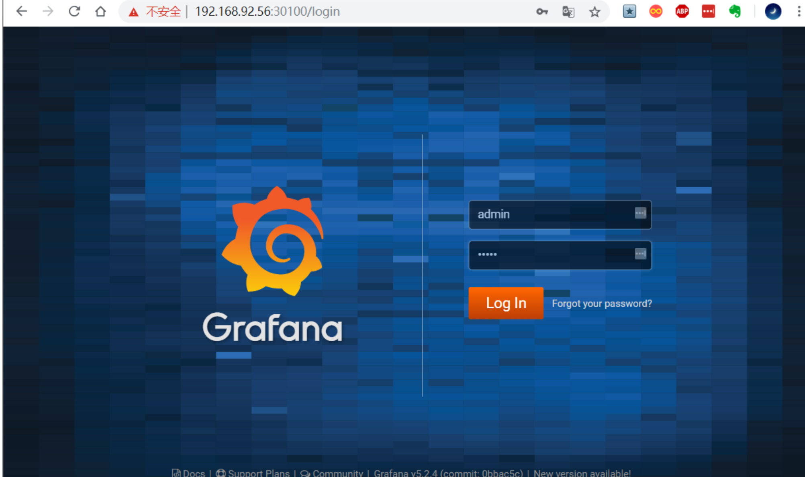
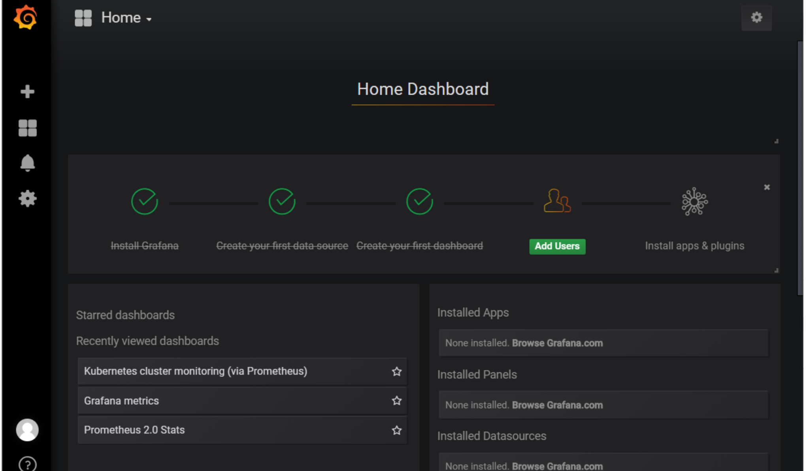
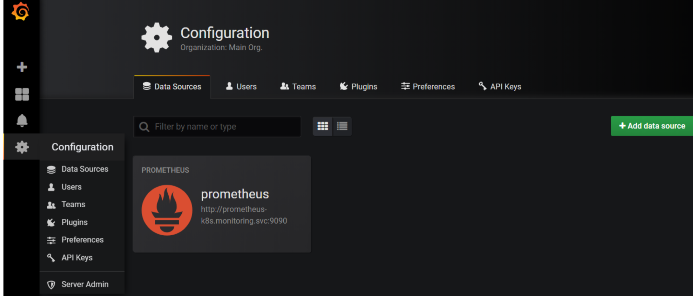
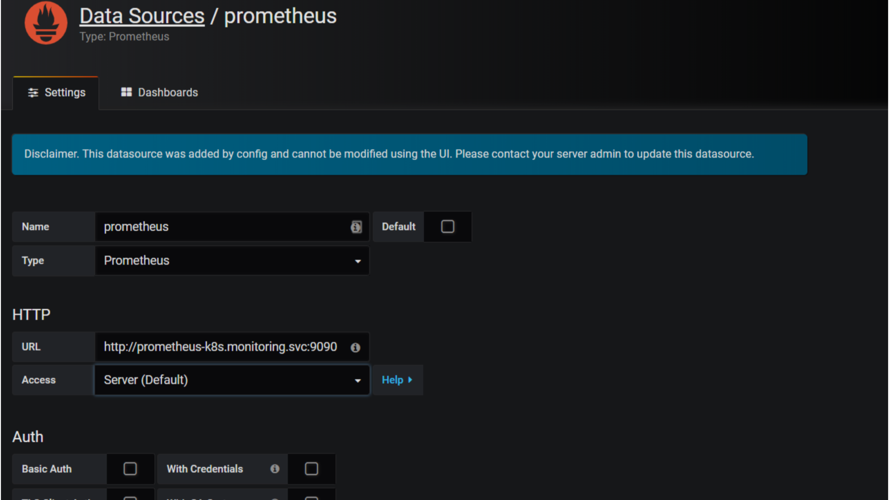
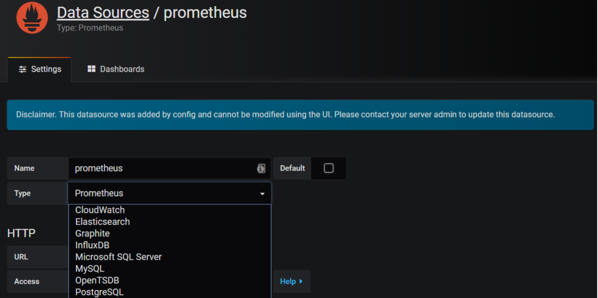

# Prometheus 安装

## 相关地址信息

Prometheus github 地址:https://github.com/coreos/kube-prometheus

## 组件说明

1.MetricServer：是kubernetes集群资源使用情况的聚合器，收集数据给kubernetes集群内使用，如kubectl,hpa,scheduler等。

2.PrometheusOperator：是一个系统监测和警报工具箱，用来存储监控数据。

3.NodeExporter：用于各node的关键度量指标状态数据。

4.KubeStateMetrics：收集kubernetes集群内资源对象数据，制定告警规则。

5.Prometheus：采用pull方式收集apiserver，scheduler，controller-manager，kubelet组件数据，通过http协议传输。

6.Grafana：是可视化数据统计和监控平台

## 构建记录

```
git clone https://github.com/coreos/kube-prometheus.git
cd kube-prometheus/manifests
```

#### 修改 grafana-service.yaml 文件，使用 nodepode 方式访问 grafana:


```
vim grafana-service.yaml
apiVersion: v1
kind: Service
metadata:
  name: grafana
  namespace: monitoring
spec:
  type: NodePort
  ports:
  - name: http
    port: 3000
    targetPort: http
    nodePort: 30100
  selector:
    app: grafana
```

#### 修改 prometheus-service.yaml，改为 nodepode

```
vim prometheus-service.yaml
apiVersion: v1
kind: Service
metadata:
  labels:
    prometheus: k8s
    name: prometheus-k8s
    namespace: monitoring
  spec:
    type: NodePort
    ports:
    - name: web
      port: 9090
      targetPort: web
      nodePort: 30200
    selector:
      app: prometheus
      prometheus: k8s
  
```

 

#### 修改 alertmanager-service.yaml，改为 nodepode

```
 
vim alertmanager-service.yaml
apiVersion: v1
kind: Service
metadata:
  labels:
    alertmanager: main
  name: alertmanager-main
  namespace: monitoring
spec:
  type: NodePort
  ports:
  - name: web
    port: 9093
    targetPort: web
    nodePort: 30300
  selector:
    alertmanager: main
    app: alertmanager
```

```
kubectl apply -f ../manifests/
kubectl get pod -n monitoring
kubectl delete -f ../manifests/  -n monitoring
kubectl get pod -n monitoring
kubectl apply -f ../manifests/
kubectl get pod -n monitoring
kubectl get pod -n monitoring -n  wide
kubectl get svc --all-namespaces
kubectl top node
kubectl top pod --all-namespaces
```


 ## Horizontal Pod Autoscaling

Horizontal Pod Autoscaling 可以根据 CPU 利用率自动伸缩一个 Replication Controller、Deployment 或者Replica Set 中的 Pod 数量


```
kubectl run php-apache --image=gcr.io/google_containers/hpa-example --requests=cpu=200m --expose --port=80
```

```
kubectl run php-apache --image=siriuszg/hpa-example --requests=cpu=200m --expose --port=80
```


##### 创建 HPA 控制器 - 相关算法的详情请参阅[这篇文档](https://git.k8s.io/community/contributors/design-proposals/horizontal-pod-autoscaler.md#autoscaling-algorithm)

```
kubectl autoscale deployment php-apache --cpu-percent=50 --min=1 --max=10
```

##### 增加负载，查看负载节点数目

```
$ kubectl run -i --tty load-generator --image=busybox /bin/sh
$ while true; do wget -q -O- http://php-apache.default.svc.cluster.local; done
```


## 资源限制 - Pod

Kubernetes 对资源的限制实际上是通过 cgroup 来控制的，cgroup 是容器的一组用来控制内核如何运行进程的相关属性集合。针对内存、CPU 和各种设备都有对应的 cgroup

默认情况下，Pod 运行没有 CPU 和内存的限额。 这意味着系统中的任何 Pod 将能够像执行该 Pod 所在的节点一 样，消耗足够多的 CPU 和内存 。一般会针对某些应用的 pod 资源进行资源限制，这个资源限制是通过 resources 的 requests 和 limits 来实现

```
 spec:
    containers:
    - image: xxxx
      imagePullPolicy: Always
      name: auth
      ports:
      - containerPort: 8080
        protocol: TCP
      resources:
        limits:
          cpu: "4"
          memory: 2Gi
        requests:
          cpu: 250m
          memory: 250Mi
```

**requests 要分分配的资源，limits 为最高请求的资源值。可以简单理解为初始值和最大值**

## 资源限制 - 名称空间

### I、计算资源配额

```
apiVersion: v1
kind: ResourceQuota
metadata:
  name: compute-resources
  namespace: spark-cluster
spec:
  hard:
    pods: "20"
    requests.cpu: "20"
    requests.memory: 100Gi
    limits.cpu: "40"
    limits.memory: 200Gi
```

### II、配置对象数量配额限制

```
apiVersion: v1
kind: ResourceQuota
metadata:
  name: object-counts
  namespace: spark-cluster
spec:
  hard:
    configmaps: "10"
    persistentvolumeclaims: "4"
    replicationcontrollers: "20"
    secrets: "10"
    services: "10"
    services.loadbalancers: "2"
```

### III、配置 CPU 和 内存 LimitRange

```
apiVersion: v1
kind: LimitRange
metadata:
  name: mem-limit-range
spec:
  limits:
  - default:
      memory: 50Gi
      cpu: 5
    defaultRequest:
      memory: 1Gi
      cpu: 1
    type: Container
```

- default 即 limit 的值
- defaultRequest 即 request 的值

## 访问 prometheus

prometheus 对应的 nodeport 端口为 30200，访问 http://MasterIP:30200



通过访问 http://MasterIP:30200/target 可以看到 prometheus 已经成功连接上了 k8s 的 apiserver



查看 service-discovery



Prometheus 自己的指标



**prometheus 的 WEB 界面上提供了基本的查询 K8S 集群中每个 POD 的 CPU 使用情况，查询条件如下:**

```
sum by (pod_name)( rate(container_cpu_usage_seconds_total{image!="", pod_name!=""}[1m] ) )
 
```

 


**上述的查询有出现数据，说明 node-exporter 往 prometheus 中写入数据正常，接下来我们就可以部署 grafana 组件，实现更友好的 webui 展示数据了**

## 访问 grafana

查看 grafana 服务暴露的端口号:

```
 kubectl get service -n monitoring  | grep grafana
    
```

如上可以看到 grafana 的端口号是 30100，浏览器访问 http://MasterIP:30100 用户名密码默认 admin/admin



修改密码并登陆



添加数据源 grafana 默认已经添加了 Prometheus 数据源，grafana 支持多种时序数据源，每种数据源都有各自 的查询编辑器




Prometheus 数据源的相关参数:



目前官方支持了如下几种数据源:



