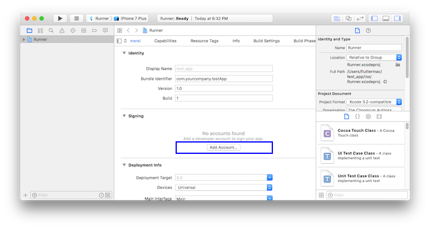
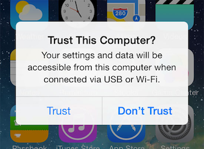
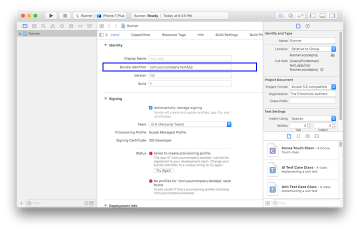

# 在 macOS 上安装和配置 Flutter 开发环境

## 系统配置要求

想要安装并运行 Flutter，你的开发环境需要最低满足以下要求：

- **操作系统**：macOS（64 位）
- **磁盘空间**：2.8 GB（不包含 IDE 或其余工具所需要的磁盘空间）
- **工具**：Flutter 使用 `git` 进行安装和升级，我们建议您安装包含了 `git` 的 Xcode，或者您也可以 [单独安装 `git`](https://git-scm.com/download/mac)。

## 获取 Flutter SDK

1. 下载以下安装包来获取最新的 stable Flutter SDK：

   [flutter_macos_1.22.5-stable.zip](https://storage.flutter-io.cn/flutter_infra/releases/stable/macos/flutter_macos_1.22.5-stable.zip)

   想要获取到其他版本的安装包，请参阅 [SDK 版本列表](https://flutter.cn/docs/development/tools/sdk/releases) 页面。

2. 将文件解压到目标路径, 比如:

   *content_copy*

   ```
   $ cd ~/development
   $ unzip ~/Downloads/flutter_macos_1.22.5-stable.zip
   ```

   如果你不想安装固定版本的安装包，你可以跳过步骤 1 和 2。或者是从 GitHub 上的 [Flutter repo](https://github.com/flutter/flutter) 获取源代码，并根据需要更改分支或标签。

   *content_copy*

   ```
   $ git clone https://github.com/flutter/flutter.git
   ```

   你也可以根据需要切换选择分支，比如用下面的参数获得稳定版本：

   *content_copy*

   ```
   $ git clone https://github.com/flutter/flutter.git -b stable --depth 1
   ```

3. 配置 `flutter` 的 PATH 环境变量：

   *content_copy*

   ```
   $ export PATH="$PATH:`pwd`/flutter/bin"
   ```

   这个命令配置了 `PATH` 环境变量，且只会在你 **当前** 命令行窗口中生效。如果想让它永久生效，请查看 [更新 PATH 环境变量](https://flutter.cn/docs/get-started/install/macos#update-your-path)。

4. 开发二进制文件预下载（可选操作）

   `flutter` 命令行工具会下载不同平台的开发二进制文件，如果需要一个封闭式的构建环境，或在网络可用性不稳定的情况下使用等情况，你可能需要通过下面这个命令预先下载 iOS 和 Android 的开发二进制文件：

   *content_copy*

   ```
   $ flutter precache
   ```

   更多使用方式，请使用 `flutter help precache` 命令查看。

现在你可以愉快地运行 Flutter 的命令行啦！

 **备忘**

如果想要升级当前的 Flutter 版本，可以查看 [升级 Flutter](https://flutter.cn/docs/development/tools/sdk/upgrading)。

### 运行 flutter doctor 命令

通过运行以下命令来查看当前环境是否需要安装其他的依赖（如果想查看更详细的输出，增加一个 `-v` 参数即可）：

*content_copy*

```
$ flutter doctor
```

这个命令会检查你当前的配置环境，并在命令行窗口中生成一份报告。安装 Flutter 会附带安装 Dart SDK，所以不需要再对 Dart 进行单独安装。你需要仔细阅读上述命令生成的报告，看看别漏了一些需要安装的依赖，或者需要之后执行的命令（这个会以 **加粗的文本** 显示出来）。

比如你可能会看到下面这样的输出：

*content_copy*

```
[-] Android toolchain - develop for Android devices
    • Android SDK at /Users/obiwan/Library/Android/sdk
    ✗ Android SDK is missing command line tools; download from https://goo.gl/XxQghQ
    • Try re-installing or updating your Android SDK,
      visit https://flutter.dev/setup/#android-setup for detailed instructions.
```

之后的部分会向你描述如果执行这些命令来完成整体的配置过程。

当你安装了任一缺失部分的依赖后，可以再次运行 `flutter doctor` 命令来确认是否成功安装。

### 直接从 Github 上（而不是归档）下载

**该建议仅适用于高级用例**

你也可以不从归档，而是用 Git 直接下载。例如，可以运行下方的命令，以下载稳定分支的 SDK：

*content_copy*

```
$ git clone https://github.com/flutter/flutter.git -b stable
```

[更新环境变量](https://flutter.cn/docs/get-started/install/macos#update-your-path)，并运行 `flutter doctor`。这个命令将会告诉你，是否还缺少运行 Flutter 所需要安装的其他依赖项（例如 Android SDK）。

如果你不使用归档，Flutter 将会下载必要的开发二进制文件（如果你使用的归档，那么这些文件已经包含在内了）。你也许会想要提前下载这些开发二进制文件（例如，您可能希望设置系统构建环境，或是您的网络可用性不佳）。那么你可以运行以下命令：

*content_copy*

```
$ flutter precache
```

更多额外下载选项，请参阅 `flutter help precache`。

 **请注意**

`flutter` 工具使用了 Google Analytics 来对基本使用情况和 [崩溃报告](https://github.com/flutter/flutter/wiki/Flutter-CLI-crash-reporting) 进行匿名的统计。这些数据用来帮助改善 Flutter 工具。

在第一次运行或者任何涉及到 `flutter config` 的信息都不会进行发送，所以你可以在发送分析数据之前选择禁止分析数据的统计。要禁用这一功能，只需要输入 `flutter config --no-analytics` 即可，想要查看当前设置使用命令 `flutter config`。如果你禁用了统计信息发送，这次的禁用行为会被记录发送，其他任何信息，以及未来都不会再有任何数据会被记录。

在下载了 Flutter SDK 的时候，意味着你同意了 Google 的 ToS，你可以在 [Google 隐私政策](https://policies.google.cn/privacy)中查看更详细的内容。

另外，Flutter 包含了 Dart SDK，它可能会发送一些使用数据和崩溃信息给 Google。

### 更新 PATH 环境变量

正如 [获取 Flutter SDK ](https://flutter.cn/docs/get-started/install/macos#get-sdk)一文中所展示你可以仅仅在当前命令行会话中更新你的 PATH 环境变量。但你也许想让这个配置永久生效，这样就可以在任意一个命令行会话中使用 `flutter` 命令了。

以下配置环境变量让其永久生效的方法在不同的机器上有略微的差别。基本上方法都是在某一个文件中增加一句命令，让它在每次新的命令行窗口打开时都执行一遍。比如：

1. 首先决定你想要将 Flutter SDK 放置在哪一个目录内，获取并记录这个目录的路径，你将要在第 3 步中用到它。

2. 打开或者创建 shell 的 `rc` 文件，比如，在 Linux 和 macOS Mojave 或 Mojave 之前的系统里，是默认使用 Bash 的，所以需要修改 `$HOME/.bashrc` 文件。 macOS Catalina 操作系统默认使用 Z Shell，所以需要修改 `$HOME/.zshrc` 文件。请知晓，如果你使用不同的 shell，文件目录或文件名可能会有所不同。

3. 在文件中增加下列这行命令，并将其中的 `[PATH_TO_FLUTTER_GIT_DIRECTORY]` 更改为你第一步获取到的路径：

   *content_copy*

   ```
   $ export PATH="$PATH:[PATH_TO_FLUTTER_GIT_DIRECTORY]/flutter/bin"
   ```

4. 运行 `source $HOME/.bash_profile` 来刷新当前命令行窗口。

5. 通过运行以下命令来验证 `flutter/bin` 文件夹是否已经添加到 PATH 环境变量中：

   *content_copy*

   ```
   $ echo $PATH
   ```

   验证 `flutter` 命令是否可用，可以执行下面的命令检测：

   *content_copy*

   ```
   $ which flutter
   ```

 **备忘**

自 1.19.0 dev 版开始，`dart` 命令就直接包含在 Flutter SDK 里了，这样可以更轻松的运行 Dart 命令行应用。下载 Flutter SDK 的时候也将同时包含兼容版本的 Dart SDK，但是如果你已经单独的下载了 Dart SDK，需要请你确保 Flutter SDK 里包含的 `dart` 在 `PATH` 环境变量里靠前的位置，因为这两个渠道下载的 `dart` 可能并不兼容。如下在 macOS、Linux 和 chromeOS 的命令可以帮助你查看你的 `flutter` 和 `dart` 命令是否位于同一目录以确保兼容。部分 Windows 系统也支持类似 `where` 的命令：

*content_copy*

```
  $ which flutter dart
  /path-to-flutter-sdk/bin/flutter
  /usr/local/bin/dart
```

如上命令行返回的内容所示，看起来 `flutter` 和 `dart` 并非来自同一 `bin` 目录，在上面的这个例子里，我们需要更新 `PATH` 环境变量，将 `<path-to-flutter-sdk>/bin` 放在 `/usr/local/bin` 之前。修改完并使命令行窗口生效之后，再次运行 `which` 或 `where` 命令，就可以发现，`flutter` 和 `dart` 位于同一目录了：

*content_copy*

```
  $ which flutter dart
  /path-to-flutter-sdk/bin/flutter
  /path-to-flutter-sdk/bin/dart
```

了解更多关于 `dart` 命令的内容，可以在命令行运行 `dart -h`，或者在 Dart 文档查看 [`dart` 工具][`dart` tool] 了解更多。

## 平台配置

macOS 可以允许开发 iOS、Android 和 Web（技术预览版正式发布）三个平台的 Flutter 应用，你可以任选一个平台完成初始配置，以此来搭建并运行起来你的第一个 Flutter 应用。

## 设置 iOS 开发环境

### 安装 Xcode

开发 iOS 平台上的 Flutter 应用，你需要一个安装了 Xcode 的 Mac 设备。

1. 通过 [直接下载](https://developer.apple.com/xcode/) 或者通过 [Mac App Store](https://itunes.apple.com/us/app/xcode/id497799835) 来安装最新稳定版 Xcode；

2. 通过在命令行中运行以下命令来配置 Xcode command-line tools:

   *content_copy*

   ```
   $ sudo xcode-select --switch /Applications/Xcode.app/Contents/Developer
   $ sudo xcodebuild -runFirstLaunch
   ```

   当你安装了最新版本的 Xcode，大部分情况下，上面的路径都是一样的。但如果你安装了不同版本的 Xcode，你可能要更改一下上述命令中的路径。

3. 运行一次 Xcode 或者通过输入命令 `sudo xcodebuild -license` 来确保已经同意 Xcode 的许可协议。

旧版本可能也能够正常工作，但是不建议在 Flutter 开发环境中使用。旧版本的 Xcode 不支持定位代码，还可能无法正常工作。

安装了 Xcode 之后，你就可以在 iOS 真机或者模拟器上运行 Flutter 应用了。

### 配置 iOS 模拟器

如果想要在 iOS 模拟器中运行和测试 Flutter 应用，按照以下步骤即可：

1. 在你的 Mac 中，通过 Spotlight 或者以下命令来运行模拟器：

   *content_copy*

   ```
   $ open -a Simulator
   ```

2. 通过模拟器菜单中的 **Hardware > Device** 选项检查当前模拟器是否是 64 位机型（iPhone 5S 或之后的机型）。

3. Depending on your development machine’s screen size, simulated high-screen-density iOS devices might overflow your screen. Grab the corner of the simulator and drag it to change the scale. You can also use the **Window > Physical Size** or **Window > Pixel Accurate** options if your computer’s resolution is high enough.

   - If you are using a version of Xcode older than 9.1, you should instead set the device scale in the **Window > Scale** menu.

   根据你当前开发机器的屏幕尺寸，模拟器模拟出来的高密度屏幕的设备可能会占满你的屏幕，你可以通过菜单中的 **Window > Scale** 选项来更改模拟器的缩放比例。

### 创建并运行一个简单的 Flutter 应用

通过以下步骤来创建你的第一个 Flutter 应用并进行测试：

1. 通过运行以下命令来创建一个新的 Flutter 应用：

   *content_copy*

   ```
   $ flutter create my_app
   ```

2. 上述命令创建了一个 `my_app` 的目录，包含了 Flutter 初始的应用模版，切换路径到这个目录内：

   *content_copy*

   ```
   $ cd my_app
   ```

3. 确保模拟器已经处于运行状态，输入以下命令来启动应用：

   *content_copy*

   ```
   $ flutter run
   ```

### Deploy to iOS devices

如果你想把 Flutter 应用部署到 iOS 的真机上，你还需要一些别的工具和一个 Apple 开发者账号。另外，你还需要在 Xcode 上针对你的机器做一些设置。

1. 如果你的应用不依赖 [Flutter plugins](https://flutter.cn/docs/development/packages-and-plugins/developing-packages#types) 与原生 iOS 代码交互，你可以跳过这一步。通过运行以下命令 [安装和设置CocoaPods](https://guides.cocoapods.org/using/getting-started.html#installation)。

   *content_copy*

   ```
   $ sudo gem install cocoapods
   ```

    **备忘**

   Ruby的默认版本需要 root 权限 `sudo` 来安装 CocoaPods gem，如果你使用的是 Ruby Version 管理器，可能就无需 root 权限。

2. 按照下面 Xcode 签名流程来配置你的项目:

   1. 通过在命令行中于你当前 Flutter 项目目录下运行 `open ios/Runner.xcworkspace` 命令来打开默认的 Xcode 工程。

   2. 在运行按钮的下拉列表里选择你想要部署到的设备；

   3. 在左侧的导航面板中选择 `Runner` 项目；

   4. 在 `Runner` 项目的设置页面，请确保勾选你的开发团队。在不同的 Xcode 版本里，这一部分的操作界面不同：

      - 在 Xcode 10 版本中，请在这里设置：**General > Signing > Team**
      - 在 Xcode 11 版本以后，请在这里设置：**Signing & Capabilities > Team**

      当选择了一个团队之后，Xcode 会创建和下载一个开发证书，并在你的账户里为你的社保注册，并在需要的时候创建和下载一个配置文件。

      - 在开始你的第一个 iOS 项目开发之前，你需要先在 Xcode 中登陆你的 Apple 开发者账号  任何 Apple ID 都可以进行开发和测试。如果想将应用上架 App Store，你需要加入 Apple Developer Program，你可以在 [Choosing a Membership](https://developer.apple.com/support/compare-memberships) 页面中查看详细的说明。

      

      - 当你第一次将设备连接到开发机用于开发时，你需要分别在 Mac 和开发机上进行信任设备的操作。当你第一次连接时，会有个弹窗，点击 `Trust` 即可。

        

        然后在 iOS 开发机上进入 Settings 应用，选择 **General > Device Management** 然后信任相应的证书。对于首次打开的用户，请选择 **General > Profiles > Device Management**。

      - 如果 Xcode 的自动签名失败了，你可以检查以下项目中 **General > Identity > Bundle Identifier** 里的值是否是唯一的。

        

3. 执行 `flutter run` 命令，或者在 Xcode 里点击运行，来运行你的应用。

   Start your app by running `flutter run` or clicking the Run button in Xcode.

## 设置 Android 开发环境

 **备忘**

Flutter 依赖 Android Studio 的全量安装来为其提供 Android 平台的支持。但你也可以使用其他的编辑器来写 Flutter 应用，接下来的步骤会提到这个问题。

### 安装 Android Studio

1. 下载并安装 [Android Studio](https://developer.android.google.cn/studio)。
2. 运行 Android Studio，并进入 ‘Android Studio Setup Wizard’，这会安装最新的 Android SDK， Android SDK Platform-Tools 以及 Android SDK Build-Tools，这些都是在开发 Android Flutter 应用时所需要的。

### 配置 Android 设备

在 Android 设备上运行或测试 Flutter 应用之前，你需要一个运行 Android 4.1（API 版本 16）或者更高的设备。

1. 在设备上打开 **Developer options** 和 **USB debugging** 选项，你可以在 [Android documentation](https://developer.android.google.cn/studio/debug/dev-options) 上查看更详细的方法介绍。
2. 如果是在 Windows 平台上使用，需要安装 [Google USB Driver](https://developer.android.google.cn/studio/run/win-usb)
3. 通过 USB 接口连接手机和电脑，如果在设备上弹出需要授权弹窗，允许授权以便让电脑能够访问你的开发设备。
4. 在命令行中，使用 `flutter devices` 命令来确保 Flutter 能够识别出你所连接的 Android 设备。

默认情况下，Flutter 会使用当前版本 `adb` 工具所依赖的 Android SDK 版本，如果你想让 Flutter 使用别的 Android SDK，你可以通过设置 `ANDROID_HOME` 环境变量来达到这个目的。

### 配置 Android 模拟器

根据以下步骤来将 Flutter 应用运行或测试于你的 Android 模拟器上：

1. 激活机器上的 [VM acceleration](https://developer.android.google.cn/studio/run/emulator-acceleration) 选项。

2. 打开 **Android Studio**，点击 **AVD Manager** 按钮，选择 **Create Virtual Device…**

   - 在一些旧的 Android Studio 版本里，需要通过 **Android Studio > Tools > Android > AVD Manager**，然后选择 **Create Virtual Device** 选项。（只有在 Android 项目中才会显示 **Android** 子选项。）
   - 如果你以及还没打开某个项目，你可以选择 **Configure > AVD Manager** 然后选择 **Create Virtual Device** 选项

3. 选择相应的设备并选择 **Next** 选项。

4. 选择一个或多个你想要模拟的 Android 版本的系统镜像，然后选择 **Next** 选项。推荐选择 **x86** 或者 **x86_64** 镜像。

5. 在 Emulated Performance 下选择 **Hardware - GLES 2.0** 选项来开启 [硬件加速](https://developer.android.google.cn/studio/run/emulator-acceleration)。

6. 确保 AVD 选项配置正确，并选择 **Finish** 选项。

   想要查看上述步骤的更多详细信息，请查看 [Managing AVDs](https://developer.android.google.cn/studio/run/managing-avds) 页面。

7. 在 Android Virtual Device Manager 中，点击工具栏中的 **Run** 选项，模拟器会启动并为你所选择的系统版本和设备显示出相应的界面。

## Web 平台设置

现在你已经可以通过使用 `beta` 渠道的 Flutter SDK 构建 Web 应用了。要开始，请通过阅读 [这些步骤](https://flutter.dev/docs/get-started/web) 完成设置。