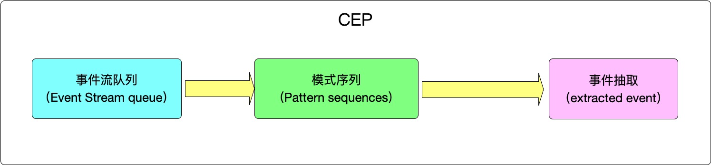

# CEP

> 一个或多个由简单事件构成的事件流通过一定的规则匹配，然后输出用户想得到的数据，满足规则的复杂事件。复杂事件处理（Complex Event Process，简称CEP）用来检测无尽数据流中的复杂模式，拥有从不同的数据行中辨识查找模式的能力。模式匹配是复杂事件处理的一个强大援助。 例子包括受一系列事件驱动的各种业务流程，例如在安全应用中侦测异常行为；在金融应用中查找价格、交易量和其他行为的模式。其他常见的用途如欺诈检测应用和传感器数据的分析等

复杂事件处理（Complex Event Processing，CEP）的应用程序框架，与传统的数据库查询处理不同，事件处理系统需要同时处理来自多个数据源的海量事件（Event），并且根据用户提供的查询语句以及匹配模式，实时地输出事件分析结果。我们在下表中列出了事件驱动应用和数据库应用的主要区别：

|              | **数据库应用** | **事件驱动的应用（Event Driven）** |
| ------------ | -------------- | ---------------------------------- |
| **查询模式** | 特定的查询请求 | 连续的查询                         |
| **响应时间** | 从几秒至数天   | 几毫秒或更少                       |
| **数据流量** | 数百条记录/秒  | >10000 事件/秒                     |

通过使用Flink，用户可以开发出基于CEP的程序来实时处理大量的原始数据，利用数据之间的层次和关联关系，有效的采用相应的规则进行处理，以降低进行事件分析，事件关联及事件解析等操作的代价。Flink同时能够支持对数据流模式匹配、异常检测、趋势分析等操作，使用户能够更好地管理、监控和挖掘数据，最终使用户得到之前无法了解的信息，并能够更快速和更有效的进行操作决策，提高关键绩效指标（KPI）。

在Flink CEP中，其核心为Pattern，它主要由输入(一个或多个由简单事件构成的事件流)、处理、输出（满足规则的复杂事件）组成。整体架构如下

- 目标：从有序的简单事件流中发现一些高阶特征
- 输入：一个或多个由简单事件构成的事件流
- 处理：识别简单事件之间的内在联系，多个符合一定规则的简单事件构成复杂事件
- 输出：满足规则的复杂事件

### 特征

- 目标：从有序的简单事件流中发现一些高阶特征
- 输入：一个或多个由简单事件构成的事件流
- 处理：识别简单事件之间的内在联系，多个符合一定规则的简单事件构成复杂事件
- 输出：满足规则的复杂事件

### CEP 架构

