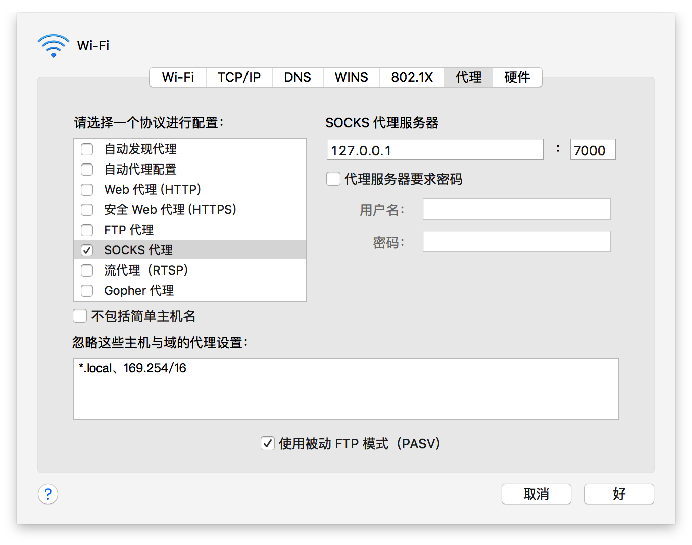
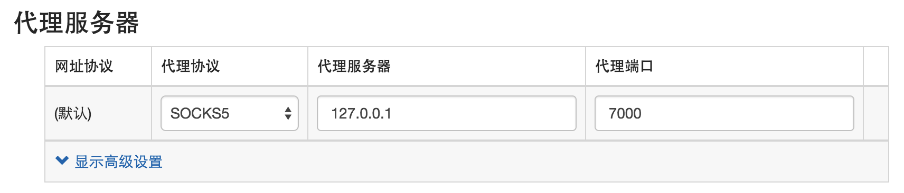

# 使用SSH命令在Linux与Mac OS X搭建socket代理上网

对于国内开发者来说，不能访问google.com的确带来很多不便，但如果有一台国外的服务器，并进行VPN搭建，确实流程较为复杂，并且不容易进行过滤。下面使用简单的ssh命令在本地搭建socket代理服务。并使用Chrome插件对需要翻墙的域名进行代理访问。

## 技术原理

ssh-clinet的大多数用途为远程登录一台Linux服务器，但是ssh的强大功能远不止这些，ssh是与另外一台有sshd服务的主机之间建立一个数据隧道，其中隧道是双向的，可以进行数据双向传输，所以ssh的其他参数，可以提供出来：

1. 正向隧道 隧道监听本地port,为普通活动提供安全连，即socket代理

```
ssh -qTfnN -L port:host:hostport -l user remote_ip
```

1. 反向隧道 隧道监听远程端口，将内网机器端口暴露到外网访问

```
ssh -qTfnN -R port:host:hostport -l user remote_ip
```

## 使用正向隧道搭建socket5服务

```
ssh -D 7000 root@202.102.1.1 

//输入密码。。。搞定
```

但是为了让数据传输更加稳定，不会因为错误退出，以及压缩传输等，需要增加几个参数：

```
ssh -qTfnN -D 7777 root@101.32.11.110
```

| 参数 | 备注                                                         |      解释      |
| :--- | :----------------------------------------------------------- | :------------: |
| -q   | Quiet mode. Causes most warning and diagnostic messages to be suppressed. |    安静模式    |
| -T   | Disable pseudo-tty allocation.                               |   不分配tty    |
| -f   | Requests ssh to go to background just before command execution. |    后台运行    |
| -n   | Redirects stdin from /dev/null                               |     不输出     |
| -N   | Do not execute a remote command. This is useful for just forwarding ports | 不执行远程命令 |

## 完整脚本

首先通过生成`ssh-keygen -t rsa`上传到服务器，以便于不用输入密码登录
完整脚本文件如下：

```shell
#!/bin/bash

#监听7000端口
PORT=7000
#不重复运行
if (pgrep -f 'ssh -qTfnN'>/dev/null)
then
    echo "Already running!"
    exit
else
    echo "Starting "
   ssh -qTfnN -D $PORT  root@58.96.1.1  && echo "Done! port on $PORT"
fi
```

## 设置浏览器代理

这个步骤是通用的，不同操作系统设置方法不同，以下是mac中的代理服务设置：



**chrome里面可以使用SwitchyOmega插件，只对需要的泛域名进行代理**

