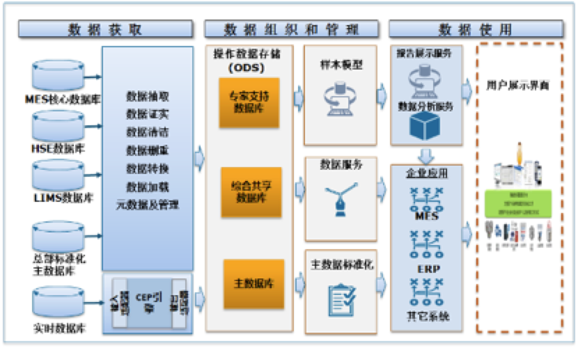
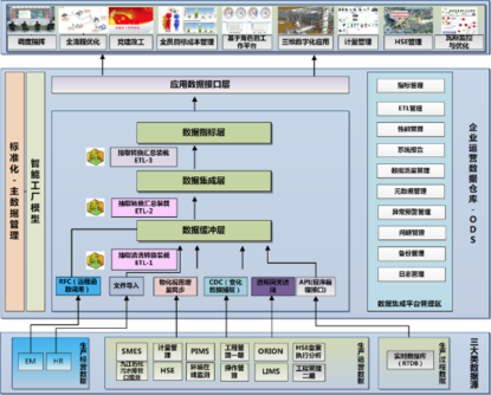
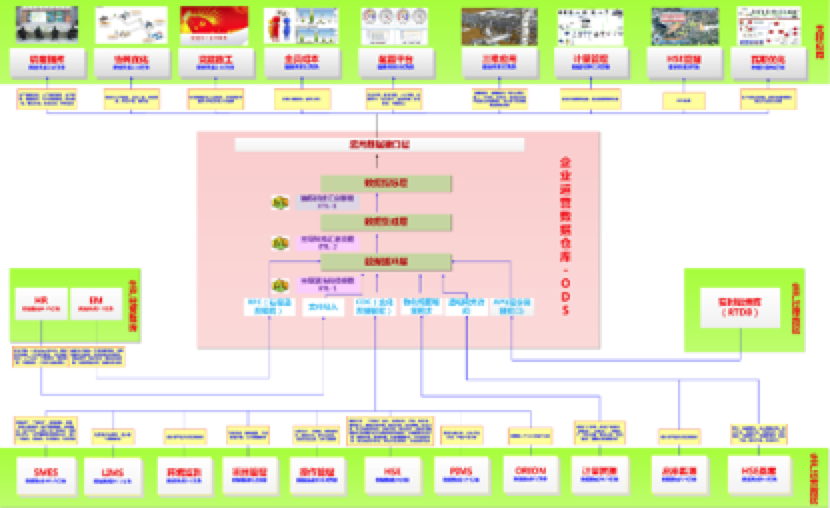

# ODS-九江项目

### 项目需求和目标

建成支持**实时**智能的企业运营数据仓库（ODS）

1)  实现企业实时、准实时异构数据整合，其中包括SMES、HSE、能源、设备、LIMS、实时数据等系统的源数据

2)  提供16类**业务主题数据的共享服务**，包括生产物料、能源、三剂、运输、工程、操作、质量、工艺、安全、环保、卫生、设备、市场、地理信息、实时监控、经营（ERP、HR）

3)  建立智能工厂模型，实现企业生产运营全业务数据视图，切实做到一次建模，全局共享

4)  建立业务规则模型，通过复杂事件处理，实现事件触发、预案主动推送

5)  实现生产运行指标、技经指标的灵活配置和自动批量计算，支撑调度指挥、辅助决策等智能化综合应用

## 解决方案

### 技术方案

#### 总体技术架构

​                               

图3.1总体技术架构图

具体描述如下：

Ø 数据源来自企业生产执行层各类有集成需求的数据，如MES核心数据库、HSE管理数据库等；

Ø 通过数据集成服务层提供的数据抽取、数据证实、数据清洁、数据去重、数据转换、数据加载、元数据管理等服务，将集成的数据送到生产综合数据层；

Ø 实时数据应通过复杂事件处理（CEP）引擎对实时数据进行预处理，过滤抽取相关信息送到目标系统。当CEP发现异常情况时，可以将告警发送给相关人员；

Ø 生产综合数据（既是ODS）包括工业分析建模数据库、综合共享数据库和主数据库。工业分析建模数据库为专家提供统一有效的数据支持，综合共享数据库为企业及合作伙伴提供一致的数据信息，同时减少直接访问生产元数据库带来的风险。企业主数据企业用于整个企业跨所有系统、应用和流程的基本业务数据的单一数据源，主数据在标准与规范上应与石化总部保持一致；

Ø 生产综合数据可以通过建模为专家提供不同主题的专业数据模型，快速有效支持专家的分析工作；

####  功能架构

​                               

图3.2功能架构图

数据集成功能体系结构主要从四个大的方面完成数据集成的功能应用：

（1）  接口文件处理

按照数据集成规定的源数据接口标准，对源业务系统生成的接口文件进行监控、采集、校验等工作，完成源业务数据到接口文件装载的预处理过程。

（2）  数据应用整合

根据设计好的集市模型，实现接口文件到数据缓冲区，数据缓冲区到数据集成区、数据集成到数据集市区、数据集市区到业务应用数据接口区的装载、转换、抽取等一系列整合过程，最终完成业务需求工作。

（3）  数据应用接口

为满足业务应用需求，设计提供统一业务数据视图或者数据应用接口等服务。

（4）  系统集成平台管理

为保证数据集成平台的稳定、高效的运行，使数据集成平台的维护、管理更为方便，系统管理区提供一系列的管理、维护功能，如系统监控、安全管理、ETL管理、数据质量管理、元数据管理等。

 

#### 网络架构

ODS采用三台服务器，其中数据库两台，其中一台服务器上存在运行的数据库实例，另一台作为备机可以实现故障切换。一台Windows服务器作为管理平台、实时数据库同步程序和透明网关程序的应用服务器。

####  系统集成方案

 

图3.3系统集成方案图

ODS上的数据来源于多个外部系统的数据，因此集成方案也是ODS设计的一个重要内容，当前ODS主要包含以下集成方式：

（1）CDC 变化数据捕捉

通过创建变化数据表，获取外部系统变化数据。

（2）物化视图增量更新

创建物化视图日志表，根据日志表增量更新相关表。

（3）透明网关访问

通过安装透明网关，集成非Oracle数据库，如SQL Server,Mysql。

（4）API程序编程接口

调用实时数据库提供接口，访问实时数据库。

（5）RFC 接口

通过SAP提供接口远程函数调用接口，获取SAP数据。

（6）文件导入

将模版文件，通过ETL程序导入到ODS数据库。

各集成方式的详细设计的内容会在章节6系统集成设计进行描述。