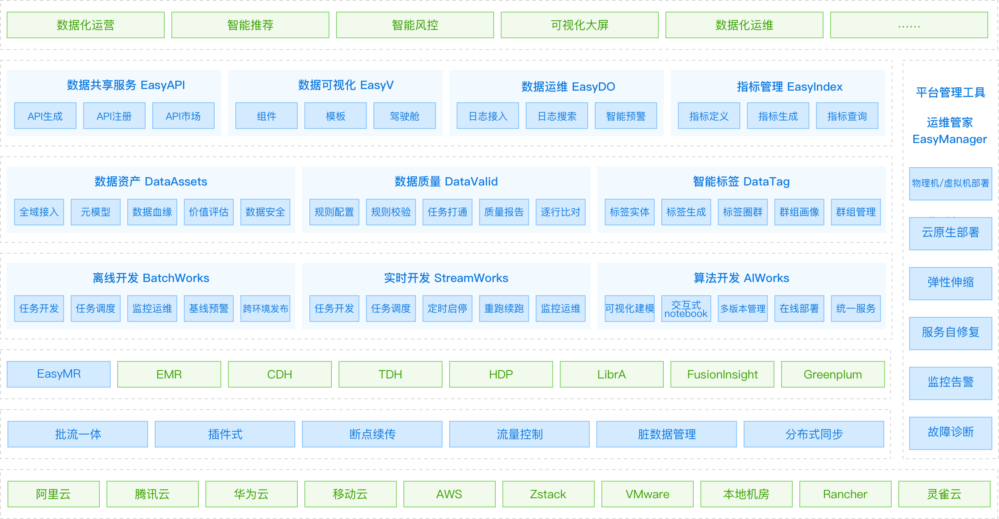
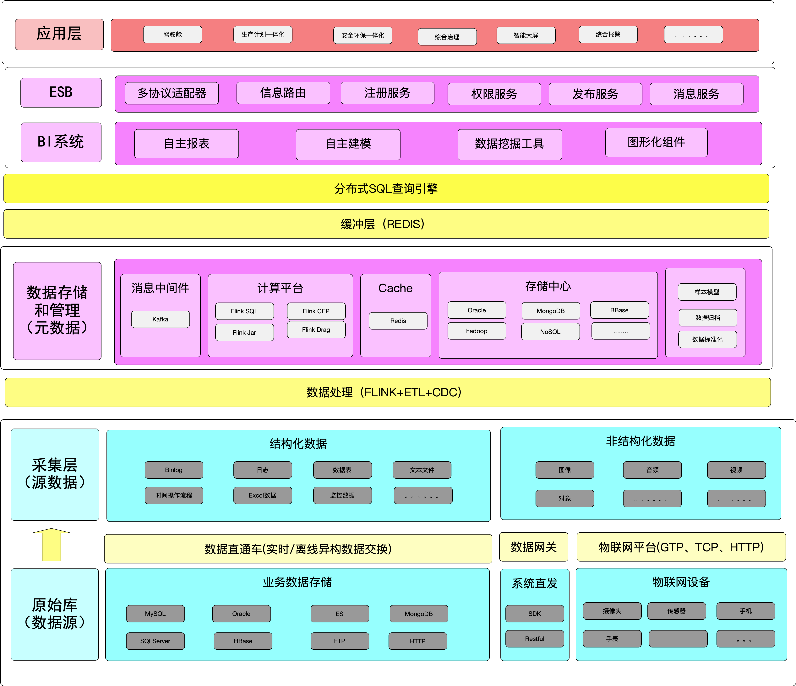

# ods技术架构

> 分为数据采集，数据存储，数据管理，智能应用

##数据采集

- mysql: flink通过监控binlog 日期实现数据落地  binlog（binlog的格式也有三种：STATEMENT、ROW、MIXED ）
- 

##数据存储

数据落地 - iceberg

##数据管理

##智能应用

看板 superset、redash、Metabase

> 备注

产品架构

