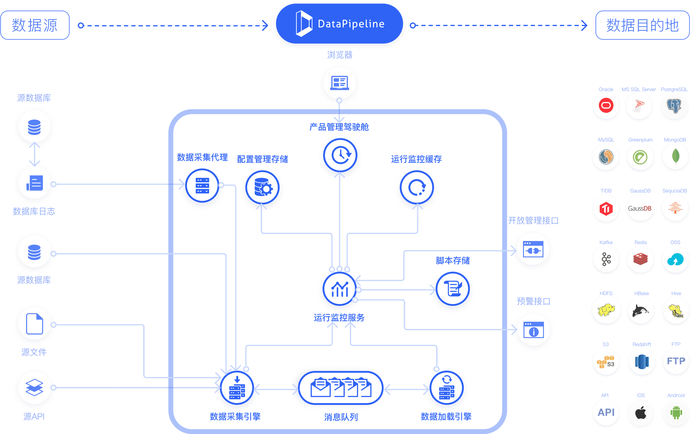
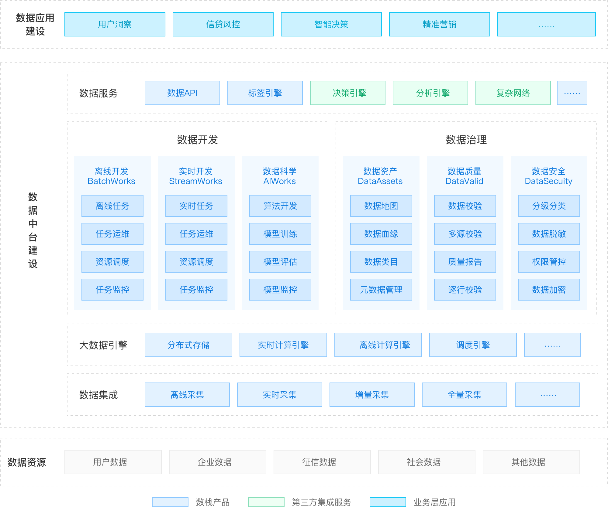

# ods 产品对比

### DataPipeline

网址：`www.datapipeline.com`

#### 架构图

#### 产品功能

- 批流一体任务管理

  通过基本配置，选择数据链路、选择资源分组、选择任务执行方式，通过限制配置与策略配置对基于链路设定之下的各类限制与策略进行个性化配置

- 映射融合链路管理

  以业务目标为导向，通过基本配置选择数据链路的相关数据源与数据目的地，建立数据对象映射关系，通过限制配置和策略配置，指定在整个数据链路域内的传输速率上限、结构变化策略、一致性保障策略及预警、日志、自动重启等任务执行策略。

- 多元异构节点管理

  通过基本配置注册实时数据融合相关的各类数据节点，通过限制配置限制数据任务执行过程中对数据节点的访问，操作动作范围及规则，通过策略配置指定语义映射、多节点降级顺序等数据融合任务执行过程中需遵循的策略。

- 动态均衡资源管理

  通过基本配置，注册、发现系统资源，建立资源分组，通过限制配置限制数据任务执行过程中对系统资源的使用限制，通过策略配置指定任务执行过程中系统资源状态变化与事件发生的应对策略与规则。

- 稳定可靠融合引擎

  执行数据融合任务的核心引擎。负责清洗、融合不同类型数据节点实时增量数据，并实时加载到数据目的地。针对不同的数据节点类型提供相适应的、准确的、高性能的增量数据加载。

## 袋鼠云

网站:`https://www.dtstack.com/`

#### 解决方案架构

#### 产品特点

- **解决系统数据孤岛**

  提高业务运行效率

  提高系统运维效率

  提高设备管控效率

- **完善数据治理管控**

  统一的运维监控平台

  集中的开发管理体系

  实现云端可视化开发

- **促进金融数字化转型**

  打造金融数字化平台

  行业用户个性化管理

  形成技术 + 数据转型

- **建设数据服务新模式**

  建设金融数据服务平台化

  建设金融数据服务开放化

  建设金融业生态体系闭环