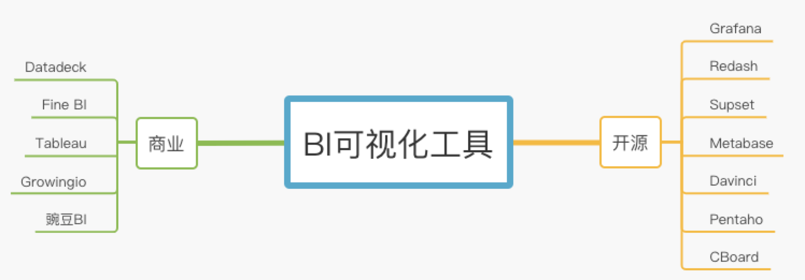

# BI产品对比



## 开源

### Grafana

```
特点：grafana 主要用于大规模指标数据的可视化展现，目前已经支持绝大部分常用的时序数据库。支持数据源丰富，支持图表展示、权限控制、支持告警、单点登录等，特性丰富。
试用体验：风格偏数据工程师/数据分析师
数据源支持：较多
版本更新速度：快
开发语言：go
```

#### 项目状态

```
官网地址：https://grafana.com/grafana/
地址：https://github.com/grafana/grafana
Watch: 1.3k
Star: 35.9k
Fork: 7.2k
Contributors 1193
```

### Redash

```
特点：redash可以作为可视化工具、数据库查询编辑器(类似navicat-premium)、数据挖掘探索工具来用。截止目前，自建redash支持43种数据源，在权限控制，精细配图方面比superset弱，但是环境易维护，可以生成中间表，可以join。 
试用体验：风格偏数据工程师/数据分析师/数据科学家
数据源支持：较多
版本更新速度：快
开发语言：Python
```

#### 项目状态

```
官网地址：https://redash.io/
地址：https://github.com/getredash/redash
Watch: 580
Star: 16.7k
Fork: 2.8k
Contributors 328
```

### Supset

```
特点：Superset 是一款由 Airbnb 开源的“现代化的企业级 BI，其通过创建和分享 dashboard，为数据分析提供了轻量级的数据查询和可视化方案。官方提供了一个复杂的权限控制，这块的功能感觉还不完善。
试用体验：风格偏数据工程师/数据分析师/数据科学家/运营
数据源支持：多
版本更新速度：较快
开发语言：Python
```

#### 项目状态

```
官网地址：https://airbnb.io/projects/superset/
地址：https://github.com/apache/incubator-superset
Watch: 1.3k
Star: 29.2k
Fork: 6k
Contributors：464
```

### Metabase

```
特点：Metabase，一个几乎开箱即用BI工具。大概半小时就是上手到半精通的工具。用户体验极佳，界面也很漂亮，但是界面中文翻译有点弱。
试用体验：风格偏 非技术人员/市场运营/产品运营/数据工程师/数据分析师/数据科学家
数据源支持：多
版本更新速度：一般
开发语言：java
```

#### 项目状态

```
官网地址：https://www.metabase.com/docs/latest/getting-started.html
地址：https://github.com/metabase/metabase
Watch: 599k
Star: 21.3k
Fork: 2.8k
Contributors：226
```

### Davinci

```
特点：宜信技术研发中心的大数据可视化平台开发的达芬奇开源BI软件。致力于提供一站式数据可视化解决方案。既可作为公有云/私有云独立部署使用，也可作为可视化插件集成到三方系统。用户只需在可视化 UI 上简单配置即可服务多种数据可视化应用，并支持高级交互/行业分析/模式探索/社交智能等可视化功能。
试用体验：风格偏 运营/数据工程师/数据分析师/数据科学家
数据源支持：多
版本更新速度：一般
开发语言：java
```

#### 项目状态

```
官网地址：https://edp963.github.io/davinci/
地址：https://github.com/edp963/davinci
Watch: 168 k
Star: 2.4 k
Fork: 981 
Contributors：20
```

### Pentaho

```
特点：Pentaho被Hitachi收购，现在是Hitachi Ventara的一部分。不过，它仍被称为Pentaho。虽然不再通过Hitachi的网站提供Pentaho Business Analytics的免费版本，但你可以在SourceForge上找到免费版本。
试用体验：风格偏 数据工程师/数据分析师/数据科学家
数据源支持：多
版本更新速度：一般
开发语言：java
```

#### 项目状态

```
官网地址：www.pentaho.com
地址：https://github.com/pentaho/pentaho-platform
Watch: 136 k
Star: 410
Fork: 664 
Contributors：147
```

### CBoard

```
特点：CBoard由国内公司主导开源, 它不仅仅是一款自助BI数据分析产品, 还是开放的BI产品开发平台。
试用体验：风格偏 数据工程师/数据分析师/数据科学家
数据源支持：多
版本更新速度：一般
开发语言：java
```

#### 项目状态

```
官网地址：https://peter_zhang921.gitee.io/cboard_docsify/#/zh-cn/
地址：https://github.com/TuiQiao/CBoard 或者 https://gitee.com/tuiqiao/CBoard
Watch: 280
Star: 2.5k
Fork: 1.1k 
Contributors：24
```

## 商业

```
市场上搜索搜的免费BI前几条大部分是商业公司个人免费版，没法在工作场景中深度使用，国内的开源BI很多都是假开源，阉割很多核心功能或者是商业用就要收费。个人如果有少量数据分析需求可以了解一下商业公司的免费个人版。
商业版本里面不打算多介绍，介绍一个用的比较多的且用的比较爽平台datadeck。为啥？你猜？哈哈！
```

### Datadeck

```
特点：在Datadeck平台，把不同渠道的数据连接起来，一键可视化呈现，成员间自由分享。拥有令人叹为观止的操作易用性，只需几下轻松的点击，实现高度灵活的可视化功能。与常见的数据面板产品提供有限的预制图表不同，DataDeck开放了全面灵活的自定义功能，以便满足用户多样化的业务需求。
试用体验：风格偏  非技术人员/市场运营/产品运营/数据工程师/数据分析师/
数据源支持：多
官网地址：https://cn.ptmind.com/datadeck/
博客站：http://www.datadeck.cn/
```

## 总结

```
结合我们数据展示方面需求以及数据平台使用的对象，Metabase所提供功能和使用体验比较符合预期。整体测试验证了一圈，我们计划在开源BI工具里面选择Metabase作为主数据展示平台，Supset 作为辅助数据平台，解决数据报表输出方面的问题。
```