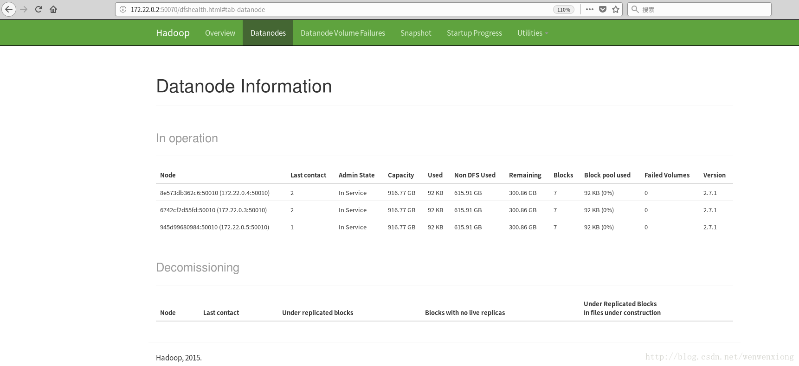

# hadoop

# 下载hadoop镜像

可以在github上自己手动构建hadoop镜像，也可以从dockerhup上下载，dockerhup上已经与该github项目建立起自动构建的关系。
docker-compose.yml文件中用到了以下5个docker镜像

```
docker pull bde2020/hadoop-datanode:1.2.0-hadoop2.7.4-java8
docker pull bde2020/hadoop-namenode:1.2.0-hadoop2.7.4-java8
docker pull bde2020/hadoop-resourcemanager:1.2.0-hadoop2.7.4-java8
docker pull bde2020/hadoop-historyserver:1.2.0-hadoop2.7.4-java8
docker pull bde2020/hadoop-nodemanager:1.2.0-hadoop2.7.4-java8
```

# docker-compose编排hadoop服务

项目中的docker-compose文件如下，该项目的一大亮点是用户可以自己方便的修改hadoop的配置文件，只需按照格式在hadoop.env中设置变量与值。

## hadoop变量配置

默认的hadoop.env

```
CORE_CONF_fs_defaultFS=hdfs://namenode:8020
CORE_CONF_hadoop_http_staticuser_user=root
CORE_CONF_hadoop_proxyuser_hue_hosts=*
CORE_CONF_hadoop_proxyuser_hue_groups=*

HDFS_CONF_dfs_webhdfs_enabled=true
HDFS_CONF_dfs_permissions_enabled=false

YARN_CONF_yarn_log___aggregation___enable=true
YARN_CONF_yarn_resourcemanager_recovery_enabled=true
YARN_CONF_yarn_resourcemanager_store_class=org.apache.hadoop.yarn.server.resourcemanager.recovery.FileSystemRMStateStore
YARN_CONF_yarn_resourcemanager_fs_state___store_uri=/rmstate
YARN_CONF_yarn_nodemanager_remote___app___log___dir=/app-logs
YARN_CONF_yarn_log_server_url=http://historyserver:8188/applicationhistory/logs/
YARN_CONF_yarn_timeline___service_enabled=true
YARN_CONF_yarn_timeline___service_generic___application___history_enabled=true
YARN_CONF_yarn_resourcemanager_system___metrics___publisher_enabled=true
YARN_CONF_yarn_resourcemanager_hostname=resourcemanager
YARN_CONF_yarn_timeline___service_hostname=historyserver
YARN_CONF_yarn_resourcemanager_address=resourcemanager:8032
YARN_CONF_yarn_resourcemanager_scheduler_address=resourcemanager:8030
YARN_CONF_yarn_resourcemanager_resource___tracker_address=resourcemanager:80
```

例如CORE_CONF_fs_defaultFS=hdfs://namenode:8020，CORE_CONF指明为/etc/hadoop/core-site.xml配置文件，fs_defaultFS是配置文件中的key，hdfs://namenode:8020是该key的取值。
详见项目中base下的entrypoint.sh脚本，用户可以修改该脚本，增添自己想配置的其他hadoop配置文件。

## docker-compsoe文件

docker-compose.yml

```
version: "2"

services:
  namenode:
    image: bde2020/hadoop-namenode:1.2.0-hadoop2.7.4-java8
    container_name: namenode
    ports:
      - 50070:50070
    volumes:
      - ./data/hadoop_namenode:/hadoop/dfs/name
    environment:
      - CLUSTER_NAME=test
    env_file:
      - ./hadoop.env

  resourcemanager:
    image: bde2020/hadoop-resourcemanager:1.2.0-hadoop2.7.4-java8
    container_name: resourcemanager
    ports:
      - 8088:8088
    depends_on:
      - namenode
      - datanode1
      - datanode2
    env_file:
      - ./hadoop.env

  historyserver:
    image: bde2020/hadoop-historyserver:1.2.0-hadoop2.7.4-java8
    container_name: historyserver
    ports:
      - 8188:8188
    depends_on:
      - namenode
      - datanode1
      - datanode2
    volumes:
      - ./data/hadoop_historyserver:/hadoop/yarn/timeline
    env_file:
      - ./hadoop.env

#  nodemanager1:
#    image: bde2020/hadoop-nodemanager:1.2.0-hadoop2.7.4-java8
#    container_name: nodemanager1
#    ports:
#      - 8042:8042
#    depends_on:
#      - namenode
#      - datanode1
#      - datanode2
#    env_file:
#      - ./hadoop.env

  datanode1:
    image: bde2020/hadoop-datanode:1.2.0-hadoop2.7.4-java8
    container_name: datanode1
    depends_on:
      - namenode
    volumes:
      - ./data/hadoop_datanode1:/hadoop/dfs/data
    env_file:
      - ./hadoop.env

  datanode2:
    image: bde2020/hadoop-datanode:1.2.0-hadoop2.7.4-java8
    container_name: datanode2
    depends_on:
      - namenode
    volumes:
      - ./data/hadoop_datanode2:/hadoop/dfs/data
    env_file:
      - ./hadoop.env

  datanode3:
    image: bde2020/hadoop-datanode:1.2.0-hadoop2.7.4-java8
    container_name: datanode3
    depends_on:
      - namenode
    volumes:
      - ./data/hadoop_datanode3:/hadoop/dfs/data
    env_file:
      - ./hadoop.env


```

创建并启动hadoop集群
sudo docker-compose up

# 访问

访问时使用容器的IP替换下面域名

```
Namenode: http://namenode:50070/dfshealth.html#tab-overview
History server: http://historyserver:8188/applicationhistory
Datanode: http://datanode:50075/
Nodemanager: http://nodemanager:8042/node
Resource manager: http://resourcemanager:8088/12345
```



停止集群 

sudo docker-compose stop 

docker-compose down

通过exec命令登录容器
docker exec -it ecef8319d2c8 /bin/sh
docker exec -it 【容器名】/bin/bash

docker attach 【容器名】也可以启动容器，但是当我们ctrl+d退出容器后。容器就会自动关闭，下次还要用docker start 【容器名】启动容器，所以我们选择上面那条命令启动，然后用docker ps 命令来查看我们当前运行的容器

进入容器后需要对容器内容查看时候无法使用vim和vi
更新来源
apt-get update
安装vim
apt-get install -y vim