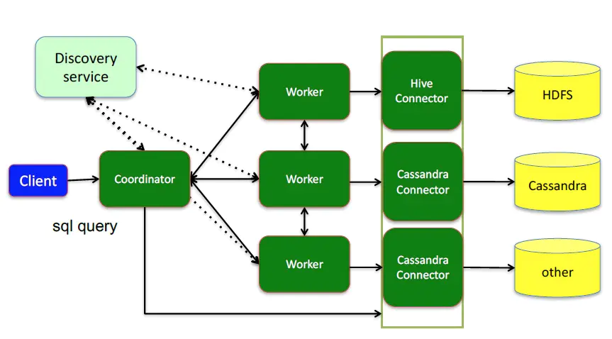

# 规划院招标文件

技术要求

1）系统方案采用基于Springcloud框架的微服务架构，能够提供微服务拆分设计，并根据竞争性谈判需求提供合理的微服务集群建议，实现高可用、高并发的服务性能。

2）系统方案采用微服务技术，能够支持可视化服务配置、服务运行管理、服务监视功能，支持常规webservice、http、MQ、socket等至少10种以上协议。提供数据发布服务（DSP)方案，通过配置数据集可实现通过webservice、http等协议发布数据服务。

3）系统方案包含关系型数据库与非关系型数据库的融合，实现混合数据架构，对炼厂结构化数据与非结构化数据进行统一管理。

4）利用分布式技术和缓存数据库，对数据的采集，存储和查询进行优化，保证千万级别或以上级别数据响应速度在秒级以内。

5）系统方案包含针对炼化业务的数据治理体系，包含炼化主数据管理、元数据管理、数据质量管理、数据血缘分析、数据目录管理、数据地图等内容；通过数据建模，以元数据方式进行数据全生命周期管理。

6）系统方案能够支撑炼化实时数据集成、处理、存储与共享，包括装置自动化控制系统、自动化仪表、动设备运行参数、安全环保监测等方面的实时数据，处理响应时间为秒级以内。

7）系统方案支持广东石化全厂智能化对象化建模，实现生产、设备、安全环保等业务域数据与三维平台的互联互通。

8）系统方案提供ETL工具解决方案，支持CDC（变化数据捕捉）技术，能够快速识别变化数据并进行同步。

9）能够通过统一的分布式sql查询引擎，实现支持跨库(如Oracle、SQLserver、Mysql等)数据查询，保证查询的高性能，异步性。

10）提供多种数据集成解决方案。

11）提供对敏感数据进行加密传输的方案。

12）有能源行业数据集成、数据分析类信息化项目成功实施案例。

1）系统平台

交付谈判响应人所负责的企业综合数据库功能模块，包括数据采集、ETL管理、采集监控、数据地图、统计查询、数据共享管理、接口服务、数据目录管理、主数据管理、标准文档管理、数据质量管理、元数据管理及基础平台（后台基础服务）等。交付的软件要满足项目目标和需求，符合整体技术框架要求

## 4、时间进度要求

分三个阶段交付。

1）第一阶段交付时间为2021/6/30，交付内容为：主数据管理、数据采集、ETL管理、采集监控、数据共享管理、接口服务等功能模块及基础平台（后台基础服务）开发与实施。

2）第二阶段交付时间为2021/10/30，交付内容为：数据目录管理、数据地图、统计查询、标准文档管理、数据质量管理、元数据管理等功能开发与实施。

3）第三阶段交付时间为2022/6/30，交付内容为：随着各业务系统上线进程，完善数据目录管理、数据地图、接口服务等功能，完成系统上线。

## 7、人员数量、资质要求及工作界面划分

谈判响应公司投入本项目的企业综合数据库技术咨询专家至少2名，包含1名数据库专家和1名数据平台开发专家，高级咨询与实施顾问至少3名，中级咨询与实施顾问至少3名，具体要求如下：

表2 谈判响应公司投入人员基本要求

| **序号** | **人员类型**             | **人员数量** | **投入工作量** | **经验要求**                                                 |
| -------- | ------------------------ | ------------ | -------------- | ------------------------------------------------------------ |
| 1        | 数据库技术咨询专家       | 1人          | 不少于264人天  | 至少有10年以上工作经验（包括5年以上能源行业信息化相关工作经验），3家以上大型炼油与化工企业信息系统咨询、实施和集成经验；具备丰富的信息技术项目管理经验，主导过炼厂智能工厂相关项目的系统架构设计和关键技术实现；具有较强的沟通协调能力、项目风险应对能力；充分了解中国石油的情况及炼化业务；具有5个以上相关项目经验。 |
| 2        | 数据平台开发技术咨询专家 | 1人          | 不少于264人天  |                                                              |
| 3        | 高级咨询与实施顾问       | 3人          | 不少于792人天  | 至少有5年以上的工作经验，具有炼化信息系统开发建设经验及类似项目经历。 |
| 4        | 中级咨询与实施顾问       | 3人          | 不少于792人天  | 至少有3年以上工作经验，具有炼化信息系统开发建设经验及类似项目经历。 |

 

1）企业综合数据库数据库技术咨询专家应具备以下技术能力：

（1）具有应用系统架构、数据库规划能力，具有技术风险的把控能力。

（2）具备业界主流关系数据库（oracle、sqlserver、mysql）高并发、高性能架构经验；具备Hadoop体系架构及关系型与非关系型混合架构的设计与建设经验；。

（3）有大型基于J2EE体系结构的项目规划、系统架构设计、高并发、高负荷、分布式系统设计；具有关系数据库与Hadoop技术开发经验，熟悉大数据处理技术，比如Spark、Hadoop、InfluxDB、hive、storm等。

（4）熟悉PAAS平台，微服务设计理念，能熟练地进行微服务设计、开发；深入了解k8+docker、Sping Cloud、SpringMVC、Spring、MyBatis、Redis、Zookeeper、Dubbo等框架；对消息队列、数据缓存、日志等中间件有深入的开发经验。

2）企业综合数据库平台技术咨询专家应具备以下技术能力：

（1）具有应用系统架构、数据库规划能力，具有技术风险的把控能力，具备业界主流关系数据库（oracle、sqlserver、mysql）高并发、高性能架构经验。

（2）有大型基于J2EE体系结构的项目规划、系统架构设计、高并发、高负荷、分布式系统设计；精通常用设计模式和主流设计工具，具有Java框架设计能力，有搭建Java框架经验，能承担核心模块的开发，能根据既定产品和项目的特性进行技术架构设计。

（3）熟悉PAAS平台，微服务设计理念，能熟练地进行微服务设计、开发；深入了解k8+docker、Sping Cloud、SpringMVC、Spring、MyBatis、Redis、Zookeeper、Dubbo等框架；对消息队列、数据缓存、日志等中间件有深入的开发经验。

（4）熟悉多线程与NIO编程，熟悉常用数据结构和算法；熟悉大数据处理技术，比如Spark、Hadoop、InfluxDB、hive、storm等。

（5）熟悉Linux系统，具备一定的网络及信息安全方面经验，有调查及解决各种部署环境相关问题的能力。

3）咨询与实施顾问要具备以下技术能力：

（1）熟悉J2EE体系结构的，精通常用设计模式和主流设计工具，具有Java框架设计能力，有搭建Java框架经验，能承担核心模块的开发。

（2）熟悉PAAS平台，微服务设计理念，能熟练地进行微服务设计、开发；深入了解k8+docker、Sping Cloud、SpringMVC、Spring、MyBatis、Redis、Zookeeper、Dubbo等框架；对消息队列、数据缓存、日志等中间件有深入的开发经验。

（3）熟悉多线程与NIO编程，熟悉常用数据结构和算法；熟悉大数据处理技术，比如Spark、Hadoop、InfluxDB、hive、storm等。

（4）熟悉Linux系统，具备一定的网络及信息安全方面经验，有调查及解决各种部署环境相关问题的能力。

### 评分标准

- 对项目过程中设计、开发、上线、移交有明确的时间和工作计划；按照描述详细程度，详细得5分，较详细得2-4分，一般得0-1分。
- 制定科学、合理、有效的质量及进度保障措施，对服务实施进行全过程管理和监督；对项目各阶段潜在的风险进行全面深入的分析和总结，提出可行的风险应对措施；按照措施的完善程度，完善得5分，较完善得2-4分，一般得0-1分。
- 对炼化企业全厂智能化的企业综合数据库建设相关的业务、技术、发展趋势及应用情况的认识深入全面，能够为项目建设提供有价值的建议和指导。按照描述详细程度，详细得12-15分，较详细得9-11分，一般得0-8分。
- 能够提供企业综合数据库技术实现方案，符合竞争性谈判文件技术方案涉及的技术要求，按照方案合理可行程度进行评价。优良得3-4分，一般得0-2分。
- 系统应采用微服务架构设计，能够提供微服务拆分设计，并根据竞争性谈判文件需求提供合理的微服务集群建议,实现高可用、高并发的服务性能。优良得3-4分，一般得0-2分。
- 能提供ETL工具解决方案，支持CDC（变化数据捕捉）技术，能够快速识别变化数据并进行同步。优良得3-4分，一般得0-2分。
- 能够提供统一的分布式sql查询引擎，实现支持跨库(如Oracle、SQLserver、Mysql等)数据查询，保证查询的高性能，异步性。优良得3-4分，一般得0-2分。
- 采用微服务技术，能够支持可视化服务配置、服务运行管理、服务监视功能。优良得3-4分，一般得0-2分。
- 提供数据发布服务（DSP)方案，通过配置数据集可实现通过webservice、http等协议发布数据服务。优良得3-4分，一般得0-2分。
- 提供多种数据集成方式解决方案，按照合理可行程度进行评价。优良得3-4分，一般得0-2分。
- 提供对敏感数据进行加密传输的方案，并能提供数据传输加密案例。优良得3-4分，一般得0-2分。
- 系统方案能够支撑炼化实时数据集成、处理、存储与共享，包括装置自动化控制系统、自动化仪表、动设备运行参数、安全环保监测等方面的实时数据，处理响应时间为秒级以内。优良得3-4分，一般得0-2分。
- 提供利用分布式技术和缓存数据库对实时数据的采集、存储和查询进行优化的方案，保证千万级别或以上级别数据响应速度在秒级以内。按照合理可行程度进行评价。优良得3-4分，一般得0-2分。
- 投入人天是否满足要求，满足得5分，不满足得0分
- 投入的综合数据库技术咨询专家和高级咨询与实施顾问具有相关技术资格认证，具有信息系统和数据库系统设计开发经验（技术咨询专家10年及以上，高级咨询与实施顾问5年及以上），具有和炼化企业综合数据库类似的系统实施经验，提供相关简历、资格证书。优秀得8-10分，良好得6-7分，一般得0-5分。
- 对知识转移情况、培训方案有计划安排。培训方案合理，知识转移方法有效。合理得5分，较合理得2-4分，较差得0-1分。
- 无偏离或正偏离得5分；偏离少、非关键条款，得2-4分；偏离或涉及重要条款，得0-1分。
- 对公司实力、咨询和实施能力、技术方案、服务承诺等各方面进行评价；技术标书内容完整、条理清晰。优秀得8-10分，良好得6-7分，一般得0-5分。

表1 企业综合数据库功能范围

| 序号 | 功能模块       | 子功能                                                       | 备注         |
| ---- | -------------- | ------------------------------------------------------------ | ------------ |
| 1    | 数据集成       | 数据采集、ETL管理、采集监控                                  | 外包         |
| 2    | 数据存储       | 数据库集群、数据共享存储                                     | 内部人员负责 |
| 3    | 数据服务       | 数据目录管理、数据地图、统计查询、数据共享管理、接口服务     | 外包         |
| 4    | 数据标准化管理 | 主数据管理、标准文档管理、数据质量管理、元数据管理           | 外包         |
| 5    | 系统管理       | 异常报警管理、系统运行分析、日志管理、权限管理、用户管理、数据安全 | 内部人员负责 |

 

Presto是由 Facebook 推出的一个基于Java开发的开源分布式SQL查询引擎，适用于交互式分析查询，数据量支持GB到PB字节。Presto本身并不存储数据，但是可以接入多种数据源，并且支持跨数据源的级联查询。

和Oracle、MySQL、Hive等数据库相比，他们都具有存储数据和计算分析的能力。如MySQL具有 InnoDB存储引擎和有SQL的执行能力；如Hive 有多种数据类型、内外表（且这么叫）的管理能力，且能利用MR、TEZ执行HQL。而Presto并不直接管理数据，他只有计算的能力。

 

**软件架构**

presto 查询引擎是一个Master-Slave的拓扑架构

## 工作原理

### SQL运行过程

1、coordinator接到SQL后，通过SQL语法解析器把SQL语法解析变成一个抽象的语法树AST，只是进行语法解析如果有错误此环节暴露
 2、语法符合SQL语法，会经过一个逻辑查询计划器组件，通过connector 查询metadata中schema 列名 列类型等，将之与抽象语法数对应起来，生成一个物理的语法树节点 如果有类型错误会在此步报错
 3、如果通过，会得到一个逻辑的查询计划，将其分发到分布式的逻辑计划器里，进行分布式解析，最后转化为一个个task
 4、在每个task里面，会将位置信息解析出来，交给执行的plan，由plan将task分给worker执行

### presto执行过程

| **序号** | **拟任岗位**          | **姓名**   | **主要工作履历介绍**   |
| -------- | -------------- | -------- | --------------------- |
| **1**    | 数据库技术专家 | 曾庆猛 | 熟悉软件开发流程，精通SQL、ASP等IT技能，在数据库设计上也有丰富的经验的软件、硬件、网络应用开发的知识，包括基于ERP、客户端/服务器构架，数据库管理软件项目的开发 |
| **2**    | 架构设计师     | 雷振杰   | 10年的工作经验，参与过中国石化总公司全国26个点ERP网络系统集成项目的方案规划和实施和中国石化总公司全国17个点VPN链路系统项目的实施， |
| **3**    | 信息需求分析师 | 艾东辉   | 大型企业多年工作经验，熟悉大型企业管理体系.参与公司与外部对接等商务谈判,为顺利承接提出合理建议,熟悉油气行业的业务流程。 |
| **4**    | JAVA工程师     | 程旭     | 经历开发工程师历练，有良好的沟通能力、语言表达能力、自我学习能力；能快速理解业务开发流程，擅于思考分析问题解决问题 |
| **5**    | JAVA工程师     | 孙晓倩   | 1年Java开发经验，有电商、ESB系统开发经验。软件编程功底扎实，并具备一定的开发小组管理能力 |
| **6**    | JAVA工程师     | 陈庆     | 在IT行业工作3年多以来一直从事Java  EE企业级应用、大规模分布式应用及web应用系统的架构设计及开发工作，积累了丰富的软件项目开发经验，具有多种主流技术或技能的经验知识，包括：Java企业级应用的多种技术及开源框架，多种database，webservice相关技术，前端技术等 |
| **7**    | JAVA工程师     | 李承     | 精通div+css、javascript、html5、jQuery,了解W3C标准，对Web标准和标签语义化有深入理解；熟练运用css3、html5、jQuery、Vue、bootstrap等独立完成整个前端页面开发（移 动端+PC响应式布局）；对浏览器不同差异和解决浏览器兼容有丰富经验，低至IE6的兼容；对用户体验有个人深刻理解，页面交互效果和动画效果有较多项目实战经验，开发过程中会加入产品没有考虑到的交互效果和动画效果；有定制前段UI组件的能力； |
| **8**    | 运维工程师     | 陈岩     | 有2年的Linux运维经验。熟悉Shell语言  和 Python语言；熟悉Web系统架构、Docker技术、监控技术,具有较强的故障排查能力和解决问题的能力；熟悉存储MySQL数据库，Linux集群架构、单点故障的优化 |
| **9**    | 测试工程师     | 李谨德   | 熟悉性能测试，熟练使用测试工具。网络安全和数据安全测试；喜欢探索提高测试效率，改进测试方法，提高测试团队的技术能力；评审和分析产品需求，开发设计的方案，把控测试方向和测试策略。 |

