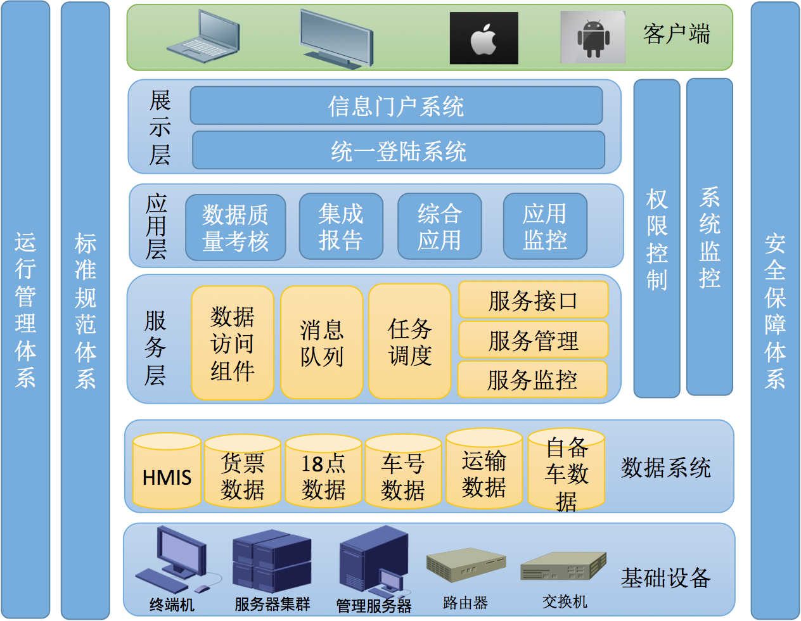

# 技术总结

## 项目现状

### 集成平台

## 开发环境

- 操作系统：Windows 10 Enterprise
- 开发工具：Eclipse 4.2
- 数据库：Oracle 
- Java SDK：Oracle JDK 1.6

## 部署环境

- 操作系统：Linux Ubuntu Server 16.04 X64
- 服务器：weblogic 10.3.6

## 项目管理工具

- 项目构建：Maven + Nexus
- 代码管理：svn + svn mananger

## 后台主要技术栈

- 核心框架：Spring 
- 视图框架：Spring MVC
- 页面引擎：JSTL
- ORM 框架： MyBatis 
- 数据库连接池：Alibaba Druid

## 前端主要技术栈

- 前端框架：Bootstrap + jQuery

## 部署运维

- 持续集成：SVN
- 持续交付：Jenkins

## 系统架构

