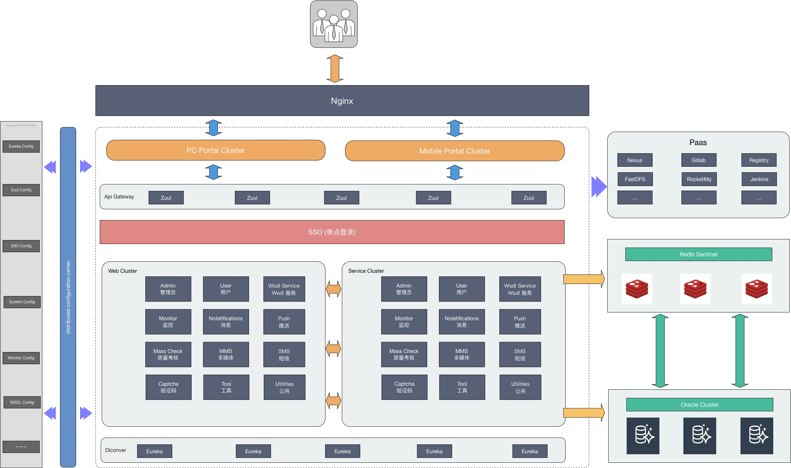

# 技术总结-微服务

## 开发环境

- 操作系统：Windows 10 Enterprise
- 开发工具：Intellij IDEA
- 数据库：Oracle 11g
- Java SDK：Oracle JDK 1.8.152

## 部署环境

- 操作系统：Linux Redhat Server 7.4 X64
- 部署服务技术：Linux + Docker

## 项目管理工具

- 项目构建：Maven + Nexus
- 代码管理：Git + GitLab
- 镜像管理：Docker Registry

## 后台主要技术栈

- 核心框架：Spring Boot + Spring Cloud
- 视图框架：Spring MVC
- 页面引擎：Thymeleaf
- ORM 框架：tk.mybatis 简化 MyBatis 开发
- 数据库连接池：Alibaba Druid
- 数据库缓存：Redis Sentinel
- 消息中间件：RocketMQ
- 接口文档引擎：Swagger2 RESTful 风格 API 文档生成
- 分布式链路追踪：ZipKin
- 分布式文件系统：Alibaba FastDFS
- 分布式服务监控：Spring Boot Admin
- 分布式协调系统：Spring Cloud Eureka
- 分布式配置中心：Spring Cloud Config
- 反向代理负载均衡：Nginx

## 前端主要技术栈

- 前端框架：Bootstrap + jQuery
- 前端模板：AdminLTE

## 自动化运维

- 持续集成：GitLab
- 持续交付：Jenkins

## 系统架构

## 服务规划

### Cloud

| 服务名称    | 服务端口 | 服务说明       |
| ----------- | -------- | -------------- |
| jcpt-eureka | 8761     | 服务注册与发现 |
| jcpt-config | 8888     | 分布式配置中心 |
| jcpt-zipkin | 9411     | 分布式链路追踪 |
| jcpt-zuul   | 8769     | 分布式路由网关 |
| jcpt-admin  | 8084     | 分布式系统监控 |

### Service

| 服务名称             | 服务端口 | 服务说明                   |
| -------------------- | -------- | -------------------------- |
| jcpt-service-admin   | 8501     | 管理员服务提供者           |
| jcpt-service-redis   | 8502     | 数据缓存服务提供者         |
| jcpt-service-sso     | 8503     | 单点登录服务提供者         |
| jcpt-service-upload  | 8505     | 文件上传服务提供者         |
| jcpt-service-system  | 8506     | 系统管理服务提供者         |
| jcpt-service-monitor | 8507     | 探针服务提供者             |
| jcpt-service-wsdl    | 8508     | webservice自定义服务提供者 |

### Web

| 服务名称         | 服务端口 | 服务说明                   |
| ---------------- | -------- | -------------------------- |
| jcpt-web-admin   | 8601     | 管理员服务消费者           |
| jcpt-web-system  | 8602     | 系统管理服务消费者         |
| jcpt-web-backend | 8603     | 后台服务聚合               |
| jcpt-web-wsdl    | 8604     | webservice自定义服务消费者 |
| jcpt-web-monitor | 8605     | 探针服务消费者             |

