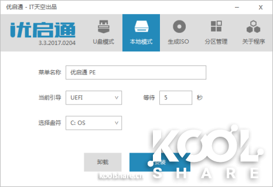

# dell-R720-vmware-esxi6.7-安装

此文是我发的一篇的准备工作，因为ESXi 6.7刚发布的原因，很多同学等着升级，故而先写了出来。原文如下：

**戴尔R730 安装升级VMware vSphere Hypervisor (ESXi) 6.7**
**https://koolshare.cn/thread-139061-1-1.html**

**这一篇，介绍怎样从U盘加载ISO镜像，并引导电脑/服务器，完成新安装/升级系统的操作，当然，实际中不仅仅用于ESXi的安装升级，也可以用于NAS4Free、FreeNAS、Proxmox VE虚拟机系统，爱快软路由系统、Panabit智能应用网关、ROS软路由、OpenWrt/LEDE，Windows XP至Win10和WinServer2003至2016的安装/升级，甚至是黑群晖引导盘的制作等。几乎是万能的！！！写这个只是为了抛砖引玉，让大家思路更开拓一些，日常维护和安装更简单一些，没有别的意思。**
**首先，咱不用UltraISO，这个软件虽然我也用的很熟，但是每换一个ISO，就要重新格式化后制作引导盘，这个在32G以上尤其是USB2.0的优盘上是基本无法接受的。并且****UltraISO似乎只对Windows7以上的引导做的比较好，所有Linux系统和基于BSD的系统全部会出问题。**

**既然是万能法（当然不可能100%万能），肯定不能经常格式化优盘，方便好用是最起码的。**

**一、主角--U盘一个或移动硬盘一块，1G以下就不要玩了，推荐16G或以上，当然容量越大越好，速度越快越好，还有一点是，不要量产，不要分区。一般16-64GB足矣，当然得看你想要能装下的系统有多少了。我的台电的USB3.0 64GB一个，和朗科的USB3.0 128GB一个，用了两三年了，还不错。请尽量选择质量好的或正品，某宝上假Kingston和杂牌较多，质量很差，用不了多久，请注意识别！**

**二、上软件的主角---优启通（EasyU，简称EU） v3.3.2018.0320 （2018.04.16 发布）**
**大约需要500MB+容量，**似乎外链不合法，所以先不发了，自己搜索IT天空吧，或者后面我再想办法。当然，如果你用其他的U盘引导软件，比如老毛桃，U启动，大白菜等，也是可以的。我只是习惯用优启通，升级较简单，兼容性做的还不错。


**三、先做启动盘，这个太简单了，但是要注意备份优盘数据，几乎所有操作都会先格式化优盘，****如果有多分区，请先用分区工具****DiskGenius中文版或傲梅分区助手删除优盘的全部分区，保存后分成一个区，再格式化成任一主流格式，推荐NTFS**
**1.**U盘制作，一键式制作方式，只需插上U盘，单击“全新制作”即可。如果你的优盘以前做过这个启动，但是出了问题，要先【还原空间】后，再【全新制作】
如果你之前是2017.0204或2018.0130，要升级到最新的2018.0320，可以直接点免格升级。
注意【还原空间】和【全新制作】一定要备份优盘数据。
因为里面含的汉化版HDTune和个别其他工具会报毒，建议关闭或退出杀毒软件，以免干扰造成失败。
默认设置建议不要动，NTFS可以兼容4GB以上的ISO或者大文件，而FAT32不支持超过4GB的单文件。
理论上兼容性最好的是exFAT格式，但是WinXP及更早的Windows默认不识别exFAT，需要打补丁才可以，很多早期的Linux也需要更新后才支持exFAT，但好处是支持超过4GB的单文件，大部分Linux和FreeBSD等系统可以直接读写。如果你身边已经没有XP系统了，推荐这个。


2.顺引官方的简介，我再详细备注一下，介绍点你今天用不到，但以后可能有用的。
本地模式，可以将PE写入当前硬盘，注意是硬盘，官方说是便于日常使用与维护，我建议千万不要这样做。至于为什么，已经有人出过问题了，U盘+硬盘都有这个引导菜单的时候，会出很多莫名其妙的问题。





3.生成ISO，可生成PE的ISO镜像，可用于量产（最近10年内的电脑不建议用量产，很老的不识别USB HDD的才需要量产成USB CD-ROM引导）、虚拟机等，可以上载到ESXi的存储盘中，供虚拟机的光驱加载，以便维护系统用。


当然，VMware Workstation和VirtualBox也可以直接调用，连上载都不需要。


4.分区管理，这是一个辅助功能，用于检查U盘制作效果。看看就可以了，千万不要动。动了就挂，就用不了了。


5.制作进度，直观的显示制作进度，建议制作时耐心等待，不要做其他任何操作


对了，进行到某个点时，个别杀毒软件会报毒，建议关闭或退出杀毒软件，以免干扰造成失败。


其他东西，设置，建议不要动，保持默认。


四、引导U盘提示制作完成后，可能个别电脑需要退出拔下重插，在根目录手动建立一个叫ISO的目录，必须是这个文件夹名，不能乱改。

然后将你需要的所有能引导的ISO镜像拷到这个目录下面，不带引导的软件类似MS Office或者AutoCAD就不要凑热闹了。

能引导的常用的系统列表如下：

VMware-VMvisor-Installer-6.7.0-8169922.x86_64_SLIC.iso      ESXi 6.7带Slic的版本
ESXi-6.7.0-8169922-RTL8168.iso                              ESXi 6.7不带Slic，但是带Realtek网卡驱动的版本
proxmox-ve_5.1-3.iso                                        Proxmox Virtual Environment 5.1-3，另外一个类似ESXi的，开源的虚拟机服务器软件。
iKuai8_x64_3.0.7_Build201804191004.iso                     爱快软路由系统
PanabitFREE_FreeBSD9.2_20170204.iso                      Panabit智能应用网关
pfSense-CE-2.4.3-RELEASE-amd64.iso                        pfSense，基于FreeBSD架构的开源软防火墙

CentOS-7-x86_64-DVD-1708.iso                              CentOS 7.4-1708的安装镜像。

Fedora-Server-dvd-x86_64-28_Beta-1.3.iso                    Fedora-Server 28_Beta-1.3
Win7_08R2_X64_Nin1_201608.iso                            无约而来的Win7/2008R2多OEM集成版，支持UEFI和USB3.0
Win_Server_08R2_33in1_v1.1-UEFI.ISO                       无约而来的Win2008R2 多OEM集成版，支持UEFI。
NAS4Free-x64-LiveCD-11.1.0.4.5403.iso                       一个免费开源的NAS系统，有中文Web配置界面，功能强大，但配置稍麻烦。
FreeNAS-11.1-U4.iso                                         也是一个免费的NAS系统，有没有中文不知道，但配置要求较高。
rhel-server-7.5-x86_64-dvd.iso                                红帽RHEL最新的7.5版
Oracle Linux Release 7 Update 5 for x86_64.iso                甲骨文Linux最新的7.5版，抄的红帽，跟红帽基本无区别。
ubuntu-18.04-desktop-amd64.iso                              Ubuntu 18.04，内置有中文，终于在2018年4月底发布了。
deepin-15.5-amd64.iso                                        深度操作系统 15.5，基于Ubuntu，软件尽量本地化，更漂亮易用。
cn_windows_server_2016_x64_dvd_9718765_2in1_201703.ISO  
                                    Windows Server 2016 二合一版，集成多OEM，有Slic直接激活。
cn_windows_server_2016_updated_feb_2018_x64_dvd_11636703.iso 
                                    完全原版Windows Server 2016镜像，官方集成补丁至2018年2月
cn_windows_10_business_editions_version_1803_updated_march_2018_x64_dvd_12063730.iso
                              最新完全官方原版的Win10 RS4-1803版，2018年4月30日更新，包含教育版、企业版、专业版。

未完待续，欢迎跟帖你喜欢或者需要安装的系统。


五、转回正题，插上优盘，服务器或者电脑要重启一下，显示Logo或自检的时候华硕按F8，惠普映泰F9，微星华擎戴尔昂达七彩虹按F11，技嘉联想梅捷按F12，VMWare虚拟机和其他个别主板按ESC，其他请自己查吧。选择HDD或者HardDisk，或者有很多主板显示USB HDD：Netac XXX，待补图。
以我的戴尔R720服务器为例吧，先是大Logo


按F11进入启动管理器，这是临时的，一次有效，下次就按BIOS里设置的引导顺序正常启动了。


台式电脑和笔记本自检很快。But，服务器，一般自检没有两三分钟就不要想，没办法，等吧。
选择BIOS Boot Menu，千万不要选UEFI方式引导。普通电脑也是，一般情况下，UEFI开头的引导方式不要选，试试就知道为什么了，看到的菜单完全不同。


扫描启动设备，再等10秒钟。


终于出来了，这是我的选项。
你肯定没有最后两项，因为这是局域网远程虚拟出来的软驱和光驱，跟虚拟机加载ISO一个原理，这个问题下一章再讲。


键盘放到Hard drive C的时候，自动跳出两个，
第一个肯定是内置的RAID5阵列卡了，
我们选第二个，前置USB：OnlyDisk（朗科的一个优盘系列）


第7项，运行其他工具，回车


再第3项，【运行自定义映像】，回车。


识别出了ISO目录下的两个映像文件，NAS4Free和VMware-VMvisor-Installer-6.7.0，即ESXi 6.7。


好，正式开始了ESXi的安装和升级，下面的步骤可以看
**戴尔R730 安装升级VMware vSphere Hypervisor (ESXi) 6.7**


NAS4Free，FreeNAS，爱快，Panabit智能应用网关，pfSense，只要ISO不超过1G，一般都可以用这种方式引导安装，或者升级，很多ISO会自动判断是否升级，检测到自己的数据会自动提示覆盖还是保留，选择保留并升级就可以了。新安装的话，完全不用担心，折腾吧。
超过1G的Linux，大部分还是可以引导安装的。

img文件，需要写盘的，如ROS软路由和黑群晖、OpenWrt/LEDE等，进入WinPE，用【IMG写盘工具.exe】或Win32DiskImager写盘吧。


Windows的大部分安装ISO，不能这样引导安装，需要进入WinPE，推荐AHCI或NVMe的新机器进Win10 PE，右击你要安装的ISO，挂载成虚拟光驱，再用安装工具写入，就可以安装了。此方法安装大部分镜像有效，但并不是100%，图待补。

gho镜像文件，进入WinPE，有Ghost32或Ghost64，也有GUI可以调用。

有关虚拟机的设置及ISO引导，可以参考这几张图，图例是ESXi 6.7的，实际上Proxmox VE类似，VMware Workstation和VirtualBox也是一样。


有关虚拟机启动太快，来不及按ESC就自动进入系统的问题，可以在这里设置延迟3秒启动。


群里有人看了，提出了一些问题，一并解答：
1.移动硬盘能做吗？
答：当然可以，只要能写入的，基本都可以。U盘也是模拟USB硬盘启动，一样的。
当然普通SATA口的台式机/笔记本硬盘也是可以的，一样地用，没什么不同，只是引导时选择SATA设备，但是服务器的SATA口可不一定能引得出来让你直接用，有的服务器，只接了一个光驱是用的SATA口，其他全部SAS磁盘阵列。

2.和UltraISO写的盘有什么区别？
答：区别非常大，UltraISO写的盘，缺点如下：
①文件不会被隐藏，被删除、修改、中毒的机率更大。
②一次只能引导一个ISO，对Linux、BSD等非Windows系统支持不好，安装时有的就会出错，个别安装正常，但使用时会出现各种莫名其妙的问题。
③做好直接就是Fat32格式，不再支持4GB以上文件。Linux没有一个推荐用UltraISO写盘的，包括红帽和CentOS、Ubutu、深度等。如果你要写Linux到优盘，推荐用UNetbootin，开源免费还更简单。
优启通等PE维护盘的好处是：
①维护分区被隐藏了，几乎不能写不能改，不会中毒。
②ISO镜像引导文件是虚拟光驱文件，直接把iso原文件拷贝到ISO文件夹下就可以了，不用修改，加载后不可写入，不会中毒，除非病毒把这个文件夹删除，否则无影响。
③可以支持多ISO文件引导，方便简单，不用经常格式化优盘。只要容量允许，假如有10个不同的ISO系统，只拷贝一次，永久使用

3.我有多个U盘，或者我多买几个，不能直接用UltraISO写ISO进去吗？
答：可以，这是你的自由，技术上实现有很多种方法，我只是介绍一种最稳定最不容易出错的。我就有两个优盘，一个做了优启通，一个用UltraISO写了Win7，但最近的锐龙2和Intel八代U不支持Win7，所以还得用优启通引导进PE安装Win10。

4.优启通不是GRUB4DOS或EasyBCD之类的引导吗？自己都可以弄吧，还更快！！
答：是的，它就是BootMGR+GRUB等一堆的混合体，理论上确实没多大区别，但实际使用上人家的兼容性就是好，用户有好多万（具体我也不知道）。自己搞的GRUB4DOS或EasyBCD视自己的技术水平，肯定很容易出兼容性和其他问题，更容易挂掉。反正我是没这个水平。

5.你没见到过的问题是，U盘启动不了，你还得格式化重新做U盘.
答：是的，近10年我遇到过两三例，不算多，但是格式化重新做了其他U盘引导也不行，当然，这不是绝对，优启通的兼容性做的还是不够完美，例如在最新的AMD锐龙2上，启动会花屏，但是能正常使用。

6.大眼鱼同学推荐了几个好东西，硬件级移动硬件转虚拟光驱，首先是思民ZM-HE135、思民VE300/IODD2531，VE400/IODD2541，还有VE350。似乎思民的都停产了。
答：查了一下某宝，以IODD2531为例，有中文电子版说明书，带液晶屏有写保护，能虚拟光驱、软驱、U盘，实际上也就虚拟光驱有用，通过盒子上的按键确认要虚拟的ISO，兼容性肯定比优启通强，理论上Windows下安装Photoshop或PTC_Creo_3.0_M120_Win64.iso连虚拟光驱软件都省了。 我都很有兴趣了，维护可以变得更简单，就是价格有点高，当然企业用的话，完全不算什么，正在考虑中。


7.有同学说，只需要写保护，普通U盘就能满足需求，不想多花钱
答：单独的移动硬盘盒，带写保护开关的有，加个笔记本硬盘就成了，比如佳翼Q5w。U盘应该也有，买带写保护开关的优盘，不会贵太多，比如朗科应该有，具体型号我也不清楚，我没有此需求。加密的U盘应该不是你想要的，因为加密功能是读写都加密，读也禁了，无法虚拟成光驱或者引导用。


#### esxi 注册码

```
JU4EU-4V307-H89U1-3K17M-3C2QA
4A2W0-AUHEJ-48891-KA1EK-3LRP8
NU2EA-6KK91-M8431-CT9X6-0C23A
MZ44K-FM10K-089F1-8A1ZP-9AKMD
1U64U-0CHE2-488H8-X32XH-320H0
1F49U-FC217-089X0-A0976-16H34

JZ0N0-ARJ80-480W0-PC8N2-022N2
NG6MR-AN306-H8DJ8-LJ2N4-8ZA02
1C2T8-AEK01-488D0-XU8QH-872JA


MY29A-81302-H8E90-H2AE2-0PKL6
```

