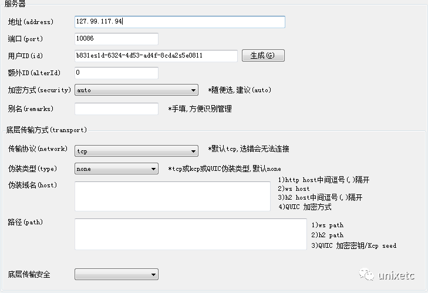

# v2fly使用

> https://www.v2fly.org/
>
> https://github.com/v2fly/v2ray-core/releases

```
version: '3.1'
services:
  v2fly:
    restart: always
    image: v2fly/v2fly-core:v4.35.1
    container_name: v2fly
    ports:
      - 81:10086
    volumes:
      - ./data/v2ray/config.json:/etc/v2ray/config.json
~
```

### config.json

```
{
    "inbounds": [
        {
            "port": 10086, // 服务器监听端口
            "protocol": "vmess",
            "settings": {
                "clients": [
                    {
                        "id": "b83138ed-6324-4d53-ad4f-8cda48b30811"
                    }
                ]
            }
        }
    ],
    "outbounds": [
        {
            "protocol": "freedom"
        }
    ]
}

```


#### 客户端配置

```
{
    "inbounds": [
        {
            "port": 7777, // SOCKS 代理端口，在浏览器中需配置代理并指向这个端口
            "listen": "127.0.0.1",
            "protocol": "socks",
            "settings": {
                "udp": true
            }
        }
    ],
    "outbounds": [
        {
            "protocol": "vmess",
            "settings": {
                "vnext": [
                    {
                        "address": "server", // 服务器地址，请修改为你自己的服务器 ip 或域名
                        "port": 10086, // 服务器端口
                        "users": [
                            {
                                "id": "b83138ed-6324-4d53-ad4f-8cda48b30811"
                            }
                        ]
                    }
                ]
            }
        },
        {
            "protocol": "freedom",
            "tag": "direct"
        }
    ],
    "routing": {
        "domainStrategy": "IPOnDemand",
        "rules": [
            {
                "type": "field",
                "ip": [
                    "geoip:private"
                ],
                "outboundTag": "direct"
            }
        ]
    }
}
```


- Windows客户端配置

下载最新版**v2rayN**，地址为https://github.com/2dust/v2rayN/releases/download/3.23/v2rayN-Core.zip

配置参考下图：



- Ubuntu客户端配置

安装方法同服务端，编辑`/usr/local/etc/v2ray/config.json`，如下配置：

```
{
    "inbounds": [
        {
            "port": 1080,
            "listen": "127.0.0.1",
            "protocol": "socks",
            "settings": {
                "udp": true
            }
        }
    ],
    "outbounds": [
        {
            "protocol": "vmess",
            "settings": {
                "vnext": [
                    {
                        "address": "127.99.117.94",
                        "port": 10086,
                        "users": [
                            {
                                "id": "b831es1d-6324-4d53-ad4f-8cda2s5e0811"
                            }
                        ]
                    }
                ]
            }
        },
        {
            "protocol": "freedom",
            "tag": "direct"
        }
    ],
    "routing": {
        "domainStrategy": "IPOnDemand",
        "rules": [
            {
                "type": "field",
                "ip": [
                    "geoip:private"
                ],
                "outboundTag": "direct"
            }
        ]
    }
}
```

```
root@vm:~# service v2ray stop
root@vm:~# service v2ray start
root@vm:~# service v2ray status
```


### 手机

> https://github.com/2dust/v2rayNG


### web管理

> https://github.com/master-coder-ll/v2ray-web-manager