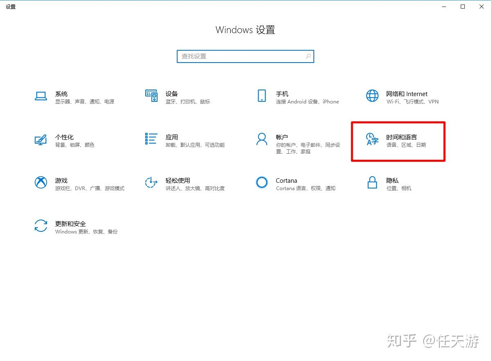

# nfs-挂载乱码

### 一个小设置，让Win10 NFS正常显示中文UTF-8

使用NAS的各位一般都会用到NFS协议，在电脑中挂载NAS里的硬盘。

Linux通常是UTF-8编码，而Windows自带的NFS服务万年不支持UTF-8，从而导致中文显示乱码。

好消息好消息，MS突然良心发现，居然支持UTF-8编码了！！！

好消息好消息，MS突然良心发现，居然支持UTF-8编码了！！！

好消息好消息，MS突然良心发现，居然支持UTF-8编码了！！！

点确定后需要重新启动，之后挂载硬盘便能正常显示中文。

中文正常显示

这个是我折腾的时候偶然发现的，也不知道究竟是什么时候MS良心发现的。

我的系统版本目前还停留在Win10专业版 1803，如果你的设置里没有我图中的选项，请更新系统。

PS: 普通mount命令即可，不需要设置lang

PSS: mount -h没有任何变动

