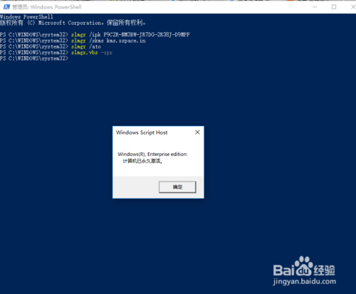

# win10永久激活方法

win10的花费不低，所以很多电脑用户选择搜索激活，但是大部分用的激活工具激活的基本上都是假激活（或许本来就是），kms激活和试用账号临时激活都是有时间限制的，虽然到时都可以继续，但是系统还是明确此激活为假激活，并没有真正激活，下面是真正永久激活教程

## 工具/原料

- 电脑

## 方法/步骤

1. 

   现在的激活工具层出不断，但基本上都是kms或者oem，并且并不是所有工具都能激活某个系统，还需要不断尝试，当我们费经心思假激活时（还是有时间限制【微软随时都可以全部封杀】），何不来正版激活（永久）。

   看系统属性并不能真正看出到底有没有激活

   **win+r打开运行，输入slmgr.vbs -xpr，回车**

   **若提示图示提示，则为kms假激活，只有6个月**

   **如果不信再输入slmgr.vbs -dlv，回车**

   **查看详细信息**

   

   

   

2. 

   首先要有一个对应产品的密钥，如果没有，搜索

   神key一般不易过期

   **技巧为限定搜索时间为一周内**

   

3. 

   **右击开始，打开Windows powershall（管理员）**

   **输入slmgr /ipk P9C2R-NM3BW-JR7DG-2R38J-D9MPF**

   **回车**

   **提示成功安装了产品密钥**

   

   

   

4. 

   输入**slmgr /skms kms.xspace.in**设置激活名称

   **回车**

   **提示……**

   

5. 

   输入**slmgr /ato**激活命令

   提示激活成功

   再次输入**slmgr.vbs -xpr**查看是否永久激活

   

   

6. 

   上面的密钥不一定有用，安装笔者第二步提示的技巧寻找

   如果实在不行，笔者再另提供一种方法——数字权利激活（此为微软在win10中新提供的激活方式）

   数字权利许可工具(很好找)虽然不是正版激活，但能有正版激活的效果

   点击左下方的**激活**

   **输入\*slmgr.vbs -xpr\***

   ***提示永久激活\***

   数字激活算是比密钥激活更好的方法

   

   

   

   

7. 

   应用户要求，提供软件。

   **【数字权利激活】https://www.lanzous.com/i31wlpc**

   

   