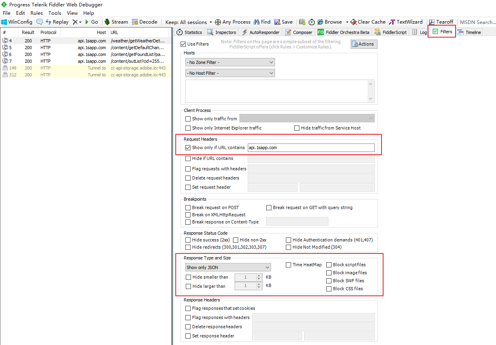
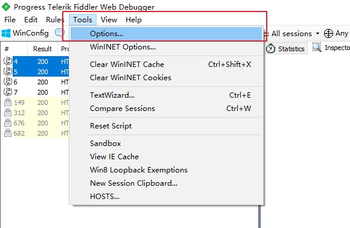
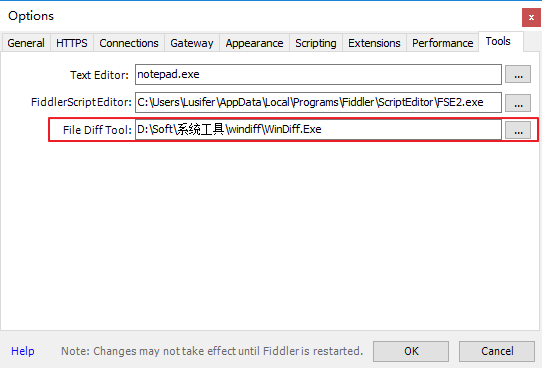
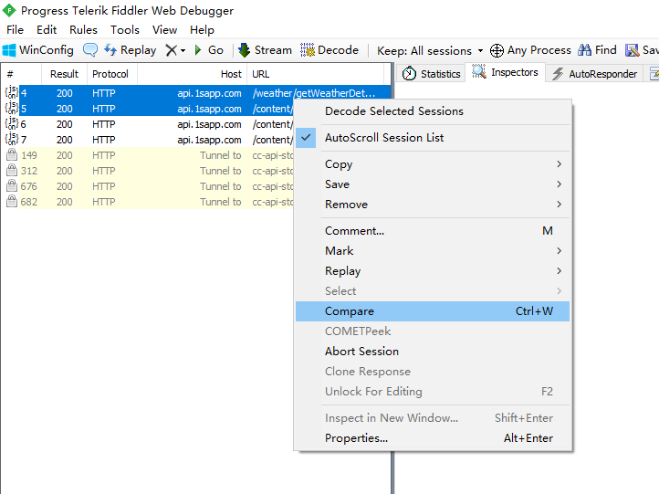
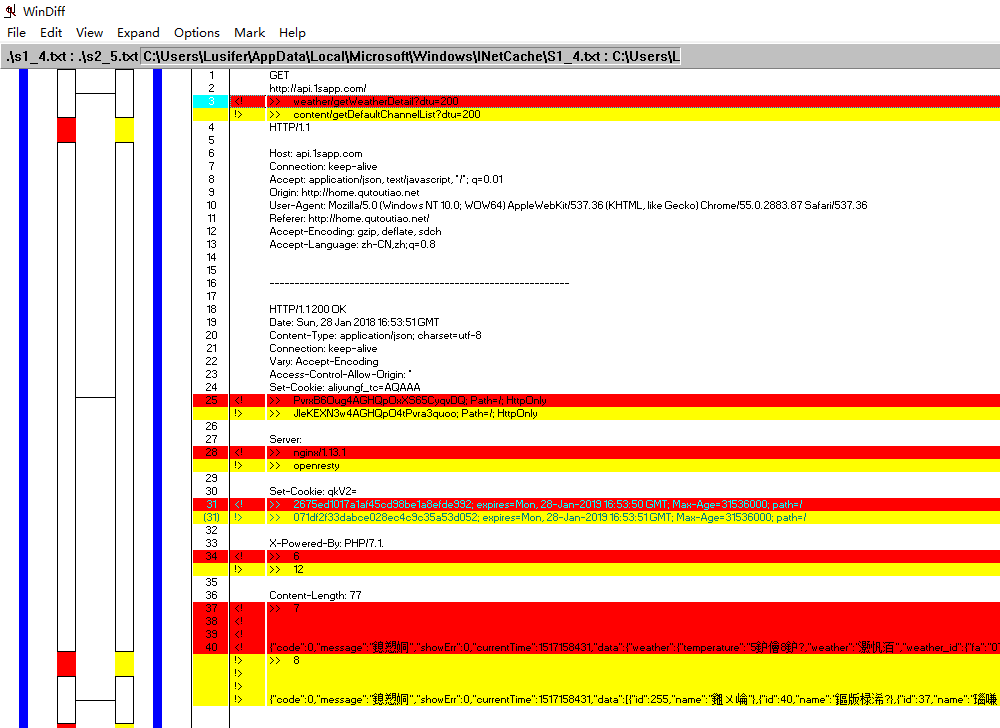
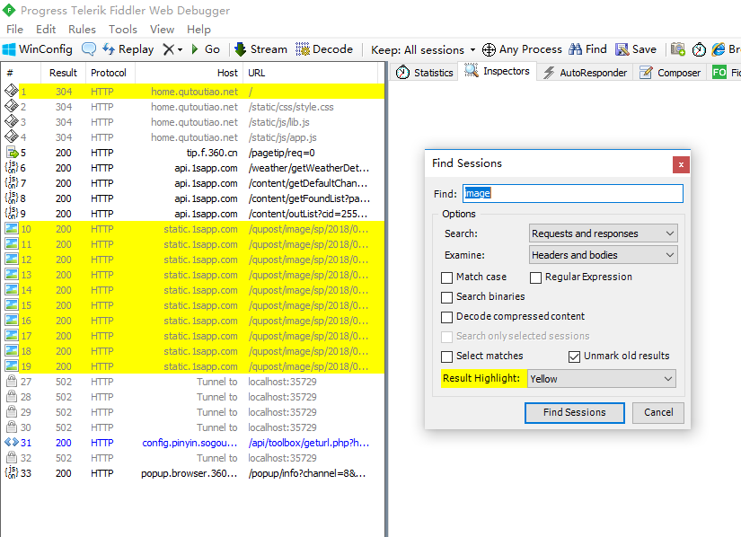
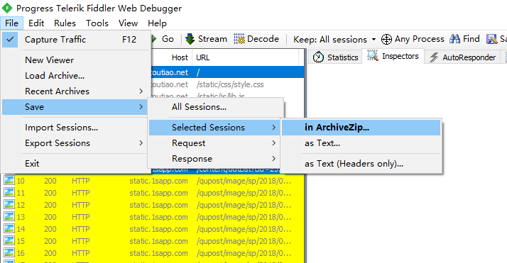

# Fiddler-会话管理
## 过滤会话
每次使用 Fiddler, 打开一个网站，都能在 Fiddler 中看到几十个会话，看得眼花缭乱。最好的办法是过滤掉一些会话，比如过滤掉图片的会话. Fiddler 中有过滤的功能, 在右边的 Filters 页签中

## 比较会话
选中 2 个会话，右键然后点击 Compare，就可以用 WinDiff 来比较两个会话的不同了(在此之前需要先设置并安装 WinDiff)

## 设置 WinDiff

## 比较

## 查询会话
用快捷键 Ctrl+F 打开 Find Sessions 的对话框，输入关键字查询你要的会话。查询到的会话会用黄色显示

## 保存会话
有些时候我们需要把会话保存下来，以便发给别人或者以后去分析。选中你想保存的会话，然后点击 `File` --> `Save` --> `Selected Sessions`

