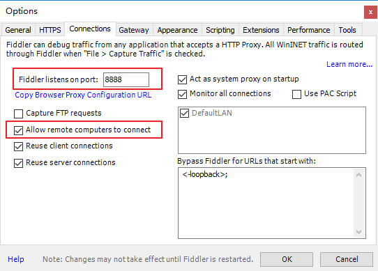
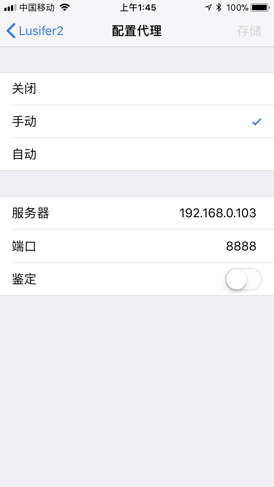
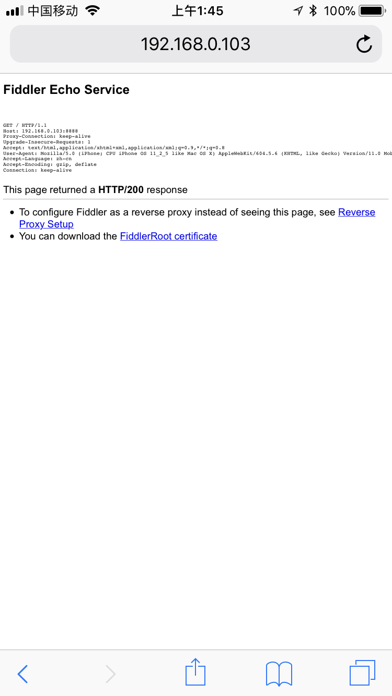
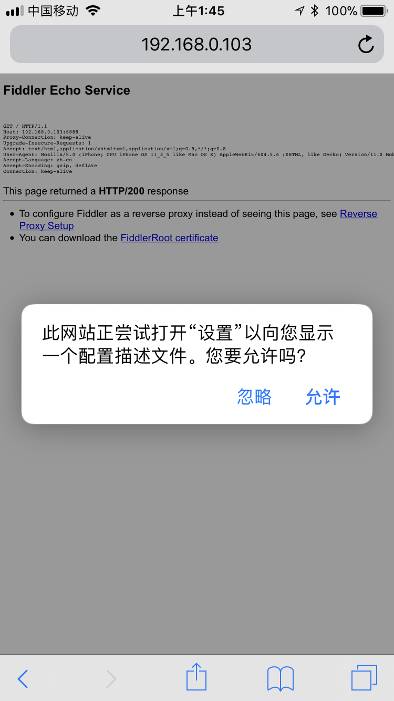
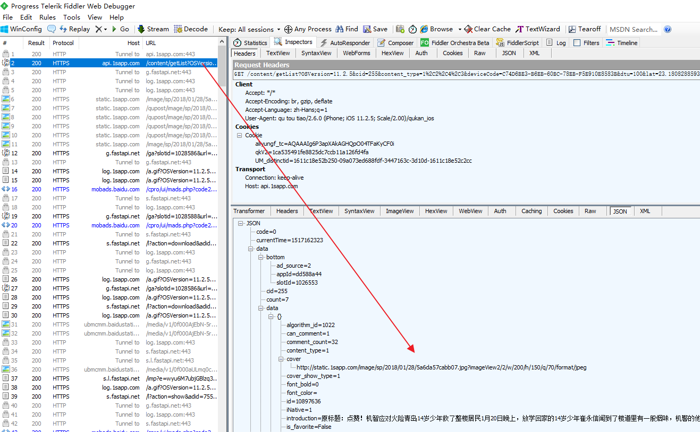

# Fiddler-手机抓包
## Fiddler 配置
需要配置 Fiddler 允许远程连接，点击 Tools --> Fiddler Options --> Connections，勾选 allow remote computers to connect，默认监听端口为 8888，若端口被占用可以设置成其他的，配置好后要重新启动 Fiddler，如下图：

## iOS 系统抓包
### 设置网络代理
打开 iPhone, 找到你的网络连接，打开 HTTP 代理，输入 Fiddler 所在机器的 IP 地址以及 Fiddler 的端口号 8888

### 安装 Fiddler 证书
这一步是为了让 Fiddler 能捕获 HTTPS 请求。如果你只需要截获 HTTP 请求，可以忽略这一步

首先要知道 Fiddler 所在的机器的 IP 地址，例如我安装了 Fiddler 的机器的 IP 地址是：192.168.0.103
打开 iPhone 的 Safari，访问 http://192.168.0.103:8888，点击 FiddlerRoot certificate 然后安装证书

### 开启 Fiddler 证书
iOS 10.3 以后，安装了的证书不是默认启用的，而是需要手动开启。设置 --> 通用 -> 关于本机 -> 证书信息设置

## 抓包效果图

## 注意事项
用完了，需要把 iPhone 上的 Fiddler 代理关闭，否则无法上网。