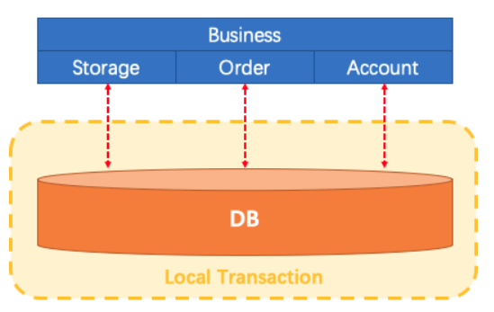
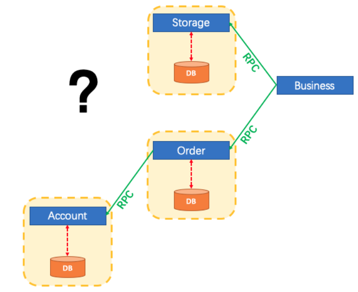
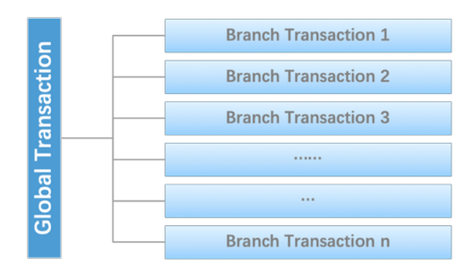
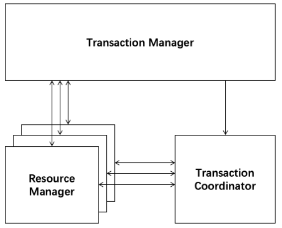
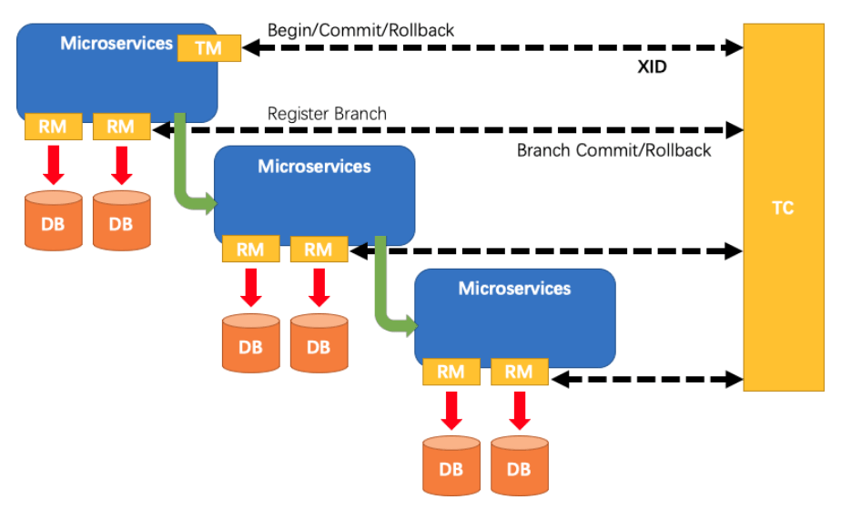
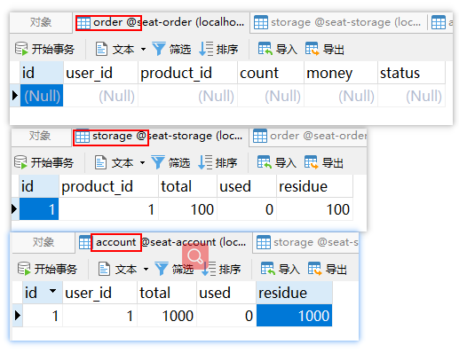
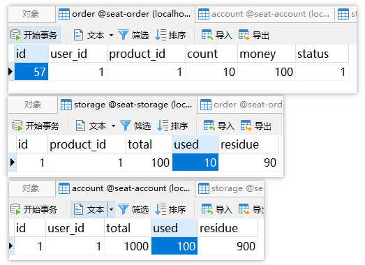

# 使用Seata彻底解决Spring Cloud中的分布式事务问题！

## 摘要

Seata是Alibaba开源的一款分布式事务解决方案，致力于提供高性能和简单易用的分布式事务服务，本文将通过一个简单的下单业务场景来对其用法进行详细介绍。

## 什么是分布式事务问题？

### 单体应用

单体应用中，一个业务操作需要调用三个模块完成，此时数据的一致性由本地事务来保证。





### 微服务应用

随着业务需求的变化，单体应用被拆分成微服务应用，原来的三个模块被拆分成三个独立的应用，分别使用独立的数据源，业务操作需要调用三个服务来完成。此时每个服务内部的数据一致性由本地事务来保证，但是全局的数据一致性问题没法保证。





### 小结

在微服务架构中由于全局数据一致性没法保证产生的问题就是分布式事务问题。简单来说，一次业务操作需要操作多个数据源或需要进行远程调用，就会产生分布式事务问题。

## Seata简介

Seata 是一款开源的分布式事务解决方案，致力于提供高性能和简单易用的分布式事务服务。Seata 将为用户提供了 AT、TCC、SAGA 和 XA 事务模式，为用户打造一站式的分布式解决方案。

## Seata原理和设计

### 定义一个分布式事务

我们可以把一个分布式事务理解成一个包含了若干分支事务的全局事务，全局事务的职责是协调其下管辖的分支事务达成一致，要么一起成功提交，要么一起失败回滚。此外，通常分支事务本身就是一个满足ACID的本地事务。这是我们对分布式事务结构的基本认识，与 XA 是一致的。





### 协议分布式事务处理过程的三个组件

- Transaction Coordinator (TC)： 事务协调器，维护全局事务的运行状态，负责协调并驱动全局事务的提交或回滚；
- Transaction Manager (TM)： 控制全局事务的边界，负责开启一个全局事务，并最终发起全局提交或全局回滚的决议；
- Resource Manager (RM)： 控制分支事务，负责分支注册、状态汇报，并接收事务协调器的指令，驱动分支（本地）事务的提交和回滚。





### 一个典型的分布式事务过程

- TM 向 TC 申请开启一个全局事务，全局事务创建成功并生成一个全局唯一的 XID；
- XID 在微服务调用链路的上下文中传播；
- RM 向 TC 注册分支事务，将其纳入 XID 对应全局事务的管辖；
- TM 向 TC 发起针对 XID 的全局提交或回滚决议；
- TC 调度 XID 下管辖的全部分支事务完成提交或回滚请求。





## seata-server的安装与配置

- 我们先从官网下载seata-server，这里下载的是`seata-server-0.9.0.zip`，下载地址：[github.com/seata/seata…](https://github.com/seata/seata/releases)

  ```
  https://master.dl.sourceforge.net/project/seata.mirror/v0.9.0/seata-server-0.9.0.zip
  ```

  

- 这里我们使用Nacos作为注册中心，Nacos的安装及使用可以参考：**Spring Cloud Alibaba：Nacos 作为注册中心和配置中心使用**；

- 解压seata-server安装包到指定目录，修改`conf`目录下的`file.conf`配置文件，主要修改自定义事务组名称，事务日志存储模式为`db`及数据库连接信息；

```
service {
  #vgroup->rgroup
  vgroup_mapping.fsp_tx_group = "default" #修改事务组名称为：fsp_tx_group，和客户端自定义的名称对应
  #only support single node
  default.grouplist = "127.0.0.1:8091"
  #degrade current not support
  enableDegrade = false
  #disable
  disable = false
  #unit ms,s,m,h,d represents milliseconds, seconds, minutes, hours, days, default permanent
  max.commit.retry.timeout = "-1"
  max.rollback.retry.timeout = "-1"
}

## transaction log store
store {
  ## store mode: file、db
  mode = "db" #修改此处将事务信息存储到数据库中

  ## database store
  db {
    ## the implement of javax.sql.DataSource, such as DruidDataSource(druid)/BasicDataSource(dbcp) etc.
    datasource = "dbcp"
    ## mysql/oracle/h2/oceanbase etc.
    db-type = "mysql"
    driver-class-name = "com.mysql.jdbc.Driver"
    url = "jdbc:mysql://localhost:3306/seat-server" #修改数据库连接地址
    user = "root" #修改数据库用户名
    password = "root" #修改数据库密码
    min-conn = 1
    max-conn = 3
    global.table = "global_table"
    branch.table = "branch_table"
    lock-table = "lock_table"
    query-limit = 100
  }
}
```

- 由于我们使用了db模式存储事务日志，所以我们需要创建一个seat-server数据库，建表sql在seata-server的`/conf/db_store.sql`中；
- 修改`conf`目录下的`registry.conf`配置文件，指明注册中心为`nacos`，及修改`nacos`连接信息即可；

```
registry {
  # file 、nacos 、eureka、redis、zk、consul、etcd3、sofa
  type = "nacos" #改为nacos

  nacos {
    serverAddr = "localhost:8848" #改为nacos的连接地址
    namespace = ""
    cluster = "default"
  }
}

```

- 先启动Nacos，再使用seata-server中`/bin/seata-server.bat`文件启动seata-server。

## 数据库准备

### 创建业务数据库

- seat_order：存储订单的数据库；
- seat_storage：存储库存的数据库；
- seat_account：存储账户信息的数据库。

### 初始化业务表

#### order表

```
CREATE TABLE `order` (
  `id` bigint(11) NOT NULL AUTO_INCREMENT,
  `user_id` bigint(11) DEFAULT NULL COMMENT '用户id',
  `product_id` bigint(11) DEFAULT NULL COMMENT '产品id',
  `count` int(11) DEFAULT NULL COMMENT '数量',
  `money` decimal(11,0) DEFAULT NULL COMMENT '金额',
  PRIMARY KEY (`id`)
) ENGINE=InnoDB AUTO_INCREMENT=7 DEFAULT CHARSET=utf8;

ALTER TABLE `order` ADD COLUMN `status` int(1) DEFAULT NULL COMMENT '订单状态：0：创建中；1：已完结' AFTER `money` ;
```

#### storage表

```
CREATE TABLE `storage` (
                         `id` bigint(11) NOT NULL AUTO_INCREMENT,
                         `product_id` bigint(11) DEFAULT NULL COMMENT '产品id',
                         `total` int(11) DEFAULT NULL COMMENT '总库存',
                         `used` int(11) DEFAULT NULL COMMENT '已用库存',
                         `residue` int(11) DEFAULT NULL COMMENT '剩余库存',
                         PRIMARY KEY (`id`)
) ENGINE=InnoDB AUTO_INCREMENT=2 DEFAULT CHARSET=utf8;

INSERT INTO `seat_storage`.`storage` (`id`, `product_id`, `total`, `used`, `residue`) VALUES ('1', '1', '100', '0', '100');

```

#### account表

```
CREATE TABLE `account` (
  `id` bigint(11) NOT NULL AUTO_INCREMENT COMMENT 'id',
  `user_id` bigint(11) DEFAULT NULL COMMENT '用户id',
  `total` decimal(10,0) DEFAULT NULL COMMENT '总额度',
  `used` decimal(10,0) DEFAULT NULL COMMENT '已用余额',
  `residue` decimal(10,0) DEFAULT '0' COMMENT '剩余可用额度',
  PRIMARY KEY (`id`)
) ENGINE=InnoDB AUTO_INCREMENT=2 DEFAULT CHARSET=utf8;

INSERT INTO `seat_account`.`account` (`id`, `user_id`, `total`, `used`, `residue`) VALUES ('1', '1', '1000', '0', '1000');

```

### 创建日志回滚表

使用Seata还需要在每个数据库中创建日志表，建表sql在seata-server的`/conf/db_undo_log.sql`中。

### 完整数据库示意图


## 制造一个分布式事务问题

这里我们会创建三个服务，一个订单服务，一个库存服务，一个账户服务。当用户下单时，会在订单服务中创建一个订单，然后通过远程调用库存服务来扣减下单商品的库存，再通过远程调用账户服务来扣减用户账户里面的余额，最后在订单服务中修改订单状态为已完成。该操作跨越三个数据库，有两次远程调用，很明显会有分布式事务问题。

## 客户端配置

- 对seata-order-service、seata-storage-service和seata-account-service三个seata的客户端进行配置，它们配置大致相同，我们下面以seata-order-service的配置为例；
- 修改application.yml文件，自定义事务组的名称；

```
spring:
  cloud:
    alibaba:
      seata:
        tx-service-group: fsp_tx_group #自定义事务组名称需要与seata-server中的对应

```

- 添加并修改file.conf配置文件，主要是修改自定义事务组名称；

```
service {
  #vgroup->rgroup
  vgroup_mapping.fsp_tx_group = "default" #修改自定义事务组名称
  #only support single node
  default.grouplist = "127.0.0.1:8091"
  #degrade current not support
  enableDegrade = false
  #disable
  disable = false
  #unit ms,s,m,h,d represents milliseconds, seconds, minutes, hours, days, default permanent
  max.commit.retry.timeout = "-1"
  max.rollback.retry.timeout = "-1"
  disableGlobalTransaction = false
}
```

- 添加并修改registry.conf配置文件，主要是将注册中心改为nacos；

```
registry {
  # file 、nacos 、eureka、redis、zk
  type = "nacos" #修改为nacos

  nacos {
    serverAddr = "localhost:8848" #修改为nacos的连接地址
    namespace = ""
    cluster = "default"
  }
}

```

- 在启动类中取消数据源的自动创建：

```
@SpringBootApplication(exclude = DataSourceAutoConfiguration.class)
@EnableDiscoveryClient
@EnableFeignClients
public class SeataOrderServiceApplication {

    public static void main(String[] args) {
        SpringApplication.run(SeataOrderServiceApplication.class, args);
    }

}
```

- 创建配置使用Seata对数据源进行代理：

```
/**
 * 使用Seata对数据源进行代理
 * Created by macro on 2019/11/11.
 */
@Configuration
public class DataSourceProxyConfig {

    @Value("${mybatis.mapperLocations}")
    private String mapperLocations;

    @Bean
    @ConfigurationProperties(prefix = "spring.datasource")
    public DataSource druidDataSource(){
        return new DruidDataSource();
    }

    @Bean
    public DataSourceProxy dataSourceProxy(DataSource dataSource) {
        return new DataSourceProxy(dataSource);
    }

    @Bean
    public SqlSessionFactory sqlSessionFactoryBean(DataSourceProxy dataSourceProxy) throws Exception {
        SqlSessionFactoryBean sqlSessionFactoryBean = new SqlSessionFactoryBean();
        sqlSessionFactoryBean.setDataSource(dataSourceProxy);
        sqlSessionFactoryBean.setMapperLocations(new PathMatchingResourcePatternResolver()
                .getResources(mapperLocations));
        sqlSessionFactoryBean.setTransactionFactory(new SpringManagedTransactionFactory());
        return sqlSessionFactoryBean.getObject();
    }

}
```

- 使用@GlobalTransactional注解开启分布式事务：

```
package com.macro.cloud.service.impl;

import com.macro.cloud.dao.OrderDao;
import com.macro.cloud.domain.Order;
import com.macro.cloud.service.AccountService;
import com.macro.cloud.service.OrderService;
import com.macro.cloud.service.StorageService;
import io.seata.spring.annotation.GlobalTransactional;
import org.slf4j.Logger;
import org.slf4j.LoggerFactory;
import org.springframework.beans.factory.annotation.Autowired;
import org.springframework.stereotype.Service;

/**
 * 订单业务实现类
 * Created by macro on 2019/11/11.
 */
@Service
public class OrderServiceImpl implements OrderService {

    private static final Logger LOGGER = LoggerFactory.getLogger(OrderServiceImpl.class);

    @Autowired
    private OrderDao orderDao;
    @Autowired
    private StorageService storageService;
    @Autowired
    private AccountService accountService;

    /**
     * 创建订单->调用库存服务扣减库存->调用账户服务扣减账户余额->修改订单状态
     */
    @Override
    @GlobalTransactional(name = "fsp-create-order",rollbackFor = Exception.class)
    public void create(Order order) {
        LOGGER.info("------->下单开始");
        //本应用创建订单
        orderDao.create(order);

        //远程调用库存服务扣减库存
        LOGGER.info("------->order-service中扣减库存开始");
        storageService.decrease(order.getProductId(),order.getCount());
        LOGGER.info("------->order-service中扣减库存结束:{}",order.getId());

        //远程调用账户服务扣减余额
        LOGGER.info("------->order-service中扣减余额开始");
        accountService.decrease(order.getUserId(),order.getMoney());
        LOGGER.info("------->order-service中扣减余额结束");

        //修改订单状态为已完成
        LOGGER.info("------->order-service中修改订单状态开始");
        orderDao.update(order.getUserId(),0);
        LOGGER.info("------->order-service中修改订单状态结束");

        LOGGER.info("------->下单结束");
    }
}
```

## 分布式事务功能演示

- 运行seata-order-service、seata-storage-service和seata-account-service三个服务；
- 数据库初始信息状态：





- 调用接口进行下单操作后查看数据库：http://localhost:8180/order/create?userId=1&productId=1&count=10&money=100





- 我们在seata-account-service中制造一个超时异常后，调用下单接口：

```
/**
 * 账户业务实现类
 * Created by macro on 2019/11/11.
 */
@Service
public class AccountServiceImpl implements AccountService {

    private static final Logger LOGGER = LoggerFactory.getLogger(AccountServiceImpl.class);
    @Autowired
    private AccountDao accountDao;

    /**
     * 扣减账户余额
     */
    @Override
    public void decrease(Long userId, BigDecimal money) {
        LOGGER.info("------->account-service中扣减账户余额开始");
        //模拟超时异常，全局事务回滚
        try {
            Thread.sleep(30*1000);
        } catch (InterruptedException e) {
            e.printStackTrace();
        }
        accountDao.decrease(userId,money);
        LOGGER.info("------->account-service中扣减账户余额结束");
    }
}
复制代码
```

- 此时我们可以发现下单后数据库数据并没有任何改变；


- 我们可以在seata-order-service中注释掉@GlobalTransactional来看看没有Seata的分布式事务管理会发生什么情况：

```
/**
 * 订单业务实现类
 * Created by macro on 2019/11/11.
 */
@Service
public class OrderServiceImpl implements OrderService {

    /**
     * 创建订单->调用库存服务扣减库存->调用账户服务扣减账户余额->修改订单状态
     */
    @Override
//    @GlobalTransactional(name = "fsp-create-order",rollbackFor = Exception.class)
    public void create(Order order) {
        LOGGER.info("------->下单开始");
        //省略代码...
        LOGGER.info("------->下单结束");
    }
}
复制代码
```

- 由于seata-account-service的超时会导致当库存和账户金额扣减后订单状态并没有设置为已经完成，而且由于远程调用的重试机制，账户余额还会被多次扣减。


## 参考资料

Seata官方文档：[github.com/seata/seata…](https://github.com/seata/seata/wiki)

## 使用到的模块

```
springcloud-learning
├── seata-order-service -- 整合了seata的订单服务
├── seata-storage-service -- 整合了seata的库存服务
└── seata-account-service -- 整合了seata的账户服务
```

## 项目源码地址


